# FLOW.md

## Bối cảnh (Context)

Tài liệu này mô tả luồng vận hành thực tế của hệ thống `multi-agent-equity-research` tại thời điểm rà soát codebase. Hệ thống được thiết kế cho nghiên cứu cổ phiếu ngành dược/y tế Việt Nam theo nguyên tắc: dữ liệu có nguồn kiểm chứng, tính toán tài chính bằng code tất định, multi-agent chỉ được dùng để lập kế hoạch, diễn giải, tổng hợp và phản biện trong phạm vi artifact đã được kiểm soát.

Các entry point quan trọng:

| Nhóm | File chính | Vai trò |
|---|---|---|
| Full pipeline | `scripts/run_research.py` | Tạo `run_id`, khởi tạo run trong DB, gọi `FullReportOrchestrator`. |
| Orchestrator | `backend/orchestrator.py` | Điều phối vòng đời `full_report`, render sau run nếu đủ trạng thái. |
| Graph runner | `backend/harness/runner.py` | Chạy 9 stage cố định: preflight, ingest, phân tích, định giá, viết báo cáo, review, export gate, publish. |
| Role config | `config/agents/agents.yml` | Khai báo 6 vai trò runtime, model, prompt, tool được phép dùng. |
| Tool registry | `backend/harness/tool_registry.py` | Ràng buộc tool thuộc vai trò nào, schema, quyền và timeout. |
| Ingestion dữ liệu cấu trúc | `scripts/ingest_ticker.py`, `backend/dataops/vnstock_ingest.py` | Lấy dữ liệu vnstock, giá, công ty, catalyst; ghi observation và promote fact. |
| Ingestion tài liệu chính thức | `scripts/auto_ingest_official_documents.py`, `scripts/ingest_pdf_llm.py` | Tìm/lấy PDF, trích bảng, OCR/LLM gap-fill, ghi fact/evidence. |
| Fact snapshot | `scripts/build_facts.py` | Đọc `fact.production_facts`, chuẩn hóa, kiểm tra completeness, tạo snapshot. |
| RAG index | `scripts/build_index.py`, `scripts/admin/chunk_pipeline.py`, `backend/retrieval.py` | Tạo chunk, metadata citation, embedding và truy xuất bằng vector/full-text. |
| Forecast/valuation | `backend/analytics/*`, `scripts/run_valuation.py` | Forecast, FCFF, FCFE, blend DCF, sensitivity, peer multiples. |
| Reporting | `backend/reporting/*`, `scripts/generate_fast_report.py` | Lắp report model, render HTML/PDF, tạo explanation. |

## Vấn đề cần giải quyết (Problem Statement)

Câu hỏi vận hành cốt lõi là: từ nhiều nguồn dữ liệu không đồng nhất như vnstock, CafeF, PDF báo cáo thường niên, OCR và LLM extraction, hệ thống làm thế nào để tạo một báo cáo phân tích cổ phiếu có số liệu tái lập được, có trích dẫn, có kiểm tra xung đột và không để agent tự ý tính hoặc bịa số.

Các bất biến quan trọng:

| Bất biến | Cách code thực thi |
|---|---|
| LLM không tính số liệu tài chính cuối cùng | Forecast/valuation chạy qua `backend.analytics` và `scripts/run_valuation.py`; agent chỉ đọc artifact. |
| Fact dùng cho valuation phải qua canonical/snapshot | `build_facts.py` đọc `fact.production_facts`, tạo snapshot; downstream đọc snapshot thay vì đọc tùy tiện. |
| Source provenance không được mất | `FactEntry`, `source_doc_id`, `source_tier`, `metadata_json`, `artifact_refs`, `evidence_refs` được truyền xuyên pipeline. |
| PDF/OCR có thể bổ sung nhưng không tự động phá dữ liệu tốt | Promotion có gate confidence, reconciliation, duplicate detection; vnstock structured API được ưu tiên trong một số winner policy. |
| Report publish phải qua gate | Runner ghi `gate_results`, `report_candidate_model`, `review_passed_report_model`, `publishable_final_report_model`; render final lấy artifact đã khóa. |

## Phân tích kỹ thuật (Technical Deep-Dive)

## 4. Luồng tổng quát chung đơn giản

```mermaid
%%{init: {"theme": "base", "themeVariables": {"fontFamily": "Inter, Arial", "primaryColor": "#E8F3FF", "primaryBorderColor": "#2F6FAE", "lineColor": "#5B6F80", "tertiaryColor": "#F8FAFC"}}}%%
flowchart LR
    U["User request<br/>ticker + period"]:::input --> O["Run Orchestrator<br/>run_id + policy"]:::service
    O --> G["Research Graph<br/>9 fixed stages"]:::service
    G --> D["Data Layer<br/>facts + snapshot + RAG index"]:::data
    D --> C["Computation Layer<br/>ratios + forecast + valuation"]:::calc
    C --> R["Report Layer<br/>draft + assembly + review"]:::agent
    R --> Q["Quality Gates<br/>citation + package + readiness"]:::gate
    Q --> P["Publishable Model<br/>locked run artifact"]:::output
    P --> X["Render<br/>PDF/HTML/explanation"]:::output

    classDef input fill:#FFF7E6,stroke:#B7791F,color:#1F2937;
    classDef service fill:#E8F3FF,stroke:#2F6FAE,color:#102A43;
    classDef data fill:#E8F8F2,stroke:#2F855A,color:#12372A;
    classDef calc fill:#F3E8FF,stroke:#6B46C1,color:#2D1B69;
    classDef agent fill:#FCE7F3,stroke:#B83280,color:#4A1234;
    classDef gate fill:#FFE8E8,stroke:#C53030,color:#4A1111;
    classDef output fill:#E6FFFA,stroke:#2C7A7B,color:#123B3C;
```

Ở mức dễ hiểu nhất: hệ thống không bắt đầu bằng agent viết báo cáo ngay. Nó bắt đầu bằng việc gom và khóa dữ liệu, sau đó tính toán bằng Python, sau đó mới để agent viết diễn giải dựa trên artifact đã có, rồi dùng gate kiểm lại trước khi xuất.

## 1. Luồng thu thập và lưu trữ dữ liệu core

### 1.1 Nguồn dữ liệu chính

| Nguồn | Đường code | Dữ liệu sinh ra | Độ tin cậy trong hệ thống |
|---|---|---|---|
| vnstock structured API | `scripts/connectors/vnstock_finance_connector.py` | `ingest.observations`, raw JSON tại `data/raw/bctc/<ticker>/` | Tier 3 nhưng sạch về cấu trúc, thường là primary cho fundamentals. |
| CafeF | `backend.documents.connectors.cafef_connector`, `auto_ingest_official_documents.py` | `extracted_facts.csv`, secondary source cho OCR | Tier 2, dùng để bổ trợ/đối chiếu. |
| PDF chính thức | `official_document_discovery`, `pdf_extractor.py` | `source_document.pdf`, `metadata.json`, `extracted_facts_pdf.csv` | Tier 0/1 nếu bảng đọc được. |
| OCR PDF scan | `pdf2image`, `pytesseract`, `ocr_artifacts.py` | Page text, candidate rows, candidate facts, reconciliation report | Official nhưng extraction rủi ro hơn; phải qua validation/reconciliation. |
| LLM PDF ingestion | `scripts/ingest_pdf_llm.py` | Additive canonical facts + company evidence | Chỉ gap-fill; không overwrite production facts đã có. |
| AGM/DHCD | `scripts/ingest_agm.py`, `backend.analytics.agm_drivers` | Driver forecast như kế hoạch doanh thu/vay nợ | Dùng làm driver tương lai nếu có provenance. |
| Manual/golden artifacts | `config/benchmarks/shared/golden_financials` | Supplement cho benchmark hoặc gap-fill có kiểm soát | Chỉ nhận dòng `accepted`, có provenance. |

### 1.2 Luồng lưu trữ dữ liệu

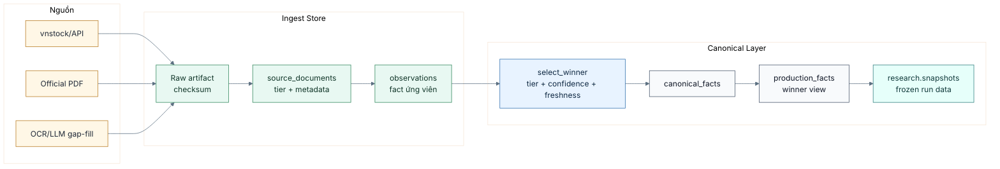

Điểm quan trọng là connector không được ghi thẳng số liệu “cuối cùng” vào báo cáo. Connector tạo observation hoặc artifact nguồn; promotion chọn winner và lưu vào canonical fact; build snapshot mới là lớp dữ liệu ổn định cho valuation/report.

### 1.3 Winner selection và raw cache

| Bước | Logic |
|---|---|
| Raw snapshot | `SourceRegistry.save_raw_snapshot()` lưu payload và checksum để có thể tái lập ingestion. |
| Alias mapping | `vnstock_finance_connector._build_alias_map()` map nhãn tiếng Việt/English/item_id sang taxonomy. |
| Lọc kỳ | MVP chỉ nhận FY; quarterly bị drop hoặc block. |
| Dedup trong batch | `_resolve_fact_collisions()` giữ giá trị có độ lớn tuyệt đối cao nhất để tránh placeholder `0` ghi đè số thật. |
| Promotion | `promote_accepted_facts()` nhóm theo `(period, metric)`, chọn winner bằng primary policy, tier, confidence, created_at. |
| Canonical read | `get_production_facts()` dùng window ranking để lấy winner ổn định. |

## 2. Luồng hoạt động khi đã có dữ liệu: từ dữ liệu nguồn đến báo cáo phân tích cổ phiếu

```mermaid
%%{init: {"theme": "base", "themeVariables": {"fontFamily": "Inter, Arial", "primaryColor": "#E8F3FF", "primaryBorderColor": "#2F6FAE", "lineColor": "#5B6F80"}}}%%
flowchart LR
    PF["production_facts"]:::data --> BF["BuildFacts<br/>FactTable + derived metrics"]:::service
    BF --> DQ["Data Gates<br/>coverage + source tier + reconciliation"]:::gate
    DQ --> S["Snapshot<br/>active + frozen"]:::data

    subgraph A["Analysis"]
        S --> RA["RatiosService"]:::calc
        RA --> FA["FinanceAgent<br/>financial narrative"]:::agent
    end

    subgraph V["Forecast & Valuation"]
        S --> FS["ForecastService"]:::calc
        FS --> VS["ValuationService<br/>FCFF + FCFE + blend"]:::calc
        VS --> VG["Valuation Gates"]:::gate
    end

    FA --> AS["ReportAssembler"]:::service
    VG --> AS
    AS --> RF["ReportAgent<br/>draft + claims"]:::agent
    RF --> RV["ReviewAgent<br/>critic + citations"]:::agent
    RV --> EG["Export Gates"]:::gate
    EG --> PM["publishable_final_report_model"]:::output
    PM --> RD["Renderer<br/>report + explanation"]:::output

    classDef data fill:#E8F8F2,stroke:#2F855A,color:#12372A;
    classDef service fill:#E8F3FF,stroke:#2F6FAE,color:#102A43;
    classDef calc fill:#F3E8FF,stroke:#6B46C1,color:#2D1B69;
    classDef agent fill:#FCE7F3,stroke:#B83280,color:#4A1234;
    classDef gate fill:#FFE8E8,stroke:#C53030,color:#4A1111;
    classDef output fill:#E6FFFA,stroke:#2C7A7B,color:#123B3C;
```

### 2.1 Stage thật trong `ResearchGraphRunner`

| Stage | Actor chính | Output chính | Gate/liên quan |
|---|---|---|---|
| `PREFLIGHT` | RuntimeService | Schema version, role/tool policy, model env OK | Fail sớm nếu DB/model/tool sai. |
| `PLAN` | PlanService | `research_plan` | Không gọi LLM trong code hiện tại; template plan cố định. |
| `INGEST_AND_VALIDATE` | DataService | `auto_ingest`, `build_facts`, `index`, `snapshot_id` | `data_quality_gate`. |
| `ANALYZE` | FinanceAgent + RatioService | `snapshot`, `ratios`, `financial_analysis`, research pack | `financial_analyst_gate`. |
| `FORECAST_AND_VALUE` | ValuationService | `forecast_model`, `valuation`, `valuation_read` | `forecast_quality_gate`, `balance_sheet_identity_gate`, `valuation_gate`, `valuation_reconciliation_gate`. |
| `WRITE_REPORT` | ReportAgent + ReportAssembler | `report_draft`, `report_candidate_model` | `REPORT_ASSEMBLY_GATE`. |
| `REVIEW` | ReviewAgent + QualityService | `quality`, `critic_review`, `review_passed_report_model` | `report_completeness_gate`, `senior_critic_gate`, `citation_gate`. |
| `EXPORT_GATES` | Deterministic gates | `report_quality_evaluation`, `quality_gate`, `publishable_final_report_model` | `package_validation_gate`. |
| `PUBLISH` | Service node | `auto_exported`, manifest/evaluation artifacts | Không tự tính lại; chỉ finalize publishable model. |

## 3. Luồng riêng của dịch vụ tất định, multi-agent và công cụ

### 3.1 Phân chia trách nhiệm

| Lớp | Ví dụ | Được làm | Không được làm |
|---|---|---|---|
| Dịch vụ tất định (deterministic service) | `build_facts`, `run_forecast`, `run_valuation`, `ReportAssembler`, gates | Tính toán, normalize, chọn winner, kiểm gate, tạo artifact | Viết claim tùy ý hoặc bỏ qua provenance. |
| Tool harness | `backend/harness/tools.py` | Bọc service thành `ServiceNodeResult`, persist artifact, ghi trace | Cho agent gọi tool ngoài registry. |
| Runtime roles | Vai trò trong `config/agents/agents.yml` | Chạy service tất định hoặc gọi LLM khi thật sự cần diễn giải/phản biện | Tính số valuation cuối bằng prose, tự fetch filesystem, override gate. |
| Model adapter | `backend/harness/model_adapter.py` | Gọi model, fallback model, validate output schema | Tạo schema/artifact tùy tiện ngoài whitelist stage. |

### 3.2 Tool ownership

| Tool | Owner role config | Công việc |
|---|---|---|
| `auto_ingest` | `data_evidence` | Thu thập CafeF/PDF/OCR, không block toàn pipeline nếu thất bại. |
| `build_facts` | `data_evidence` | Tạo fact snapshot và data-quality artifact. |
| `build_index` | `data_evidence` | Tạo document chunks cho RAG/citation. |
| `read_snapshot` | `financial_analysis` | Đọc snapshot đã đóng băng. |
| `read_ratio_artifact` | `financial_analysis` | Tính ratios từ snapshot. |
| `run_forecast` | `forecast_valuation` | Forecast driver-based tất định. |
| `run_valuation` | `forecast_valuation` | Chạy FCFF/FCFE/blend/sensitivity. |
| `read_valuation_artifact` | `forecast_valuation` | Đọc valuation JSON từ storage. |
| `evaluate_report_quality` | `senior_critic` | Kiểm chất lượng báo cáo từ artifact. |

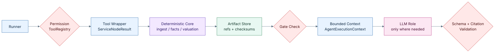

## 6. Luồng RAG: chunking, parsing metadata, embedding, retrieval

### 6.1 Build index

`scripts/build_index.py` tạo evidence chunks từ bốn nguồn theo thứ tự ưu tiên thực tế:

1. Official PDF có text layer: đọc bằng `pdfplumber`, mỗi trang là một chunk.
2. OCR artifact: đọc `storage/sources/ocr_artifacts/<ticker>/<year>/<doc_id>/pages/page_*.txt`, mỗi trang là một chunk.
3. Synthetic fact chunks: tạo chunk ngắn cho từng `(fiscal_year, metric)` từ accepted canonical facts, cộng thêm summary theo năm.
4. External `.txt` documents: chia theo nhóm 3 đoạn văn.

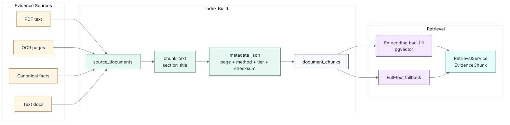

### 6.2 Metadata và citation

| Metadata | Ý nghĩa |
|---|---|
| `extraction_method` | `pdf_text`, `ocr`, `synthetic_facts`, `document`, `cafef_api`; giúp filter và audit. |
| `page_number` | Trang gốc của PDF/OCR; dùng cho citation. |
| `document_id` | Định danh tài liệu, đặc biệt cho OCR run. |
| `source_tier` | Độ tin cậy nguồn; tier thấp hơn đáng tin hơn. |
| `fiscal_year` | Cho phép retrieve theo năm nhưng vẫn giữ chunk không năm nếu `NULL`. |
| `checksum` | Phát hiện thay đổi chunk để invalid embedding. |

### 6.3 Embedding và retrieval

| Bước | Logic |
|---|---|
| Embedding | `scripts/admin/chunk_pipeline.py` lấy chunk thiếu embedding, gọi `text-embedding-3-small`, ghi vector vào `ingest.document_chunks.embedding`. |
| Vector path | `RetrievalService` embed query nếu có OpenAI key, search pgvector, dùng penalty theo `source_tier` để ưu tiên nguồn chính thức nhưng vẫn cho synthetic exact fact thắng nếu liên quan hơn. |
| Fallback path | Nếu không có embedding/provider hoặc vector không ra kết quả, dùng full-text search PostgreSQL `to_tsvector('simple')`. |
| Output | `EvidenceChunk` gồm `chunk_id`, `source_id`, `chunk_index`, `chunk_text`, tier, page, document, URI và `citation_key = source_id/chunk_index`. |

## 7. Luồng input-process-output cơ bản

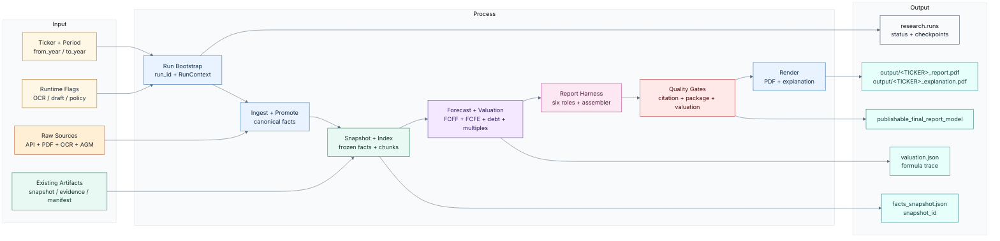

| Input | Process | Output |
|---|---|---|
| `ticker`, `from_year`, `to_year`, flags OCR/draft | `run_research.py` tạo run, policy, `RunContext` | `run_id`, row trong `research.runs`. |
| Raw financial/API/PDF/OCR data | Connectors, extraction, observation insert, promotion | `fact.canonical_facts`, `fact.production_facts`. |
| Canonical facts | `build_facts.py`, normalizer, completeness, reconciliation | `facts_snapshot.json`, `snapshot_id`, validation report. |
| Source text và facts | `build_index.py`, chunk pipeline | `ingest.document_chunks`, embeddings, retrieval-ready evidence. |
| Snapshot | Ratios, forecast, valuation engines | `forecast.json`, `valuation.json`, formula traces. |
| Artifacts + evidence | Runtime roles + ReportAssembler | `report_candidate_model`, chart/table specs. |
| Candidate report | Critic, citation, package, quality gates | `publishable_final_report_model`. |
| Final model | Renderer | `output/<TICKER>_report.pdf`, `output/<TICKER>_explanation.pdf` hoặc Supabase `exports`. |

## 8. Luồng OCR theo loại tài liệu và cách dữ liệu đi tiếp

Mục tiêu của OCR không phải chỉ là đọc chữ từ PDF scan, mà là đưa từng loại tài liệu chính thức vào đúng nhánh xử lý: tài liệu tài chính tạo candidate facts, tài liệu quản trị tạo event/assumption evidence, còn tài liệu giải trình hoặc công bố thông tin tạo bằng chứng kiểm chứng luận điểm. Vì vậy phần OCR phải bắt đầu từ câu hỏi “đọc tài liệu nào, lấy nội dung gì, rồi dữ liệu đó được dùng như thế nào”.

### 8.1 Loại tài liệu cần OCR

| Nhóm tài liệu | Ví dụ đầu vào | Nội dung cần OCR/trích xuất | Vai trò trong báo cáo |
|---|---|---|---|
| BCTC tối thiểu 4 năm gần nhất | BCTC kiểm toán năm, BCTC soát xét bán niên, BCTC quý nếu năm hiện tại chưa có đủ dữ liệu | Bảng cân đối kế toán, kết quả kinh doanh, lưu chuyển tiền tệ, thuyết minh nợ vay, tiền, phải thu, hàng tồn kho, capex, số cổ phiếu | Tạo candidate facts cho snapshot tài chính, kiểm tra xu hướng 4 năm, hỗ trợ DCF, multiples và phân tích chất lượng lợi nhuận. |
| Báo cáo thường niên | Annual report PDF có scan hoặc bảng không đọc được bằng parser thường | Mô hình kinh doanh, cơ cấu doanh thu, rủi ro ngành, ban lãnh đạo, chiến lược, kế hoạch đầu tư, giải trình biến động lớn | Tạo evidence cho business overview, risk factors, qualitative moat và giả định forecast. |
| Tài liệu đại hội cổ đông | Tờ trình ĐHĐCĐ, biên bản, nghị quyết, tài liệu họp thường niên/bất thường | Kế hoạch doanh thu/lợi nhuận, cổ tức, phát hành cổ phiếu, ESOP, M&A, đầu tư dự án, thay đổi nhân sự, ủy quyền HĐQT | Tạo corporate action events và management guidance; các số kế hoạch không được trộn với số thực hiện nếu chưa gắn loại dữ liệu rõ ràng. |
| Nghị quyết và công bố thông tin | Nghị quyết HĐQT, công bố bất thường, giải trình biến động lợi nhuận, giao dịch cổ đông lớn | Sự kiện trọng yếu, ngày hiệu lực, giá trị giao dịch, nguyên nhân tăng/giảm kết quả kinh doanh, thay đổi vốn, thay đổi sở hữu | Tạo timeline sự kiện, cảnh báo rủi ro và bằng chứng cho phần catalyst/overhang. |
| Bản cáo bạch hoặc tài liệu phát hành | Hồ sơ chào bán, phát hành riêng lẻ, niêm yết bổ sung | Mục đích sử dụng vốn, pha loãng, giá phát hành, số lượng cổ phiếu, điều kiện chuyển đổi | Điều chỉnh share count, net debt/cash, dilution và giả định vốn hóa. |
| Presentation quan hệ nhà đầu tư | IR deck, analyst meeting deck, investor update | Sản lượng, thị phần, pipeline sản phẩm, backlog, guidance không nằm trong BCTC | Bổ sung assumption evidence, nhưng phải đánh dấu là management-provided và cần đối chiếu với kết quả thực tế. |

### 8.2 Sau OCR thì làm gì

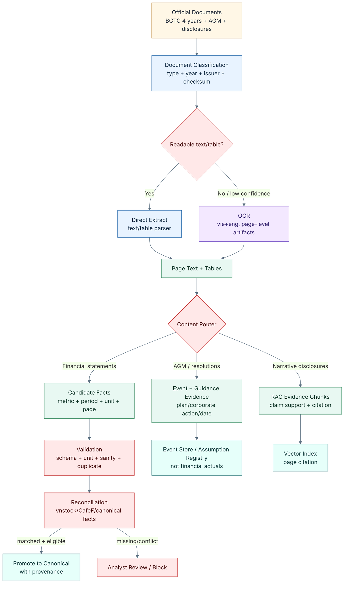

### 8.3 Quy tắc phân luồng sau OCR

| Output sau OCR | Bước xử lý tiếp theo | Điều kiện được dùng trong báo cáo |
|---|---|---|
| Page text theo từng trang | Lưu artifact theo `ticker/year/document_id/page_number`, sau đó chunk/index cho RAG | Được dùng làm citation nếu có metadata nguồn, trang và checksum; không tự động trở thành số tài chính. |
| Dòng bảng BCTC | Map nhãn tiếng Việt sang `metric_id`, parse kỳ báo cáo, chuẩn hóa đơn vị | Chỉ đi tiếp nếu nhận diện được statement type, period, metric và đơn vị hợp lệ. |
| Candidate financial facts | Validate schema, sanity check, duplicate detection, reconciliation với nguồn structured | Chỉ promote khi khớp nguồn phụ trong tolerance hoặc policy cho phép bổ sung gap có provenance rõ ràng. |
| Kế hoạch từ ĐHĐCĐ | Ghi thành management guidance hoặc assumption evidence, ví dụ kế hoạch doanh thu/lợi nhuận/cổ tức | Không được ghi đè actual facts; dùng cho forecast narrative sau khi phân biệt rõ `plan`, `guidance`, `actual`. |
| Nghị quyết/corporate actions | Chuẩn hóa thành sự kiện có ngày hiệu lực, loại sự kiện, giá trị, số cổ phiếu liên quan | Được dùng để điều chỉnh share count, dilution hoặc risk/catalyst khi có trích dẫn nguồn. |
| Nội dung giải trình và rủi ro | Tạo evidence chunks và tag chủ đề như margin, debt, receivables, inventory, litigation, regulatory risk | Được dùng để hỗ trợ luận điểm định tính; không tạo chỉ tiêu định lượng nếu thiếu bảng/số đối chiếu. |
| Conflict report | Ghi mâu thuẫn giữa OCR, API và canonical facts | Block promotion đối với metric trọng yếu; đưa vào analyst review thay vì dùng số im lặng. |

### 8.4 Chuẩn hóa đơn vị

| Trường hợp | Logic |
|---|---|
| VND đầy đủ trong OCR, ví dụ `4.343.720.860.197` | `_parse_ocr_vnd_bn()` chia `1_000_000_000` để ra tỷ VND. |
| Dấu phẩy kiểu triệu VND, ví dụ `4,127,400` | Parse thành triệu rồi chia `1_000` để ra tỷ VND. |
| EPS | `_parse_eps_raw()` giữ VND/cp, không scale thành tỷ. |
| Metric taxonomy | `metric_metadata.validate_and_normalize()` đảm bảo unit phù hợp semantic type; invalid unit bị reject. |
| Analytics engines | `to_analytics_vnd_bn()` chuyển monetary canonical value sang contract tỷ VND cho valuation. |

## 9. Luồng phát hiện dữ liệu thiếu, dữ liệu trùng lặp và nguồn mâu thuẫn

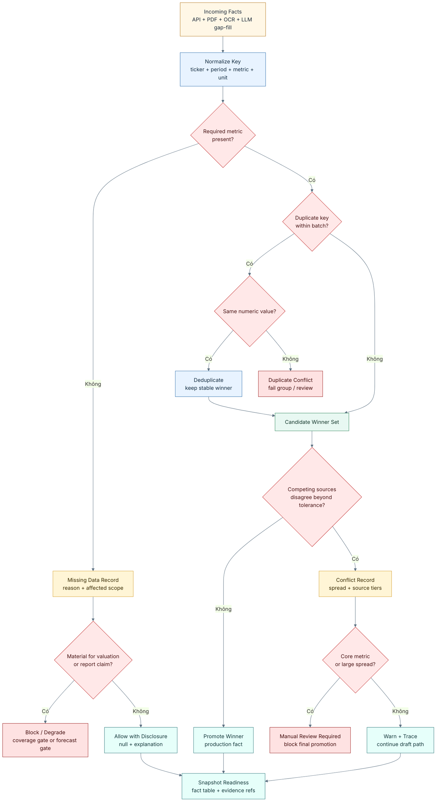

### 9.1 Dữ liệu thiếu

| Lớp | Cách phát hiện | Hành động |
|---|---|---|
| Ingestion theo năm | `YearResult.ingest_status`: `SOURCE_MISSING`, `CAFEF_EMPTY`, `EXTRACTION_FAILED_SCANNED_PDF`, `LOW_CONFIDENCE` | Ghi report/artifact, pipeline có thể tiếp tục với fallback nhưng gate sẽ phản ánh. |
| Fact coverage | `build_fy_validation_report()` yêu cầu tối thiểu 3 FY và core keys: revenue, net income, total assets, equity, OCF | `coverage_gate` hoặc `core_keys_gate` fail. |
| Source tier | `check_source_tier_coverage()` kiểm mỗi FY có Tier 0/1 hay không | Nhiều kỳ thiếu Tier 0/1 có thể block trend/valuation readiness. |
| Snapshot | `read_snapshot_tool()` fail nếu `snapshot_id_missing` hoặc snapshot đọc lỗi | Stage `ANALYZE` dừng. |
| Forecast | `forecast_quality_gate`, `balance_sheet_identity_gate` | Không đủ debt/capex/NWC hoặc balance sheet không cân bằng thì gate fail/warn. |

### 9.2 Dữ liệu trùng lặp

| Lớp | Logic |
|---|---|
| vnstock raw facts | `_resolve_fact_collisions()` nhóm cùng ticker/year/period/metric/source, giữ giá trị có `abs(value)` lớn nhất để tránh placeholder `0`. |
| PDF rows | `_validate_pdf_rows()` và `_sanitize_extracted_csv_for_year()` dedup theo period/statement/metric/extraction method. |
| OCR candidate facts | `_apply_duplicate_detection()` nhóm `(ticker, fiscal_year, period_type, statement_type, metric_id)`: cùng giá trị thì giữ first, khác giá trị thì fail cả nhóm. |
| Promotion OCR | `promote_candidate_facts()` block duplicate `(metric_id, period_key)` trong batch. |
| DB observations | `insert_observations()` dùng upsert/dedup theo contract observation. |

### 9.3 Nguồn mâu thuẫn

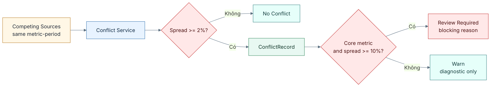

Trong reconciliation chính thức giữa API và official document, `financial_fact_reconciler.reconcile_one()` dùng tolerance 0.5%. Nếu khác quá ngưỡng, status là `manual_review_required` và không promote tự động.

## 10. Luồng riêng của OCR: lấy từ đâu, lấy gì, rồi đi đâu

OCR trong hệ thống không phải là một bước “đọc PDF cho có chữ” đơn giản. Nó là một nhánh ingestion riêng dành cho tài liệu chính thức bị scan, bảng trong PDF không có text layer, hoặc file có text nhưng parser bảng không nhận ra được đủ chỉ tiêu tài chính. Mục tiêu của OCR là biến ảnh trang PDF thành dữ liệu có provenance đủ mạnh để hỗ trợ ba việc: bổ sung fact còn thiếu, tạo evidence/citation theo trang, và phát hiện trường hợp cần analyst review.

### 10.1 OCR lấy dữ liệu từ những đâu

| Nguồn OCR | Đường dẫn/file | Code liên quan | Khi nào dùng |
|---|---|---|---|
| PDF báo cáo tài chính/báo cáo thường niên chính thức đã staging | `data/official_documents/<TICKER>/<YEAR>/source_document.pdf` | `scripts/auto_ingest_official_documents.py`, `backend.documents.pdf_extractor` | Khi PDF có trang scan hoặc `pdfplumber` không lấy được text/table đủ tin cậy. |
| PDF chính thức đã download qua discovery | `data/official_documents/<TICKER>/<YEAR>/metadata.json` + `source_document.pdf` | `official_document_discovery`, `_fetch_pdf()` | Khi hệ thống tự tìm tài liệu từ nguồn IR/HOSE/HNX/SSC/CafeF-linked. |
| OCR artifacts đã chạy trước đó | `storage/sources/ocr_artifacts/<TICKER>/<YEAR>/<DOCUMENT_ID>/pages/page_*.txt` | `scripts/extract_facts_from_ocr.py`, `scripts/build_index.py` | Khi cần tái xử lý page text, map lại fact, hoặc index RAG mà không OCR lại PDF. |
| OCR cache cho LLM ingestion | `storage/sources/llm_ocr/<TICKER>/<YEAR>/` | `scripts/ingest_pdf_llm.py`, `scripts/pdf_pages.py` | Khi LLM fact/evidence extractor cần text từ PDF scan nhưng muốn cache để tránh chạy OCR lặp. |
| Nguồn đối chiếu phụ | CafeF rows, vnstock/canonical production facts, raw local BCTC cache | `_build_secondary_source_from_cafef()`, `_build_secondary_source_from_db()` | Không phải input OCR trực tiếp; dùng để reconciliation sau khi OCR trích số. |

### 10.2 OCR cố lấy ra những dữ liệu gì

| Nhóm dữ liệu cần lấy | Ví dụ metric/field | Mục đích |
|---|---|---|
| Text từng trang | Nội dung `page_001.txt`, `page_002.txt` | Làm citation theo trang, phục vụ RAG, giúp analyst kiểm lại nguồn gốc. |
| Dòng bảng tài chính thô | `raw_label`, `raw_value`, `page_number`, `statement_type` | Giữ dấu vết từ nhãn tiếng Việt và số gốc trước khi normalize. |
| Fact ứng viên (CandidateFact) | `metric_id`, `normalized_value`, `unit`, `confidence`, `document_id` | Staging fact; chưa được phép dùng trực tiếp cho valuation. |
| Chỉ tiêu lõi cho valuation | `revenue.net`, `net_income.parent`, `total_assets`, `equity`, `operating_cash_flow.total`, `capex.total`, debt/cash/share metrics | Lấp gap dữ liệu, kiểm balance sheet/cash flow, hỗ trợ forecast và valuation. |
| Metadata nguồn | `ocr_run_id`, `document_id`, checksum, `ocr_lang`, page, extraction method | Đảm bảo reproducibility và truy được từ claim về trang tài liệu. |
| Báo cáo đối chiếu | `ocr_vs_structured.json`, status `matched/conflicted/missing_secondary_source` | Quyết định fact có thể promote, cần review, hay bị block. |

### 10.3 Luồng OCR chi tiết

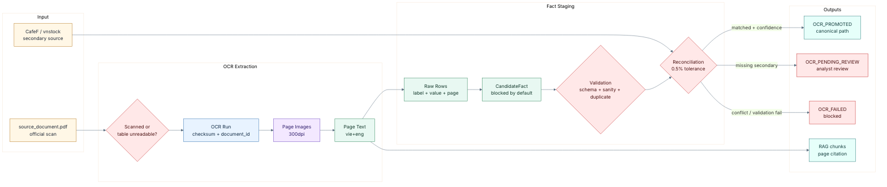

### 10.4 Sau OCR thì dữ liệu đi đâu

| Output OCR | Đường đi tiếp theo | Kết quả trong hệ thống |
|---|---|---|
| Page text | `build_index.py` đọc `storage/sources/ocr_artifacts/.../pages` | Mỗi trang thành một `ingest.document_chunks` với `extraction_method="ocr"`, `page_number`, `document_id`, `source_tier=1`. |
| Candidate rows/facts | `ocr_candidate_facts.py`, `ocr_validation.py` | Fact vẫn ở staging; mặc định `promotion_status="blocked"`. |
| Validation results | `validate_candidate_facts()` | Fact fail schema/period/sanity/duplicate bị loại khỏi reconciliation/promotion. |
| Reconciliation report | `data/reconciliation/<TICKER>/<YEAR>/ocr_vs_structured.json` | Cho biết OCR khớp, mâu thuẫn, hay thiếu nguồn phụ; là artifact audit cho analyst. |
| Promoted OCR facts | `fact_promotion` hoặc ingestion official flow | Chỉ fact đủ điều kiện mới đi vào canonical/production facts hoặc golden supplement có provenance. |
| Auto-ingest summary | `artifacts/official_sources/<TICKER>_auto_ingest_result.json` và `.md` | UI/evaluation biết năm nào `OCR_PROMOTED`, `OCR_PENDING_REVIEW`, hoặc `OCR_FAILED`. |
| RAG chunks | `ingest.document_chunks` + optional embeddings | Report/citation có thể trích trang scan dù số cuối cùng chưa được promote. |

### 10.5 Quy tắc chặn rủi ro của OCR

| Rủi ro OCR | Cơ chế kiểm soát |
|---|---|
| OCR đọc nhầm số do dấu chấm/phẩy Việt Nam | Parser riêng `_parse_ocr_vnd_bn()` xử lý full VND dot-thousands và chuyển về tỷ VND. |
| Nhầm dòng mã số báo cáo thành giá trị tài chính | Parser lọc các mã dòng nhỏ/suspicious và cần metric mapping hợp lệ. |
| Nhầm tax expense với net income hoặc bảng bị lệch dòng | `ocr_validation.py` có financial sanity checks và fail nếu tax gần bằng net income trong ngữ cảnh bất thường. |
| Cùng metric có nhiều số khác nhau trong một batch | Duplicate detection fail toàn bộ nhóm nếu giá trị mâu thuẫn. |
| OCR fact chưa có nguồn phụ để đối chiếu | Critical metrics không được auto-promote nếu `missing_secondary_source`; chuyển review thay vì âm thầm dùng. |
| OCR làm hỏng dữ liệu cấu trúc tốt | Thiết kế additive/gated: OCR chỉ bổ sung hoặc làm evidence; không tự động overwrite fact production đã đáng tin. |

Tóm lại, OCR là đường cứu dữ liệu cho tài liệu scan và là nguồn evidence theo trang, nhưng không phải “nguồn số cuối cùng” ngay lập tức. Số OCR muốn đi vào valuation phải qua staging, validation, reconciliation, confidence gate và promotion; còn text OCR có thể đi vào RAG để hỗ trợ citation, audit và review.

## 11. Luồng riêng của multiagents

### 11.1 Sáu vai trò runtime cố định

Không phải mọi vai trò dưới đây đều là agent LLM thật sự. Một số stage đang chạy như service tất định hoặc tool wrapper, dù config/prompt lịch sử có tên `...Agent`. Bảng này dùng tên ngắn theo đúng bản chất runtime để tránh hiểu nhầm.

| Tên ngắn | Bản chất | Stage chính | Input | Output | Ranh giới an toàn |
|---|---|---|---|---|---|
| `PlanService` | Service tất định | `PLAN` | Objective, ticker, scope | `research_plan` | Không gọi LLM trong code hiện tại; chỉ tạo template plan cố định. |
| `DataService` | Tool/service ingestion | `INGEST_AND_VALIDATE` | Source config, year range, OCR flag | `auto_ingest`, `facts_snapshot`, `index` | Không tự xác nhận Tier 3-only là verified; gate dữ liệu quyết định readiness. |
| `FinanceAgent` | Agent diễn giải có schema | `ANALYZE` | Snapshot, ratios, research pack | Financial analysis narrative | Không tính ratio cuối bằng prose; chỉ diễn giải artifact đã tính. |
| `ValuationService` | Service tính toán tất định | `FORECAST_AND_VALUE` | Snapshot, forecast drivers, valuation input pack | `forecast.json`, `valuation.json`, formula traces | Không vá debt/capex/share count bằng lời; thiếu dữ liệu phải thành warning/gate. |
| `ReportAgent` | Agent tổng hợp báo cáo | `WRITE_REPORT` | Approved artifacts, evidence refs, valuation outputs | Report draft, claims | Không tạo claim ngoài evidence/artifact đã cấp. |
| `ReviewAgent` | Agent phản biện + quality tool | `REVIEW` | Draft, valuation, citation map, quality result | Critic review, findings | Không approve khi deterministic gate fail; chỉ nêu vấn đề và readiness. |

### 11.2 Agent context và lifecycle

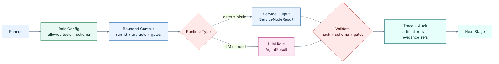

### 11.3 Cơ chế evidence follow-up

Agent có thể trả `evidence_request`. Runner chỉ cho mỗi agent một follow-up chính thức; nếu tiếp tục yêu cầu thêm, request được ghi vào `insufficient_evidence` thay vì làm pipeline lặp vô hạn. Đây là cách hệ thống giảm rủi ro agentic loop không hội tụ.

## Khuyến nghị chiến lược (Strategic Recommendations)

| Ưu tiên | Khuyến nghị | Lý do |
|---|---|---|
| Correctness | Giữ nguyên nguyên tắc “valuation bằng code, agent chỉ diễn giải”. | Đây là lớp bảo vệ quan trọng nhất chống hallucination số liệu. |
| Reproducibility | Khi debug report, bắt đầu từ `run_id`, `manifest.json`, `facts_snapshot.json`, `forecast.json`, `valuation.json`. | Mọi stage đều có artifact và checksum; debug theo artifact nhanh hơn debug theo prose. |
| Data quality | Khi có mâu thuẫn số liệu, đọc `source_conflicts`, `fact_reconciliation`, OCR validation/reconciliation artifacts trước khi sửa forecast. | Sai số thường phát sinh từ source mapping/unit, không phải từ valuation engine. |
| RAG quality | Sau khi `build_index.py` thay đổi chunk, chạy embedding backfill trước khi đánh giá retrieval. | Chunk đổi sẽ reset embedding; retrieval có thể fallback full-text nếu chưa backfill. |
| Product flow | Tách rõ “full research run” và “fast render”. | Full run tốn chi phí/latency cao; fast render chỉ dùng artifact đã có và phù hợp cho cập nhật UI/report. |
