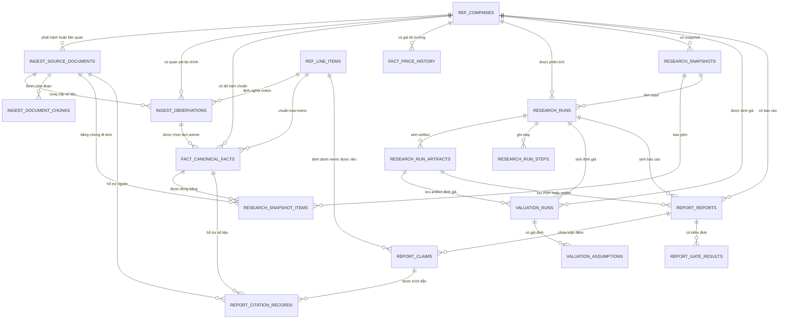
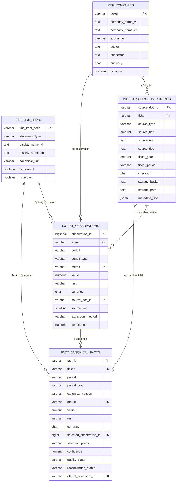
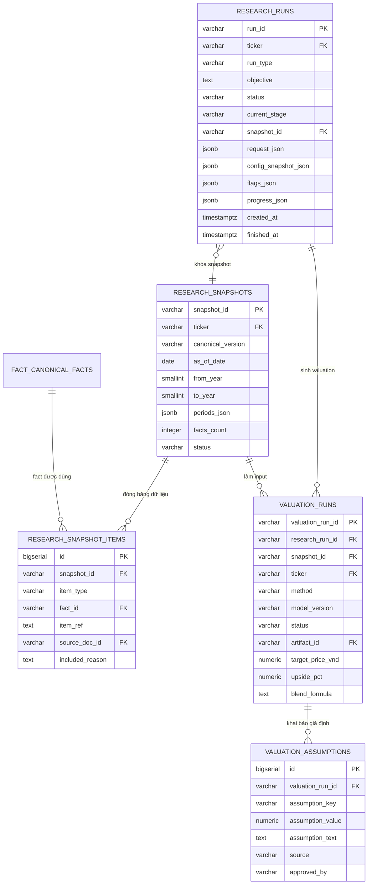
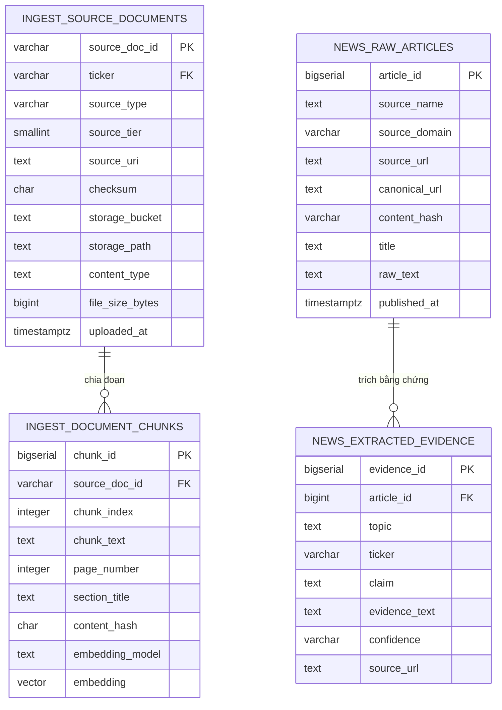
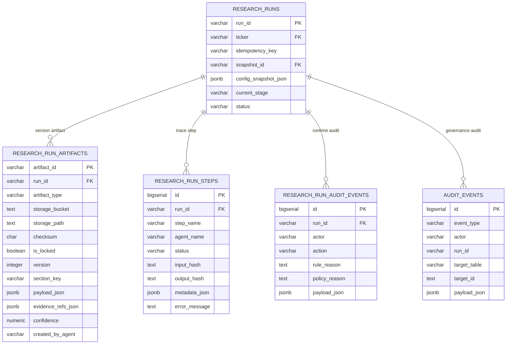
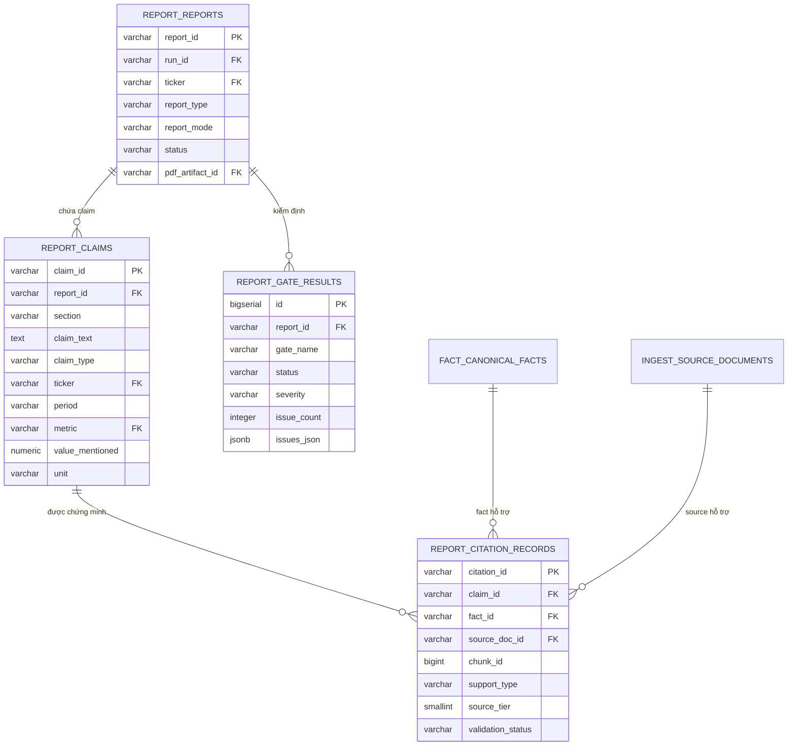
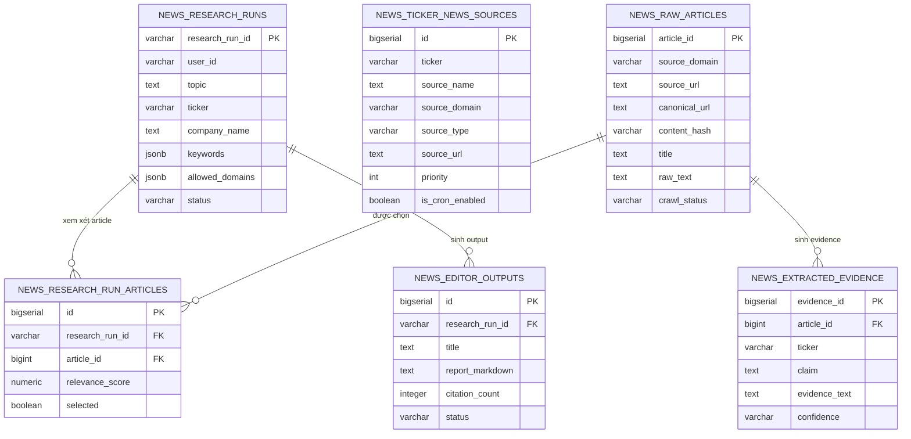
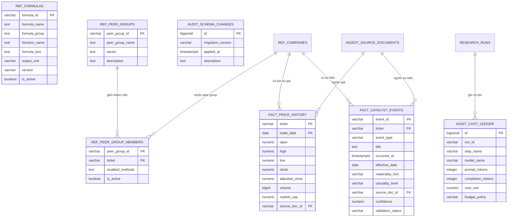

# Sơ đồ ER và kiến trúc dữ liệu Supabase

Cập nhật: 2026-06-15

## Context

Tài liệu này mô tả mô hình dữ liệu hiện tại trên Supabase PostgreSQL và Supabase Storage để phục vụ mục 3.3 của đồ án: thiết kế kiến trúc dữ liệu và lưu trữ. Trọng tâm là các schema đang dùng sau canonical cutover: `ref`, `ingest`, `fact`, `research`, `valuation`, `report`, `audit` và `news`. Các schema cũ đã được migrate hoặc dọn dẹp không được xem là nguồn thiết kế chính.

Supabase Storage không phải một schema quan hệ, nhưng được đưa vào sơ đồ như lớp lưu trữ object vì các bảng `ingest.source_documents` và `research.run_artifacts` chỉ lưu metadata, checksum và đường dẫn object (`storage_bucket`, `storage_path`). Thiết kế này tách rõ dữ liệu có cấu trúc trong PostgreSQL khỏi file gốc, artifact phân tích và PDF đầu ra.

## Problem Statement

Đồ án cần trình bày mô hình dữ liệu không chỉ như danh sách bảng, mà như một kiến trúc có khả năng tái lập kết quả: tài liệu nguồn tạo observation, observation được chọn thành canonical fact, canonical fact được đóng băng vào snapshot, snapshot đi vào valuation/report, claim trong report trỏ ngược về fact và source document, còn mọi artifact được gắn với `run_id`.

| Yêu cầu đồ án | Cách tài liệu này đáp ứng |
|---|---|
| 3.3.1. Mô hình dữ liệu tài chính chuẩn hóa | Mô tả `ref`, `ingest`, `fact` và quan hệ observation -> canonical fact |
| 3.3.2. Thiết kế cơ sở dữ liệu phục vụ phân tích tài chính | Mô tả `research`, `valuation`, `report` và luồng từ run đến định giá/báo cáo |
| 3.3.3. Thiết kế kho tài liệu và chỉ mục truy xuất bằng chứng | Mô tả `source_documents`, `document_chunks`, pgvector và Storage bucket `sources` |
| 3.3.4. Quản lý phiên bản dữ liệu và kết quả phân tích | Mô tả `canonical_version`, `snapshot_id`, `run_id`, `artifact_id`, checksum và manifest |
| 3.3.5. Khả năng truy vết nguồn dữ liệu và tái lập kết quả | Mô tả chuỗi citation: report claim -> canonical fact -> observation -> source document -> storage object |

## Technical Deep-Dive

### 1. Bản đồ schema hiện tại

| Schema | Vai trò | Bảng chính |
|---|---|---|
| `ref` | Dữ liệu tham chiếu ổn định | `companies`, `line_items`, `formulas`, `peer_groups`, `peer_group_members` |
| `ingest` | Đăng ký nguồn, quan sát thô, chunk tài liệu | `source_documents`, `observations`, `document_chunks`, `connector_runs` |
| `fact` | Dữ kiện chuẩn và dữ liệu thị trường | `canonical_facts`, `price_history`, `catalyst_events`, view `production_facts` |
| `research` | Runtime nghiên cứu, snapshot, artifact | `runs`, `snapshots`, `snapshot_items`, `run_artifacts`, `run_steps`, `run_audit_events`, `run_approvals` |
| `valuation` | Kết quả định giá và giả định được khai báo | `runs`, `assumptions` |
| `report` | Báo cáo, luận điểm, trích dẫn, kiểm định | `reports`, `claims`, `citation_records`, `gate_results`, `approval_records` |
| `audit` | Nhật ký quản trị và chi phí | `events`, `cost_ledger`, `schema_changes` |
| `news` | Bằng chứng tin tức whitelist | `research_runs`, `raw_articles`, `extracted_evidence`, `research_run_articles`, `editor_outputs`, `ticker_news_sources` |

### 2. ER tổng quan toàn hệ thống



### 3. Mô hình dữ liệu tài chính chuẩn hóa



Mô hình này dùng `ingest.observations` làm vùng candidate facts và `fact.canonical_facts` làm nguồn sự thật tài chính chuẩn hóa. Một chỉ tiêu tài chính không được ghi trực tiếp từ báo cáo vào bảng canonical; nó phải đi qua observation, có source tier, phương pháp trích xuất, confidence và chính sách chọn winner. Khi dữ liệu không tồn tại hoặc không đủ căn cứ, pipeline nghiệp vụ ghi `null` ở artifact/bản giải trình thay vì bịa một row trong `canonical_facts`.

### 4. Thiết kế cơ sở dữ liệu phục vụ phân tích tài chính



Điểm thiết kế cốt lõi là `snapshot_id`. Hệ thống không định giá trực tiếp trên dữ liệu sống; một lần chạy nghiên cứu phải khóa snapshot, sau đó định giá và báo cáo đều dùng cùng snapshot. Điều này làm cho kết quả có thể tái lập, vì cùng `run_id` có thể truy lại cấu hình, snapshot, facts, giả định định giá và artifact.

### 5. Thiết kế kho tài liệu và chỉ mục truy xuất bằng chứng



`ingest.document_chunks` là lớp truy xuất bằng chứng cho tài liệu chính thức, có `embedding vector(1536)` và chỉ mục HNSW phục vụ tìm kiếm ngữ nghĩa. `news.extracted_evidence` là lớp bằng chứng tin tức đã whitelist, tách khỏi fact tài chính để tránh trộn dữ kiện định lượng kiểm toán với tín hiệu tin tức.

| Bucket Supabase Storage | Bảng metadata trỏ tới | Nội dung | Quy tắc chính |
|---|---|---|---|
| `sources` | `ingest.source_documents` | PDF báo cáo tài chính, báo cáo thường niên, disclosure, tài liệu IR | PostgreSQL lưu checksum và object key, không lưu binary |
| `runs` | `research.run_artifacts` | Snapshot, valuation JSON, evidence pack, manifest, model báo cáo, PDF giải trình | Mọi object phải gắn `run_id` |
| `exports` | Artifact xuất bản client-facing | PDF chính thức hoặc bản xuất được chia sẻ | Dùng signed URL khi cần phân phối |
| `archive` | Không phải nguồn production chính | Debug, legacy, failed runs | Chỉ phục vụ điều tra và lưu trữ |

### 6. Quản lý phiên bản dữ liệu và kết quả phân tích



Quản lý phiên bản được thực hiện ở ba tầng. Tầng dữ liệu dùng `canonical_version` trong `fact.canonical_facts` và `research.snapshots`. Tầng runtime dùng `run_id`, `idempotency_key`, `config_snapshot_json` và `snapshot_id`. Tầng artifact dùng `artifact_id`, `artifact_type`, `version`, `checksum`, `is_locked`, `storage_bucket` và `storage_path`.

### 7. Khả năng truy vết nguồn dữ liệu và tái lập kết quả



Chuỗi truy vết chuẩn:

```text
report.reports.report_id
-> report.claims.claim_id
-> report.citation_records.fact_id
-> fact.canonical_facts.selected_observation_id
-> ingest.observations.source_doc_id
-> ingest.source_documents.storage_bucket + storage_path
```

Với định giá, chuỗi tái lập tương ứng là:

```text
research.runs.run_id
-> research.runs.snapshot_id
-> research.snapshot_items.fact_id
-> valuation.runs.valuation_run_id
-> valuation.assumptions
-> research.run_artifacts.artifact_id
```

Hai chuỗi này cho phép người đọc kiểm tra lại một con số trong báo cáo từ PDF, claim, canonical fact, observation, tài liệu nguồn, cho đến object gốc trong Supabase Storage. Nếu một dữ kiện không có trong nguồn hợp lệ, hệ thống không tạo fact giả; kết quả nghiệp vụ tương ứng được ghi `null` trong artifact/bản giải trình và được đưa vào cảnh báo chất lượng.

### 8. Schema tin tức và bằng chứng bổ trợ



Schema `news` không thay thế `fact`. Nó chỉ cung cấp evidence bổ trợ cho catalyst, bối cảnh ngành và sự kiện doanh nghiệp. Ràng buộc whitelist ở `news.raw_articles.source_domain` giúp giảm rủi ro lấy tin từ nguồn không được phép.

### 9. Schema tham chiếu, dữ liệu thị trường và audit



`ref.formulas` là registry công thức, không phải nơi lưu kết quả tính toán. `ref.peer_groups` và `ref.peer_group_members` hỗ trợ định giá so sánh bằng bội số. `fact.price_history` lưu dữ liệu thị trường theo ngày; `fact.catalyst_events` lưu sự kiện có khả năng ảnh hưởng đến luận điểm đầu tư. `audit.cost_ledger` và `audit.schema_changes` phục vụ governance, kiểm soát chi phí và chứng minh lịch sử thay đổi schema.

## Strategic Recommendations

| Mục đồ án | Sơ đồ nên dùng | Luận điểm cần nhấn mạnh |
|---|---|---|
| 3.3.1 | Mô hình dữ liệu tài chính chuẩn hóa | Observation là vùng ứng viên; canonical fact là nguồn chuẩn; không có dữ liệu thì không sinh fact giả |
| 3.3.2 | Thiết kế cơ sở dữ liệu phục vụ phân tích tài chính | `run_id` và `snapshot_id` là trục tái lập phân tích |
| 3.3.3 | Thiết kế kho tài liệu và chỉ mục truy xuất bằng chứng | PostgreSQL lưu metadata/chunk/vector; Storage lưu binary/artifact |
| 3.3.4 | Quản lý phiên bản dữ liệu và kết quả phân tích | `canonical_version`, `snapshot_id`, `artifact_id`, checksum và `version` kiểm soát drift |
| 3.3.5 | Khả năng truy vết nguồn dữ liệu và tái lập kết quả | Claim trong báo cáo truy ngược được tới fact, observation, source document và object gốc |

Kết luận: thiết kế dữ liệu của dự án không phải một kho JSON rời rạc, mà là một data lineage graph có khóa chính ổn định, khóa ngoại rõ ràng, object-key contract và cơ chế snapshot theo `run_id`. Cấu trúc này phục vụ trực tiếp ba mục tiêu: định giá có thể tái lập, báo cáo có thể kiểm chứng và thiếu sót dữ liệu được giải trình minh bạch thay vì bị che bằng giả định ngầm.
