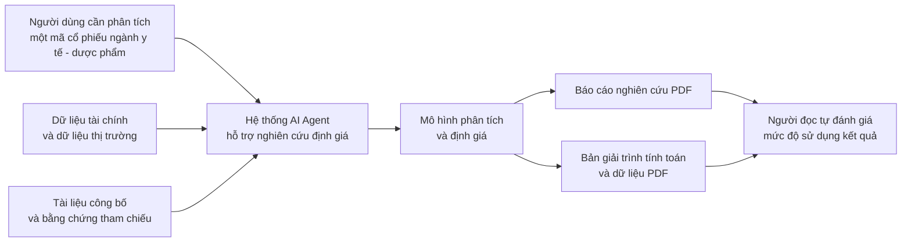
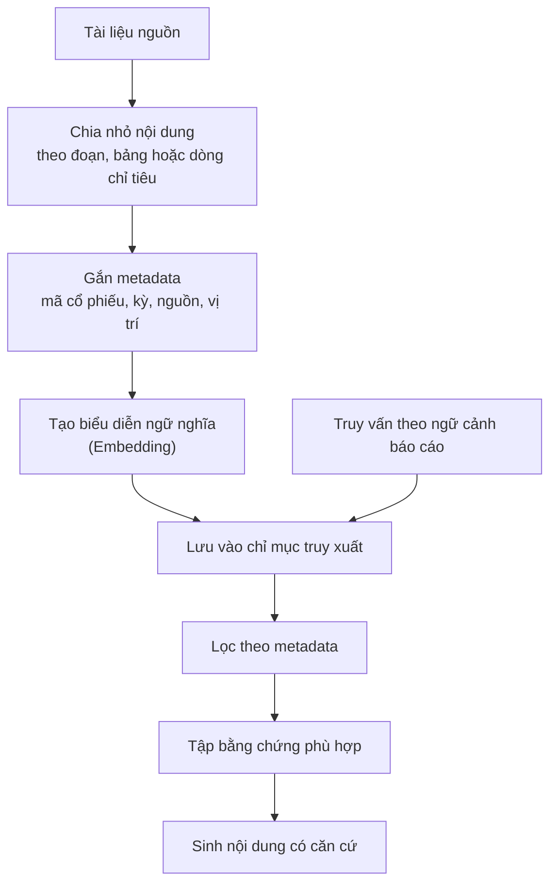
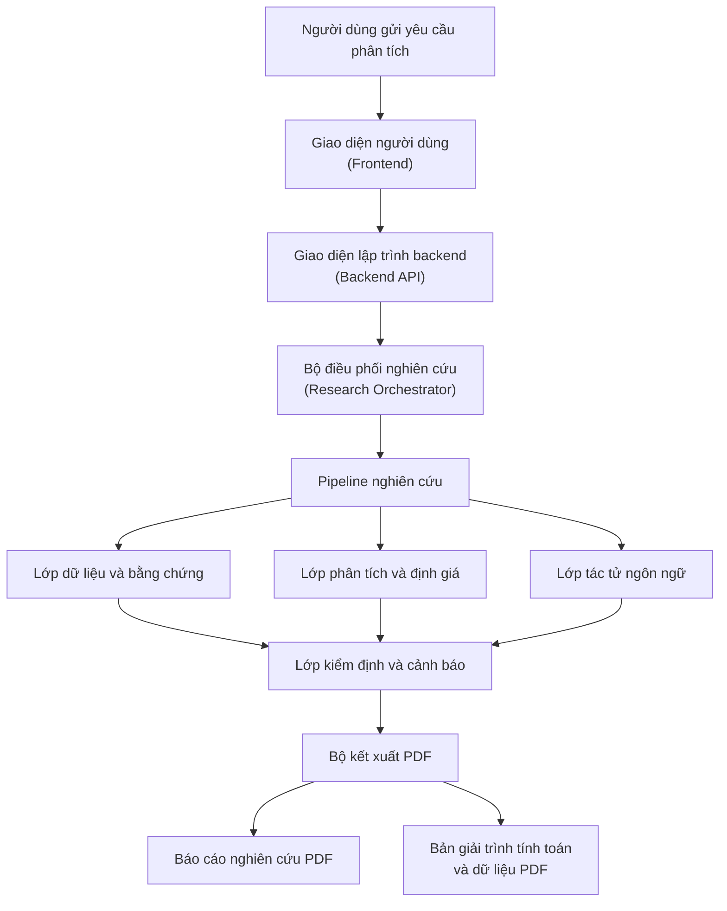
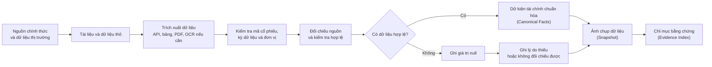
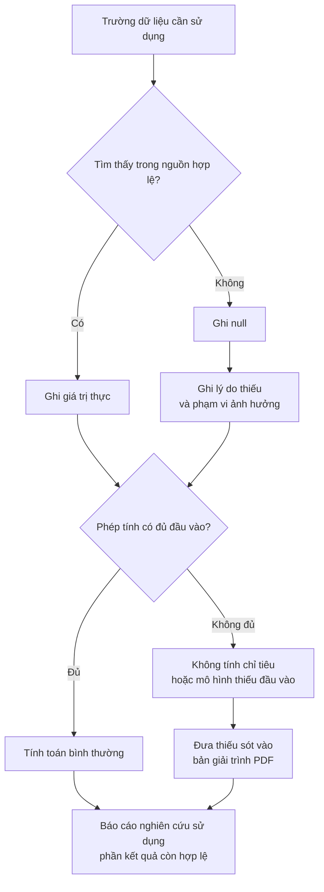
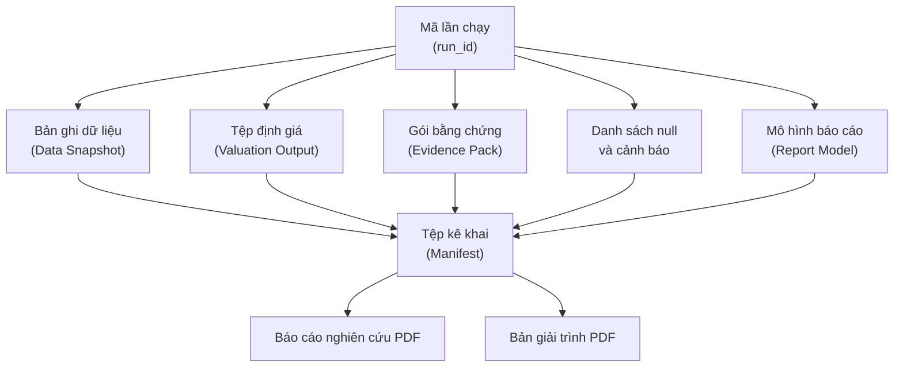
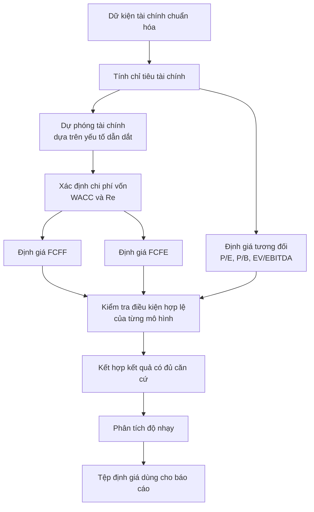
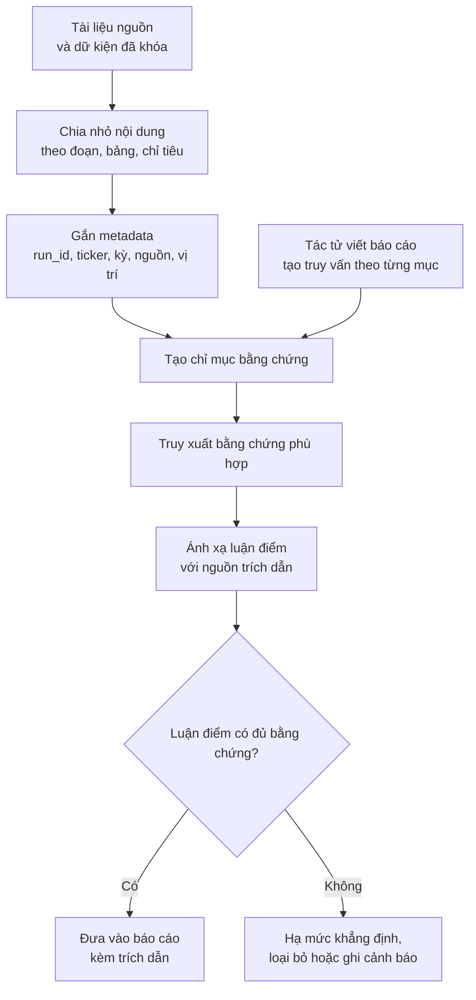
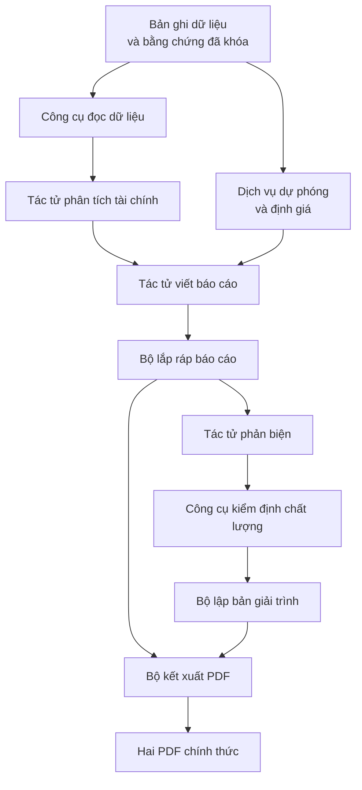
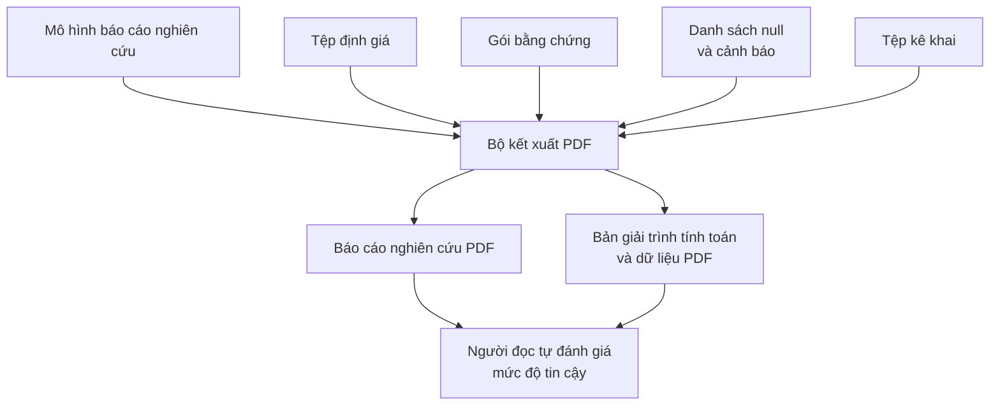

# SEQUENCE.md — Luồng tuần tự và danh mục hình/bảng sử dụng trong đồ án

Cập nhật: 2026-06-15  
Phạm vi: Hệ thống AI Agent hỗ trợ định giá cổ phiếu ngành y tế – dược phẩm tại Việt Nam

---

## 1. Context

Tài liệu này mô tả các luồng chính của hệ thống từ thời điểm người dùng gửi yêu cầu phân tích một mã cổ phiếu đến khi hệ thống tạo ra hai đầu ra chính thức:

| Đầu ra | Mục đích |
|---|---|
| Báo cáo nghiên cứu PDF | Trình bày tổng quan doanh nghiệp, phân tích tài chính, kết quả định giá, luận điểm đầu tư, rủi ro và khuyến nghị trên phần dữ liệu có căn cứ |
| Bản giải trình tính toán và dữ liệu PDF | Trình bày nguồn dữ liệu, công thức, giả định được khai báo, dữ liệu thiếu, giá trị `null`, phép tính không thực hiện được, cảnh báo kiểm định và giới hạn sử dụng |

Trong hệ thống này, HTML nếu xuất hiện chỉ là lớp trung gian kỹ thuật phục vụ kết xuất PDF, không phải đầu ra nghiệp vụ cuối cùng. Hệ thống cũng không thiết kế theo hướng tạo một bản nháp để người dùng chỉnh sửa trong luồng chính, mà mỗi lần chạy hợp lệ về mặt kỹ thuật sẽ tạo ra hai PDF chính thức: báo cáo nghiên cứu và bản giải trình. Nếu thiếu dữ liệu nghiệp vụ, hệ thống không tự nội suy, không lấy trung bình ngành để thay thế, không để mô hình ngôn ngữ lớn tự suy đoán, mà ghi giá trị `null`, loại khỏi phép tính không đủ đầu vào và giải thích rõ trong bản giải trình.

---

## 2. Problem Statement

Các sơ đồ của đồ án cần thể hiện đúng bản chất hệ thống: đây không phải là một chatbot tài chính tự do, cũng không phải một pipeline để LLM tự đọc dữ liệu rồi tự viết báo cáo. Hệ thống được thiết kế như một quy trình phân tích có kiểm soát, trong đó dữ liệu, tính toán, bằng chứng, diễn giải và kiểm định được tách thành các lớp rõ ràng.

Các điểm cần nhấn mạnh khi vẽ sơ đồ:

| Vấn đề cần thể hiện | Cách trình bày trong sơ đồ |
|---|---|
| Dữ liệu thô không đi thẳng vào báo cáo | Luồng dữ liệu phải đi qua thu thập, kiểm tra, chuẩn hóa, tạo snapshot và chỉ mục bằng chứng |
| Thiếu dữ liệu không làm hệ thống bịa số | Có luồng riêng cho dữ liệu thiếu: ghi `null`, ghi lý do thiếu, không tính chỉ tiêu không đủ đầu vào |
| LLM không tự tính định giá | Các mô hình FCFF, FCFE, định giá tương đối và độ nhạy được đặt trong lớp dịch vụ tất định |
| AI Agent không được tự do quyết định toàn bộ luồng | Có bộ điều phối nghiên cứu kiểm soát thứ tự xử lý, dữ liệu được phép dùng và công cụ được phép gọi |
| Kiểm định không phải phê duyệt thủ công | Cổng kiểm định ghi nhận cảnh báo, lỗi, thiếu sót và giới hạn; báo cáo vẫn được xuất nếu không có lỗi kỹ thuật chặn kết xuất |
| Đầu ra gồm hai PDF chính thức | Sơ đồ cuối phải thể hiện rõ báo cáo nghiên cứu PDF và bản giải trình tính toán – dữ liệu PDF |

---

## 3. Danh mục hình, bảng và biểu đồ quan trọng dùng trong đồ án

Danh mục dưới đây chỉ giữ các mục quan trọng nhất, tránh làm đồ án bị quá tải bởi bảng/sơ đồ phụ. Các tên hình và bảng có thể paste trực tiếp vào danh mục hình, danh mục bảng hoặc phần mô tả từng chương.

| Chương | Loại | Tên đề xuất | Mục đích sử dụng |
|---|---|---|---|
| Chương 1 | Sơ đồ | Hình 1.1. Tổng quan bài toán và phạm vi hệ thống | Giúp người đọc hiểu bài toán từ yêu cầu định giá cổ phiếu đến hai đầu ra có kiểm chứng |
| Chương 2 | Bảng | Bảng 2.1. So sánh các phương pháp định giá cổ phiếu | Làm rõ vai trò của FCFF, FCFE và định giá tương đối |
| Chương 2 | Bảng | Bảng 2.2. Rủi ro của LLM/AI Agent trong phân tích tài chính và cơ chế kiểm soát | Làm nền lý thuyết cho thiết kế hệ thống có kiểm chứng |
| Chương 2 | Sơ đồ | Hình 2.1. Luồng RAG phục vụ truy xuất bằng chứng | Trình bày nguyên lý truy xuất tăng cường sinh nội dung ở mức khái quát |
| Chương 3 | Sơ đồ | Hình 3.1. Quy trình tổng thể từ yêu cầu phân tích đến hai PDF chính thức | Sơ đồ trung tâm của toàn bộ hệ thống |
| Chương 3 | Sơ đồ | Hình 3.2. Luồng thu thập, chuẩn hóa dữ liệu và tạo chỉ mục bằng chứng | Chứng minh dữ liệu được kiểm soát trước khi dùng cho phân tích |
| Chương 3 | Sơ đồ | Hình 3.3. Luồng xử lý dữ liệu thiếu và ghi nhận giá trị null | Chứng minh hệ thống không tự giả định hoặc nội suy dữ liệu thiếu |
| Chương 3 | Sơ đồ | Hình 3.4. Luồng lưu trữ, phiên bản và truy vết theo run_id | Chứng minh báo cáo có thể truy vết về snapshot, dữ liệu, định giá và bằng chứng |
| Chương 3 | Bảng | Bảng 3.1. Cấu trúc dữ kiện tài chính chuẩn hóa | Trình bày schema lõi của dữ liệu tài chính sau chuẩn hóa |
| Chương 3 | Sơ đồ | Hình 3.5. Luồng thuật toán phân tích tài chính và định giá | Chứng minh các phép tính tài chính được thực hiện bằng dịch vụ tất định |
| Chương 3 | Bảng | Bảng 3.2. Các mô hình định giá, đầu vào và điều kiện hợp lệ | Tóm tắt FCFF, FCFE, định giá tương đối, độ nhạy và điều kiện sử dụng |
| Chương 3 | Sơ đồ | Hình 3.6. Quy trình truy xuất bằng chứng và gắn trích dẫn cho báo cáo | Chứng minh luận điểm trong báo cáo phải gắn với bằng chứng |
| Chương 3 | Sơ đồ | Hình 3.7. Luồng tác tử, dịch vụ và công cụ | Phân biệt tác tử LLM với dịch vụ tất định và công cụ kiểm định |
| Chương 3 | Bảng | Bảng 3.3. Vai trò, đầu vào và đầu ra của các tác tử | Làm rõ chức năng của từng tác tử trong pipeline |
| Chương 3 | Bảng | Bảng 3.4. So sánh framework agent chuyên dụng và bộ điều phối tự xây dựng | Bảo vệ quyết định không dùng LangChain/LangGraph làm lõi điều phối |
| Chương 3 | Sơ đồ | Hình 3.8. Luồng kết xuất báo cáo nghiên cứu và bản giải trình | Làm rõ hai PDF chính thức và quan hệ với cùng một run_id |
| Chương 4 | Bảng | Bảng 4.1. Kết quả kiểm thử dữ liệu và mức độ đầy đủ dữ liệu | Chứng minh hệ thống đã được kiểm thử trên dữ liệu thực tế |
| Chương 4 | Bảng | Bảng 4.2. Kết quả định giá theo từng phương pháp | Trình bày kết quả FCFF, FCFE, P/E, P/B, EV/EBITDA và giá trị hợp lý kết hợp |
| Chương 4 | Bảng | Bảng 4.3. Ma trận độ nhạy định giá | Trình bày độ nhạy của giá trị hợp lý theo tỷ suất chiết khấu và tăng trưởng dài hạn |
| Chương 4 | Biểu đồ | Biểu đồ 4.1. So sánh giá trị hợp lý và giá thị trường | Trực quan hóa upside/downside của kết quả định giá |
| Chương 4 | Bảng | Bảng 4.4. Kết quả kiểm định và cảnh báo chất lượng báo cáo | Trình bày kết quả kiểm tra dữ liệu, công thức, trích dẫn, tái lập và gói xuất bản |
| Chương 5 | Bảng | Bảng 5.1. Tổng hợp mục tiêu, kết quả đạt được và hạn chế | Đối chiếu mục tiêu ban đầu với kết quả thực hiện và hướng phát triển |

---

## 4. Hình 1.1. Tổng quan bài toán và phạm vi hệ thống

**Ý nghĩa:** Hình này đặt phạm vi của đề tài ở mức tổng quan. Hệ thống không thay thế chuyên gia đầu tư và không tự động đưa ra quyết định đầu tư cuối cùng, mà hỗ trợ tạo báo cáo nghiên cứu có dữ liệu, bằng chứng và bản giải trình đi kèm.

---

## 5. Hình 2.1. Luồng RAG phục vụ truy xuất bằng chứng

**Ý nghĩa:** Hình này trình bày nguyên lý RAG ở Chương 2. Khi sang Chương 3, luồng này được cụ thể hóa thành cơ chế truy xuất bằng chứng và gắn trích dẫn cho báo cáo phân tích cổ phiếu.

---

## 6. Hình 3.1. Quy trình tổng thể từ yêu cầu phân tích đến hai PDF chính thức

**Ý nghĩa:** Đây là sơ đồ trung tâm của Chương 3. Hệ thống đi từ yêu cầu phân tích đến hai PDF chính thức, trong đó dữ liệu, định giá, tác tử ngôn ngữ và kiểm định chất lượng là các lớp phối hợp với nhau. Hệ thống không tạo một bản nháp nghiệp vụ riêng cho người dùng trong luồng chính.

---

## 7. Hình 3.2. Luồng thu thập, chuẩn hóa dữ liệu và tạo chỉ mục bằng chứng

**Ý nghĩa:** Luồng này chứng minh dữ liệu thô không được đưa trực tiếp vào báo cáo. Dữ liệu phải qua trích xuất, kiểm tra, chuẩn hóa và đối chiếu; phần thiếu hoặc không hợp lệ được ghi `null` và lưu lý do để đưa vào bản giải trình.

---

## 8. Hình 3.3. Luồng xử lý dữ liệu thiếu và ghi nhận giá trị null

**Ý nghĩa:** Đây là sơ đồ cần giữ vì thể hiện nguyên tắc quan trọng của hệ thống: không có dữ liệu thì không bịa dữ liệu. Dữ liệu thiếu không làm hệ thống tự nội suy hoặc yêu cầu LLM điền số thay thế; phần không đủ đầu vào sẽ không được tính và được giải thích trong bản giải trình.

---

## 9. Hình 3.4. Luồng lưu trữ, phiên bản và truy vết theo run_id

**Ý nghĩa:** Luồng này chứng minh báo cáo không được dựng từ “file mới nhất” hoặc dữ liệu sống không kiểm soát. Mỗi báo cáo và bản giải trình phải gắn với cùng một `run_id`, cùng snapshot, cùng tệp định giá, cùng gói bằng chứng và cùng tệp kê khai.

---

## 10. Bảng 3.1. Cấu trúc dữ kiện tài chính chuẩn hóa

| Trường dữ liệu | Ý nghĩa | Ví dụ |
|---|---|---|
| `run_id` | Mã định danh của lần chạy phân tích | `DHG_2026_06_15_001` |
| `ticker` | Mã cổ phiếu | `DHG` |
| `company_name` | Tên doanh nghiệp | `Công ty Cổ phần Dược Hậu Giang` |
| `metric_id` | Mã chỉ tiêu tài chính chuẩn hóa | `net_revenue`, `net_income`, `total_assets` |
| `fiscal_year` | Năm tài chính | `2024` |
| `period_type` | Loại kỳ dữ liệu | `FY`, `Q`, `YTD` |
| `statement_type` | Nhóm báo cáo tài chính | `income_statement`, `balance_sheet`, `cash_flow` |
| `value` | Giá trị sau chuẩn hóa | `4876000000000` |
| `unit` | Đơn vị chuẩn nội bộ | `VND` |
| `source_id` | Mã nguồn dữ liệu hoặc tài liệu | `DHG_AR_2024` |
| `source_type` | Loại nguồn | Báo cáo thường niên, báo cáo tài chính, dữ liệu thị trường |
| `confidence_status` | Trạng thái tin cậy sau kiểm tra | `verified`, `needs_review`, `null` |
| `missing_reason` | Lý do thiếu dữ liệu nếu giá trị là `null` | Không có trong nguồn, sai kỳ, không xác định được đơn vị |

**Ý nghĩa:** Bảng này trình bày cấu trúc dữ liệu lõi của hệ thống. Mỗi số liệu tài chính không chỉ là một giá trị, mà phải có mã cổ phiếu, kỳ dữ liệu, đơn vị, nguồn, trạng thái kiểm tra và quan hệ với lần chạy cụ thể.

---

## 11. Hình 3.5. Luồng thuật toán phân tích tài chính và định giá

**Ý nghĩa:** Sơ đồ này làm rõ rằng các phép tính định lượng không do LLM tự thực hiện trong phần văn bản. Tỷ số tài chính, WACC, FCFF, FCFE, định giá tương đối, kết hợp kết quả và phân tích độ nhạy đều được tính bằng dịch vụ tất định.

---

## 12. Bảng 3.2. Các mô hình định giá, đầu vào và điều kiện hợp lệ

| Mô hình/phương pháp | Đầu vào chính | Điều kiện hợp lệ | Cách xử lý khi thiếu đầu vào |
|---|---|---|---|
| FCFF | EBIT, thuế suất, khấu hao, CAPEX, thay đổi vốn lưu động, WACC, tăng trưởng dài hạn | Có đủ dòng tiền dự phóng; `WACC > g`; số cổ phiếu lớn hơn 0 | Không tính mô hình FCFF; ghi thiếu sót vào bản giải trình |
| FCFE | Lợi nhuận sau thuế, khấu hao, CAPEX, thay đổi vốn lưu động, vay ròng, chi phí vốn chủ sở hữu | Có đủ dữ liệu vay ròng; `Re > g`; số cổ phiếu lớn hơn 0 | Không tính mô hình FCFE hoặc giảm vai trò trong kết quả kết hợp |
| P/E | EPS của doanh nghiệp mục tiêu, hệ số P/E nhóm so sánh | EPS hợp lệ; nhóm so sánh cùng ngành hoặc gần ngành | Không dùng P/E nếu EPS âm hoặc nhóm so sánh không phù hợp |
| P/B | BVPS của doanh nghiệp mục tiêu, hệ số P/B nhóm so sánh | Vốn chủ sở hữu hợp lệ; dữ liệu giá và số cổ phiếu có nguồn | Không dùng P/B nếu BVPS không hợp lệ |
| EV/EBITDA | EBITDA, nợ vay, tiền mặt, hệ số EV/EBITDA nhóm so sánh | EBITDA dương; dữ liệu nợ vay và tiền mặt hợp lệ | Không tính EV/EBITDA nếu EBITDA không đủ căn cứ |
| Phân tích độ nhạy | Tỷ suất chiết khấu, tăng trưởng dài hạn, dòng tiền cơ sở | Chỉ thực hiện trên mô hình hợp lệ | Không tạo ma trận nếu mô hình nền không hợp lệ |
| Giá trị hợp lý kết hợp | Kết quả từ các phương pháp hợp lệ và trọng số | Trọng số phản ánh độ tin cậy của từng phương pháp | Chỉ kết hợp các phương pháp đủ điều kiện |

**Ý nghĩa:** Bảng này giúp hội đồng thấy rằng từng phương pháp định giá đều có điều kiện sử dụng rõ ràng. Hệ thống không ép ra giá mục tiêu nếu mô hình không đủ đầu vào.

---

## 13. Hình 3.6. Quy trình truy xuất bằng chứng và gắn trích dẫn cho báo cáo

**Ý nghĩa:** Luồng này cho thấy báo cáo không được viết dựa trên trí nhớ hoặc suy đoán của mô hình ngôn ngữ. Mỗi luận điểm quan trọng, đặc biệt là luận điểm có số liệu, định giá hoặc rủi ro, phải được ánh xạ với bằng chứng phù hợp.

---

## 14. Hình 3.7. Luồng tác tử, dịch vụ và công cụ

**Ý nghĩa:** Tên hình nên dùng là “Luồng tác tử, dịch vụ và công cụ”, không nên gọi chung là “luồng hệ thống đa tác tử”, vì không phải mọi thành phần đều là agent. Tác tử LLM phụ trách diễn giải, viết và phản biện; các phép tính định giá, lắp báo cáo, lập bản giải trình và kết xuất PDF là dịch vụ tất định.

---

## 15. Bảng 3.3. Vai trò, đầu vào và đầu ra của các tác tử

| Vai trò | Chức năng chính | Đầu vào | Đầu ra |
|---|---|---|---|
| Quản lý nghiên cứu | Xác định phạm vi, tạo run_id và điều phối pipeline | Mã cổ phiếu, phạm vi thời gian, cấu hình lần chạy | Kế hoạch nghiên cứu và trạng thái khởi tạo |
| Tác tử dữ liệu và bằng chứng | Hỗ trợ tổ chức dữ liệu, chuẩn hóa và xây dựng bằng chứng | Nguồn dữ liệu, tài liệu tài chính, quy tắc nguồn | Dữ kiện chuẩn hóa, snapshot, chỉ mục bằng chứng |
| Tác tử phân tích tài chính | Diễn giải chỉ tiêu tài chính và xu hướng chính | Dữ liệu đã khóa, tỷ số tài chính, cảnh báo dữ liệu | Phân tích tài chính có cấu trúc |
| Tác tử dự phóng và định giá | Diễn giải giả định và kết quả từ dịch vụ định giá | Kết quả dự phóng, FCFF, FCFE, định giá tương đối | Giải thích kết quả định giá và hạn chế |
| Tác tử viết báo cáo | Tổng hợp luận điểm đầu tư và viết báo cáo | Phân tích tài chính, định giá, bằng chứng, nguồn trích dẫn | Mô hình báo cáo nghiên cứu |
| Tác tử phản biện | Kiểm tra lập luận, mức độ khẳng định và trích dẫn | Báo cáo, bằng chứng, kết quả định giá, cảnh báo | Nhận xét phản biện và cảnh báo chất lượng |

**Ý nghĩa:** Bảng này giúp làm rõ ranh giới giữa các vai trò. Mô hình ngôn ngữ lớn không phải nguồn dữ liệu và không phải máy tính định giá, mà là lớp hỗ trợ diễn giải, tổng hợp và phản biện.

---

## 16. Bảng 3.4. So sánh framework agent chuyên dụng và bộ điều phối tự xây dựng

| Tiêu chí | Framework agent chuyên dụng | Bộ điều phối tự xây dựng trong đề tài |
|---|---|---|
| Mục tiêu thiết kế | Tối ưu cho chuỗi tác vụ linh hoạt, hỏi đáp, truy xuất hoặc thử nghiệm nhanh | Tối ưu cho quy trình định giá có kiểm soát, có kiểm định và có khả năng giải trình |
| Điều phối tác tử | Tác tử có thể linh hoạt lựa chọn bước xử lý và công cụ | Luồng xử lý cố định, mỗi bước có đầu vào, đầu ra và điều kiện kiểm tra rõ ràng |
| Tính toán tài chính | Có thể gọi công cụ tính toán nhưng cần thêm nhiều lớp kiểm soát | Tính toán được tách riêng thành mô-đun tất định; AI không tự tính số liệu |
| Quản lý trạng thái | Phụ thuộc vào mô hình trạng thái của framework hoặc lớp tích hợp bổ sung | Gắn trực tiếp với `run_id`, snapshot, tệp định giá, bằng chứng, cảnh báo và báo cáo |
| Kiểm soát nguồn dữ liệu | Cần thiết kế thêm cơ chế ràng buộc nguồn và trích dẫn | Mọi dữ kiện và luận điểm đều phải gắn với nguồn, bằng chứng hoặc kết quả tính toán |
| Xử lý dữ liệu thiếu | Dễ bị lẫn với cơ chế tự bổ sung hoặc suy luận nếu không kiểm soát chặt | Dữ liệu thiếu được ghi `null`, không tự giả định, không tự nội suy |
| Phù hợp với đề tài | Phù hợp hơn với nguyên mẫu agent tổng quát | Phù hợp hơn với hệ thống phân tích cổ phiếu cần tính tái lập và kiểm chứng |

**Ý nghĩa:** Bảng này bảo vệ lựa chọn kiến trúc của đề tài. Việc không dùng LangChain hoặc LangGraph làm lõi điều phối không có nghĩa là hệ thống không có AI Agents; hệ thống vẫn có tác tử, nhưng tác tử bị đặt trong một pipeline có kiểm soát.

---

## 17. Hình 3.8. Luồng kết xuất báo cáo nghiên cứu và bản giải trình

**Ý nghĩa:** Hình này làm rõ đầu ra cuối cùng của hệ thống gồm hai PDF chính thức. Báo cáo nghiên cứu trình bày kết quả phân tích trên phần dữ liệu có căn cứ, còn bản giải trình trình bày nguồn dữ liệu, công thức, giả định, giá trị `null`, cảnh báo và giới hạn sử dụng.

---

## 18. Bảng 4.1. Kết quả kiểm thử dữ liệu và mức độ đầy đủ dữ liệu

| Nhóm kiểm thử | Nội dung kiểm tra | Kết quả cần báo cáo |
|---|---|---|
| Kiểm tra nguồn dữ liệu | Có dữ liệu tài chính, thị trường và tài liệu nguồn hay không | Tỷ lệ có dữ liệu theo mã cổ phiếu và năm tài chính |
| Kiểm tra kỳ dữ liệu | Dữ liệu có đúng năm tài chính và loại kỳ cần dùng hay không | Danh sách kỳ thiếu, kỳ sai hoặc kỳ không đối chiếu được |
| Kiểm tra đơn vị | Đơn vị có xác định được và quy đổi đúng không | Số trường hợp quy đổi thành công và trường hợp cần ghi `null` |
| Kiểm tra chỉ tiêu | Các chỉ tiêu trọng yếu có ánh xạ được về mã chuẩn không | Tỷ lệ ánh xạ thành công theo nhóm chỉ tiêu |
| Kiểm tra dữ liệu thiếu | Trường nào thiếu và ảnh hưởng đến phép tính nào | Danh sách giá trị `null` và mô hình bị ảnh hưởng |

---

## 19. Bảng 4.2. Kết quả định giá theo từng phương pháp

| Phương pháp | Giá trị hợp lý/cổ phiếu | Điều kiện dữ liệu | Trọng số nếu kết hợp | Ghi chú |
|---|---:|---|---:|---|
| FCFF | ... | Đủ/thiếu đầu vào | ... | ... |
| FCFE | ... | Đủ/thiếu đầu vào | ... | ... |
| P/E | ... | Đủ/thiếu đầu vào | ... | ... |
| P/B | ... | Đủ/thiếu đầu vào | ... | ... |
| EV/EBITDA | ... | Đủ/thiếu đầu vào | ... | ... |
| Giá trị hợp lý kết hợp | ... | Chỉ dùng mô hình hợp lệ | 100% | ... |

---

## 20. Bảng 4.3. Ma trận độ nhạy định giá

| Tỷ suất chiết khấu / Tăng trưởng dài hạn | g thấp | g cơ sở | g cao |
|---|---:|---:|---:|
| WACC/Re thấp | ... | ... | ... |
| WACC/Re cơ sở | ... | ... | ... |
| WACC/Re cao | ... | ... | ... |

**Ý nghĩa:** Bảng này cho thấy giá trị hợp lý thay đổi như thế nào khi thay đổi tỷ suất chiết khấu và tăng trưởng dài hạn. Đây là bảng bắt buộc trong phần kết quả định giá vì giá trị cuối kỳ và giá trị hợp lý thường nhạy cảm với hai giả định này.

---

## 21. Biểu đồ 4.1. So sánh giá trị hợp lý và giá thị trường

Biểu đồ này nên dùng dạng cột hoặc dạng thanh ngang, gồm tối thiểu hai giá trị:

| Nhóm giá trị | Ý nghĩa |
|---|---|
| Giá thị trường | Giá cổ phiếu tại thời điểm định giá hoặc thời điểm lấy dữ liệu |
| Giá trị hợp lý kết hợp | Kết quả định giá cuối cùng sau khi kết hợp các phương pháp hợp lệ |
| Giá trị FCFF/FCFE/Relative, nếu cần | Có thể thêm nếu muốn minh họa độ lệch giữa các phương pháp |

**Ý nghĩa:** Biểu đồ này giúp người đọc nhìn nhanh mức upside/downside. Không nên lạm dụng quá nhiều biểu đồ ở Chương 4 nếu đồ án chỉ có một case study chính.

---

## 22. Bảng 4.4. Kết quả kiểm định và cảnh báo chất lượng báo cáo

| Nhóm kiểm định | Nội dung kiểm tra | Kết quả | Cách thể hiện trong đầu ra |
|---|---|---|---|
| Kiểm định dữ liệu | Dữ liệu có nguồn, đúng kỳ, đúng đơn vị, không thiếu trường trọng yếu | Đạt/Cảnh báo | Ghi trong bản giải trình |
| Kiểm định định giá | Công thức, điều kiện mô hình, đầu vào FCFF/FCFE/Relative | Đạt/Cảnh báo/Không tính được | Chỉ trình bày mô hình hợp lệ trong báo cáo |
| Kiểm định trích dẫn | Luận điểm có bằng chứng và nguồn phù hợp | Đạt/Cảnh báo | Hạ mức khẳng định hoặc ghi chú nguồn yếu |
| Kiểm định báo cáo | Số liệu trong báo cáo khớp với snapshot và tệp định giá | Đạt/Cảnh báo | Ghi cảnh báo nếu có sai lệch |
| Kiểm định gói xuất bản | Hai PDF cùng `run_id`, cùng snapshot và cùng tệp kê khai | Đạt/Không đạt kỹ thuật | Không kết xuất nếu lỗi kỹ thuật chặn PDF |

**Ý nghĩa:** Bảng này cần dùng từ “kiểm định và cảnh báo”, không nên gọi là “phê duyệt”, vì hệ thống không dùng cổng kiểm định để dừng xuất bản do thiếu dữ liệu nghiệp vụ. Thiếu dữ liệu được minh bạch hóa trong bản giải trình.

---

## 23. Bảng 5.1. Tổng hợp mục tiêu, kết quả đạt được và hạn chế

| Mục tiêu ban đầu | Kết quả đạt được | Minh chứng trong đồ án | Hạn chế còn lại |
|---|---|---|---|
| Xây dựng pipeline hỗ trợ định giá cổ phiếu | Hoàn thành pipeline từ yêu cầu đến hai PDF | Hình 3.1, Hình 3.8 | Phạm vi thử nghiệm còn giới hạn |
| Chuẩn hóa dữ liệu tài chính có truy vết | Có dữ kiện chuẩn hóa, snapshot và run_id | Bảng 3.1, Hình 3.4 | Dữ liệu nguồn tại Việt Nam còn thiếu và không đồng nhất |
| Tính toán định giá bằng mô-đun tất định | Có FCFF, FCFE, định giá tương đối và độ nhạy | Hình 3.5, Bảng 4.2, Bảng 4.3 | Một số mô hình có thể không tính được nếu thiếu đầu vào |
| Sinh báo cáo có bằng chứng | Có truy xuất bằng chứng và ánh xạ trích dẫn | Hình 3.6 | Chất lượng trích dẫn phụ thuộc vào chất lượng tài liệu nguồn |
| Kiểm định chất lượng đầu ra | Có cảnh báo dữ liệu, công thức, trích dẫn và gói xuất bản | Bảng 4.4 | Cần thêm đánh giá chuyên gia để kiểm chứng chất lượng phân tích |

---

## 24. Strategic Recommendations

Khi đưa các sơ đồ này vào đồ án, nên giữ nguyên nguyên tắc trình bày sau:

1. **Chương 1** chỉ dùng một sơ đồ tổng quan để mở bài, không trình bày chi tiết kỹ thuật.
2. **Chương 2** chỉ dùng một sơ đồ RAG ở mức lý thuyết, còn phần triển khai cụ thể để Chương 3.
3. **Chương 3** là nơi đặt phần lớn sơ đồ hệ thống, vì đây là chương phương pháp và thiết kế.
4. **Chương 4** tập trung vào bảng kết quả và biểu đồ định giá, không nên thêm nhiều sơ đồ kiến trúc mới.
5. **Chương 5** chỉ cần bảng tổng kết mục tiêu, kết quả và hạn chế, không cần thêm sơ đồ phức tạp.

Bộ sơ đồ tối giản nhưng đủ mạnh nên gồm: Hình 1.1, Hình 2.1, Hình 3.1 đến Hình 3.8, Biểu đồ 4.1. Các bảng quan trọng nên gồm: Bảng 2.1, Bảng 2.2, Bảng 3.1 đến Bảng 3.4, Bảng 4.1 đến Bảng 4.4 và Bảng 5.1.

Kết luận: bộ `SEQUENCE.md` này mô tả đúng logic sản phẩm của hệ thống: không có bản nháp nghiệp vụ trong luồng chính, không có giả định ngầm cho dữ liệu thiếu, không dừng xuất bản chỉ vì thiếu dữ liệu nghiệp vụ, và luôn xuất hai PDF chính thức nếu kết xuất kỹ thuật thành công. Báo cáo nghiên cứu trình bày kết quả trên phần dữ liệu đủ căn cứ; bản giải trình trình bày nguồn dữ liệu, công thức, giả định, giá trị `null`, cảnh báo và giới hạn để người đọc tự đánh giá mức độ sử dụng.
