# Bang bieu va so do de dinh kem do an

## Context

Tai lieu nay tap hop cac bang bieu va so do nen dua vao do an ve he thong nghien cuu co phieu duoc pham Viet Nam co kiem soat bang AI Agents. Noi dung duoc thiet ke de phu hop voi logic hien tai cua du an: du lieu co nguon, tinh toan dinh gia bang ma Python, bao cao co bang chung, workflow co `run_id`, evaluation gates va phan quyen tac tu theo artifact da khoa.

## Problem Statement

Do an khong nen chi mo ta he thong bang van xuoi, vi cac thanh phan nhu ingestion, canonical facts, valuation, evidence packet, citation gate, package validation va human approval co nhieu quan he phu thuoc. Cac bang va so do duoi day giup nguoi doc thay ro bon nguyen tac thiet ke cot loi:

| Nguyen tac | Y nghia trong do an | Cach truc quan hoa phu hop |
|---|---|---|
| Evidence-grounded workflow | Moi claim va con so quan trong phai truy nguoc duoc ve source, fact, valuation artifact hoac evidence packet | So do lineage, bang metadata bang chung, bang gate trich dan |
| Code-first valuation | LLM khong duoc tinh lai doanh thu, FCFF, FCFE, WACC, target price hoac sensitivity | So do valuation deterministic, bang cong thuc, bang dieu kien hop le |
| Run-scoped reproducibility | Moi lan chay phai gan voi `run_id`, snapshot, artifact, checksum va manifest | Bang san pham trung gian, so do trang thai, bang metadata run |
| Controlled agentic workflow | AI Agents chi dien giai, viet draft va phan bien trong pham vi artifact da khoa | Bang vai tro tac tu, bang quyen goi tool, so do dieu phoi agent |

## Technical Deep-Dive

### Hinh 3.1. Mo hinh dau vao - xu ly - dau ra cua he thong

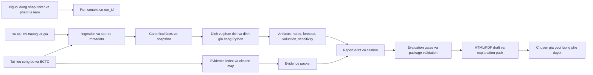

### Hinh 3.2. Quy trinh tu du lieu nguon den bao cao phan tich co phieu

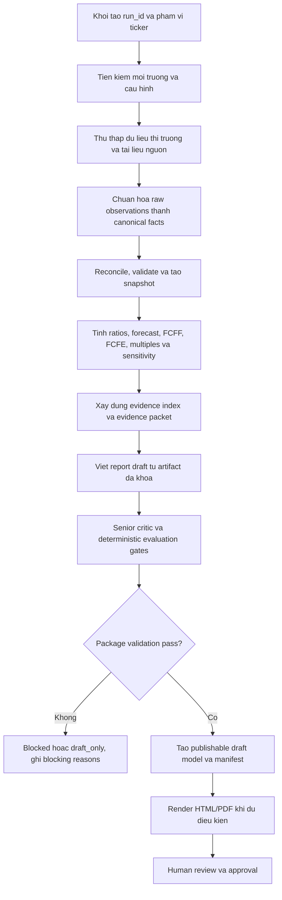

### Bang 3.1. San pham trung gian trong moi lan chay phan tich

| San pham trung gian | Dinh danh chinh | Noi dung | Nguon tao | Vai tro trong truy vet |
|---|---|---|---|---|
| Run context | `run_id`, ticker, period scope | Cau hinh lan chay, pham vi nam, che do draft/final | `scripts/run_research.py`, `backend/orchestrator.py` | Diem neo de lien ket moi artifact va gate |
| Raw source payload | `source_doc_id`, URL/path, checksum | Du lieu thi truong, BCTC, tai lieu cong bo, metadata nguon | Ingestion connectors | Chung minh nguon goc du lieu truoc khi chuan hoa |
| Canonical facts snapshot | `snapshot_id`, `run_id` | Facts chuan hoa theo metric, nam tai chinh, don vi, source tier | `build_facts` va fact reconciliation | Dau vao bat buoc cho analysis, forecast va valuation |
| Valuation artifact | `run_id`, `valuation.json` | FCFF, FCFE, blend, multiples, sensitivity, formula trace | `backend/analytics/` | Chung minh target price duoc tinh bang ma chuong trinh |
| Evidence packet | `run_id`, `evidence_pack.json` | Evidence refs, formula traces, artifact refs, source snippets | Evidence/index/export gates | Ho tro reviewer tai kiem tra claim va so lieu |
| Report model | `publishable_final_report_model` | Cau truc bao cao da lap rap tu artifacts | Reporting assembler | Nguon render HTML/PDF, khong phai file moi nhat tuy y |
| Gate results | `quality_gate`, `blocking_reasons` | Ket qua data, valuation, citation, report, package gates | Evaluation framework | Giai thich ly do pass, warn, blocked hoac failed |
| Export artifacts | PDF/HTML, manifest, explanation pack | Bao cao doc duoc va tap giai trinh | Renderer va storage layer | Dau ra de hoi dong/chuyen gia danh gia |

### Hinh 3.3. Co che kiem dinh theo tung cong chat luong

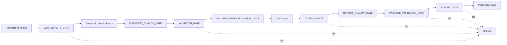

### Bang 3.2. Danh muc nguon du lieu su dung trong he thong

| Nguon du lieu | Loai du lieu | Vai tro trong he thong | Muc do tin cay | Co che kiem soat |
|---|---|---|---|---|
| Bao cao tai chinh/BCTC cong bo | Tai lieu chinh thuc, bang tai chinh | Nguon uu tien cho doanh thu, loi nhuan, tai san, no vay, dong tien | Cao neu truy vet duoc source document | Source metadata, OCR validation, reconciliation, source tier policy |
| Du lieu thi truong qua connector | Gia, volume, market cap, multiples tham chieu | Dau vao dinh gia tuong doi va so sanh gia thi truong | Trung binh den cao tuy nguon | Cached payload, timestamp, stale data check |
| Company master/universe registry | Ticker, ten cong ty, san, nganh | Xac dinh pham vi universe va mapping cong ty | Cao neu do du an quan tri | Schema `ref`, universe validation |
| News/catalyst sources duoc whitelist | Su kien, catalyst, rui ro dinh tinh | Ho tro narrative va risk/catalyst section | Trung binh, phu thuoc nguon | Whitelist, dedup, relevance filter, citation validation |
| Artifact noi bo theo run | Snapshot, valuation, evidence, report model | Nguon duy nhat cho report run-scoped | Cao neu locked va co checksum | Manifest, artifact lock, storage allow-list |

### Bang 3.3. Dinh dang du lieu dau vao va dau ra

| Nhom | Dinh dang | Vi tri/doi tuong tieu bieu | Dieu kien hop le | Cach xu ly khi thieu |
|---|---|---|---|---|
| Tai lieu nguon | PDF, HTML, raw payload JSON | BCTC, cong bo thong tin, market payload | Co metadata nguon, thoi gian, ticker va checksum | Gan missing source, khong tu tao so lieu thay the |
| Du lieu cau hinh | YAML, JSON, CSV | Agent config, export policy, universe, benchmark datasets | Schema hop le, key bat buoc day du | Block preflight hoac ghi configuration issue |
| Facts chuan hoa | Database row, artifact JSON | `ticker`, `metric_id`, `fiscal_year`, `value`, `unit`, `source_id` | Don vi va period hop le, source traceable | Ghi `null` hoac data gap, khong de LLM suy doan |
| Artifact dinh gia | JSON | valuation, forecast, sensitivity, formula trace | Co assumptions, formula trace, snapshot_id | Block valuation/report neu la input trong yeu |
| Evidence packet | JSON | Evidence refs, citation map, source snippets | Claim trong yeu co evidence ref phu hop | Citation gate fail hoac warning theo severity |
| Bao cao | HTML, PDF, explanation pack | Report draft, client-facing final neu du approval | Render tu publishable model va pass post-render audit | Khong render final neu thieu approval hoac package validation |

### Hinh 3.4. Quy trinh xu ly tai lieu va trich xuat bang tai chinh

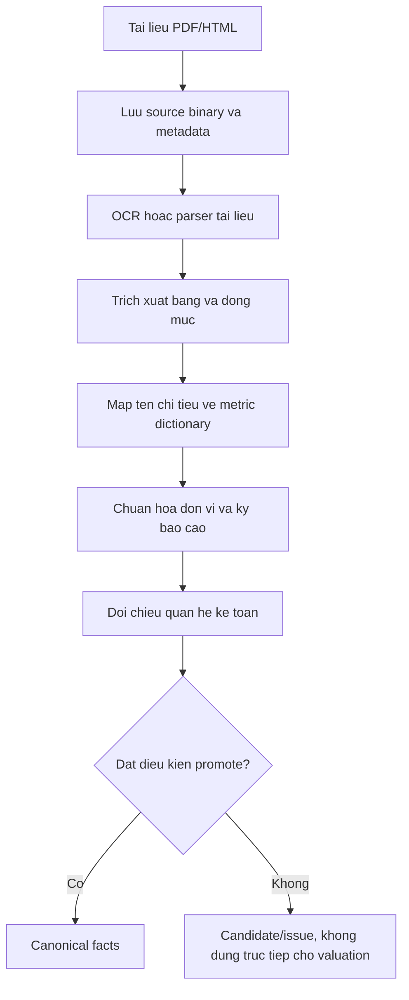

### Bang 3.4. Vi du anh xa chi tieu tai chinh ve ma chuan

| Ten trong bao cao | Bien the co the gap | Ma chi tieu chuan | Nhom bao cao | Ghi chu kiem soat |
|---|---|---|---|---|
| Doanh thu ban hang va cung cap dich vu | Doanh thu thuan, net revenue | `revenue` | Income statement | Phai thong nhat don vi ty dong/VND va fiscal year |
| Loi nhuan sau thue | NPAT, loi nhuan sau thue TNDN | `net_income` | Income statement | Dung de tinh ROE, EPS neu co shares hop le |
| Tai san ngan han | Current assets | `current_assets` | Balance sheet | Kiem tra voi tong tai san va cac nhom tai san |
| No phai tra | Total liabilities | `total_liabilities` | Balance sheet | Can truy vet khi tinh leverage va net debt |
| Luu chuyen tien thuan tu HDKD | CFO, operating cash flow | `cash_flow_operations` | Cash flow statement | Khong thay the FCFF neu chua tinh CAPEX/NWC dung contract |
| Chi phi dau tu tai san co dinh | CAPEX, purchase of fixed assets | `capex` | Cash flow / derived | Can quy uoc dau am/duong nhat quan |

### Bang 3.5. Quy tac phat hien du lieu thieu, trung lap va mau thuan nguon

| Loai van de | Dieu kien phat hien | Cach xu ly | Trang thai dau ra |
|---|---|---|---|
| Thieu fact trong yeu | Metric bat buoc cho valuation khong co trong snapshot | Ghi data gap, khong de LLM tu bo sung | Block hoac unresolved NA trong valuation |
| Trung lap cung source | Nhieu observation cung ticker, metric, period, source nhung value khac nhau | Doi chieu checksum, timestamp, source document row | Promotion issue neu khong xac dinh winner |
| Mau thuan giua nguon | Cung metric/period nhung official source va secondary source khac nhau vuot tolerance | Uu tien official source, ghi discrepancy | Warning hoac blocker neu fact trong yeu |
| Sai don vi | Gia tri lech cap do do VND/ty dong/trieu dong | Chuan hoa unit va luu unit goc trong metadata | Pass neu unit traceable |
| Sai dau CAPEX/no vay | Dong tien dau tu hoac vay tra no khong theo sign convention | Ap dung sign policy va test invariant | Block valuation neu anh huong FCFF/FCFE |

### Hinh 3.5. Kien truc du lieu tong the cua he thong

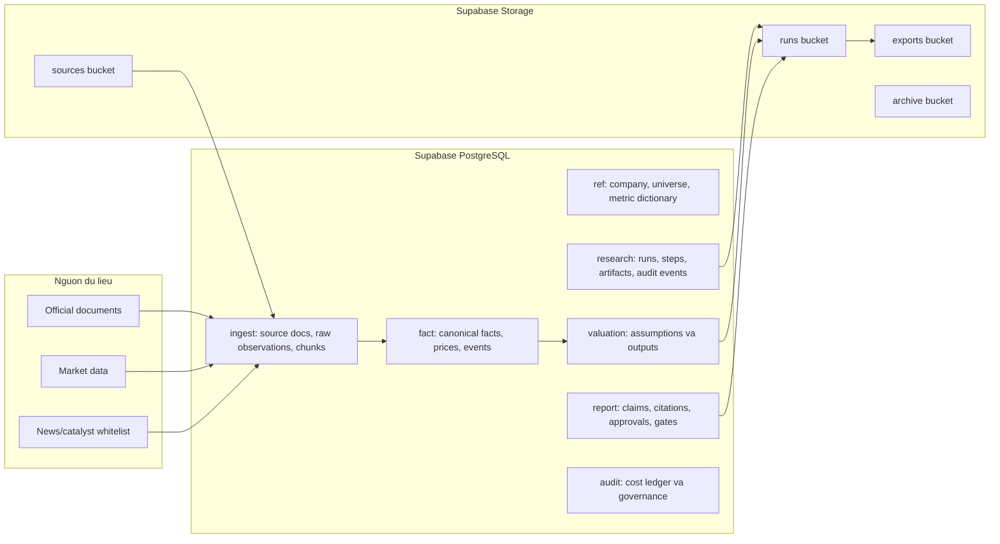

### Bang 3.6. Cau truc du kien tai chinh chuan hoa

| Truong | Kieu du lieu | Bat buoc | Y nghia | Vi du |
|---|---|---:|---|---|
| `ticker` | string | Co | Ma co phieu hoac dinh danh cong ty | `DHG` |
| `metric_id` | string | Co | Ma chi tieu theo metric dictionary | `revenue`, `net_income` |
| `fiscal_year` | integer | Co | Nam tai chinh | `2025` |
| `period_type` | enum | Co | Nam, quy, trailing period | `FY` |
| `value` | numeric/null | Co | Gia tri da chuan hoa; `null` neu thieu hop le | `4850.25` |
| `unit` | string | Co | Don vi sau chuan hoa | `VND_bn` |
| `source_id` | string | Co | Tai lieu/nguon goc | `source_doc_2025_ar` |
| `confidence` | numeric | Nen co | Diem tin cay/promote | `0.98` |
| `status` | enum | Co | Candidate, promoted, rejected, missing | `promoted` |
| `lineage` | object | Nen co | Trang, bang, dong, parser/OCR trace | `page=42; table=IS` |

### Hinh 3.6. Co che truy vet va tai lap ket qua

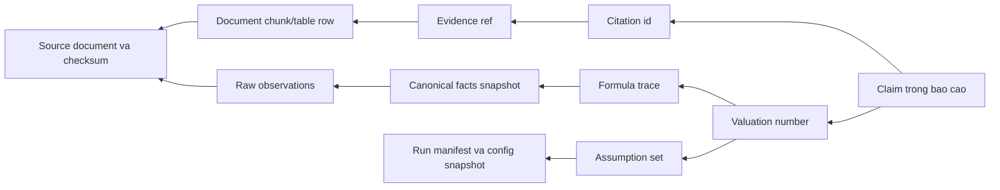

### Hinh 3.7. Luong thuat toan phan tich tai chinh va dinh gia

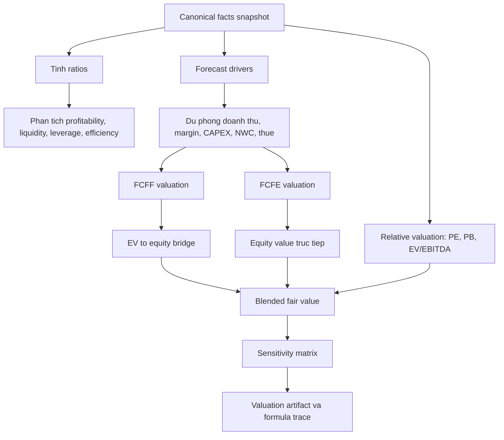

### Bang 3.7. Nhom chi tieu tai chinh va cong thuc tinh

| Nhom | Chi tieu | Cong thuc khai quat | Dau vao bat buoc | Muc dich phan tich |
|---|---|---|---|---|
| Sinh loi | Gross margin | Loi nhuan gop / Doanh thu | Gross profit, revenue | Danh gia kha nang tao bien loi nhuan |
| Sinh loi | Net margin | Loi nhuan sau thue / Doanh thu | Net income, revenue | Do chat luong loi nhuan cuoi cung |
| Sinh loi | ROE | Loi nhuan sau thue / Von chu so huu binh quan | Net income, equity | Do hieu qua su dung von chu |
| Thanh khoan | Current ratio | Tai san ngan han / No ngan han | Current assets, current liabilities | Danh gia kha nang dap ung nghia vu ngan han |
| Don bay | Debt to equity | Tong no vay hoac no phai tra / Von chu so huu | Debt/liabilities, equity | Do rui ro cau truc von |
| Hieu qua | Asset turnover | Doanh thu / Tong tai san binh quan | Revenue, total assets | Do hieu qua khai thac tai san |
| Dinh gia | P/E | Gia thi truong / EPS | Market price, EPS | So sanh voi peer va lich su |
| Dinh gia | EV/EBITDA | Enterprise value / EBITDA | Market cap, net debt, EBITDA | Dinh gia theo gia tri doanh nghiep |

### Bang 3.8. Cac bien dau vao cua mo hinh du phong tai chinh

| Bien dau vao | Nguon uu tien | Anh huong den mo hinh | Gate lien quan |
|---|---|---|---|
| Tang truong doanh thu | Historical facts, catalyst, analyst assumption | Quyet dinh doanh thu du phong va scale dong tien | Forecast quality gate |
| Bien loi nhuan gop | Historical gross margin, industry context | Tac dong truc tiep den EBIT va FCFF | Forecast quality gate |
| Chi phi ban hang/quan ly | Historical expense ratios | Anh huong operating margin | Forecast quality gate |
| CAPEX | Cash flow statement, fixed asset policy | Lam giam FCFF/FCFE | Valuation gate |
| Khau hao | Historical D&A, asset base | Cong lai trong FCFF/FCFE | Valuation gate |
| Nhu cau von luu dong | Receivables, inventory, payables | Dieu chinh dong tien tu hoat dong | Valuation reconciliation gate |
| Thue suat | Statutory/effective tax rate | Anh huong NOPAT va FCFF | Formula trace gate |
| No vay rong | Balance sheet, cash, borrowings | EV to equity bridge va FCFE | Valuation reconciliation gate |

### Bang 3.9. Dieu kien hop le cua cac mo hinh dinh gia

| Mo hinh | Dieu kien dau vao toi thieu | Dieu kien chan loi | Cach xu ly khi khong dat |
|---|---|---|---|
| FCFF | EBIT/NOPAT, D&A, CAPEX, NWC, WACC, terminal growth | WACC phai lon hon terminal growth; formula trace day du | Block hoac giam trong so neu thieu input trong yeu |
| FCFE | Net income, D&A, CAPEX, NWC, net borrowing, cost of equity | Cost of equity phai lon hon terminal growth; sign convention hop le | Block hoac chi dung nhu cross-check |
| Relative P/E | EPS, gia thi truong, peer P/E | EPS khong am neu dung P/E truyen thong | Danh dau not meaningful neu EPS am |
| EV/EBITDA | EBITDA, net debt, market cap, peer multiple | EBITDA duong va net debt traceable | Khong dung lam anchor neu EBITDA khong hop le |
| Blended fair value | It nhat mot valuation method pass gate | Trong so co justification va tong bang 100% | Draft_only neu chi co mot method yeu |
| Sensitivity | Base fair value, WACC/Re grid, terminal growth grid | Grid hop ly, khong vi pham discount rate > growth | Block neu matrix khong tai lap duoc |

### Bang 3.10. Cau truc ma tran phan tich do nhay

| WACC/Re \ Terminal growth | 1.0% | 1.5% | 2.0% | 2.5% | 3.0% |
|---:|---:|---:|---:|---:|---:|
| 9.0% | Dien gia tri hop ly/co phieu | Dien gia tri hop ly/co phieu | Dien gia tri hop ly/co phieu | Dien gia tri hop ly/co phieu | Dien gia tri hop ly/co phieu |
| 9.5% | Dien gia tri hop ly/co phieu | Dien gia tri hop ly/co phieu | Dien gia tri hop ly/co phieu | Dien gia tri hop ly/co phieu | Dien gia tri hop ly/co phieu |
| 10.0% | Dien gia tri hop ly/co phieu | Dien gia tri hop ly/co phieu | Dien gia tri hop ly/co phieu | Dien gia tri hop ly/co phieu | Dien gia tri hop ly/co phieu |
| 10.5% | Dien gia tri hop ly/co phieu | Dien gia tri hop ly/co phieu | Dien gia tri hop ly/co phieu | Dien gia tri hop ly/co phieu | Dien gia tri hop ly/co phieu |
| 11.0% | Dien gia tri hop ly/co phieu | Dien gia tri hop ly/co phieu | Dien gia tri hop ly/co phieu | Dien gia tri hop ly/co phieu | Dien gia tri hop ly/co phieu |

### Hinh 3.8. Quy trinh truy xuat bang chung phuc vu sinh bao cao

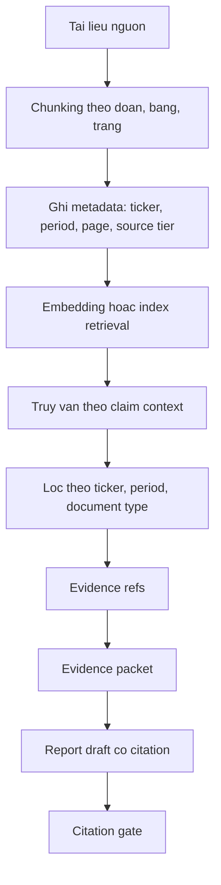

### Bang 3.11. Metadata cua mot muc bang chung

| Truong metadata | Y nghia | Vi du |
|---|---|---|
| `evidence_id` | Dinh danh duy nhat cua evidence item | `ev_DHG_2025_AR_p42_t1_r3` |
| `ticker` | Ma co phieu lien quan | `DHG` |
| `run_id` | Lan chay su dung evidence | `run_20260615_001` |
| `document_type` | Loai tai lieu nguon | `annual_report`, `financial_statement`, `market_data` |
| `period` | Ky tai chinh cua evidence | `FY2025` |
| `page_or_table` | Vi tri trong tai lieu | `page 42, table income_statement` |
| `content_type` | Van ban, bang, so lieu, chart, news | `table_row` |
| `source_tier` | Do tin cay nguon | `Tier 1 official` |
| `confidence` | Diem tin cay sau parser/retrieval | `0.94` |
| `checksum` | Kiem tra tinh toan ven | `sha256:...` |

### Bang 3.12. Tap bang chung bat buoc cho tung phan bao cao

| Phan bao cao | Bang chung toi thieu | Gate kiem soat | Rui ro neu thieu |
|---|---|---|---|
| Tong quan doanh nghiep | Company master, nganh, san niem yet, mo ta hoat dong | Citation gate | Mo ta sai doanh nghiep hoac ngoai pham vi |
| Ket qua tai chinh | Revenue, gross profit, net income, balance sheet, cash flow facts | Data quality gate, citation gate | Claim dinh luong khong co nguon |
| Phan tich ratio | Ratio artifact va canonical facts | Financial analyst gate | LLM dien giai tren chi tieu chua tinh |
| Du phong | Assumption set, forecast drivers, historical trend | Forecast quality gate | Gia dinh khong traceable |
| Dinh gia | Valuation artifact, formula trace, sensitivity | Valuation gate, formula trace gate | Target price khong tai lap duoc |
| Rui ro va catalyst | News/catalyst evidence, source whitelist | Citation gate, relevance checks | Dua tin khong lien quan hoac nguon yeu |
| Khuyen nghi | Fair value, market price, upside/downside, recommendation policy | Valuation reconciliation gate | Recommendation khong khop voi target price |

### Hinh 3.9. Thuat toan anh xa luan diem voi nguon trich dan

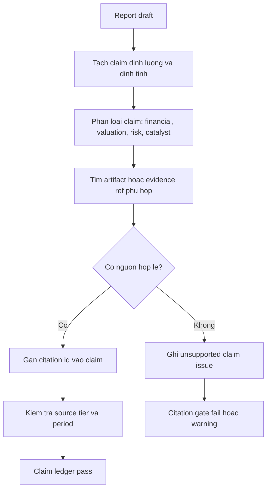

### Hinh 3.10. Mo hinh dieu phoi AI Agents trong pipeline co dinh

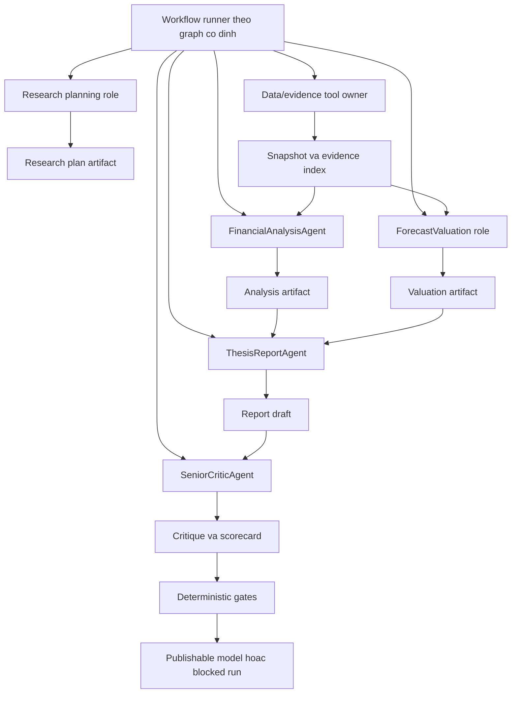

### Bang 3.13. Vai tro, dau vao va dau ra cua cac tac tu/vai tro

| Vai tro cau hinh | Ten goi trong do an | Phan loai dung | Dau vao | Dau ra | Gioi han quan trong |
|---|---|---|---|---|---|
| `research_manager` | Vai tro lap ke hoach nghien cuu | Vai tro quy trinh/dich vu deterministic | Ticker, period scope, policy | Research plan | Khong nen mo ta la agent tu dieu phoi tu do |
| `data_evidence` | Vai tro so huu cong cu du lieu va bang chung | Vai tro quy trinh so huu tool | Source config, ticker, run_id | Snapshot, index, evidence refs | Runner goi tool deterministic, khong phai LLM tu chon fact |
| `financial_analysis` | Tac tu phan tich tai chinh | Tac tu LLM | Snapshot, ratio artifact, known limitations | Financial analysis artifact | Khong tinh lai chi tieu neu artifact khong co |
| `forecast_valuation` | Vai tro du phong va dinh gia | Vai tro lai | Snapshot, assumptions, market data | Forecast, valuation, formula trace | Dinh gia do Python tinh; LLM chi dien giai neu duoc goi |
| `thesis_report` | Tac tu viet luan diem va ban nhap bao cao | Tac tu LLM | Analysis, valuation, evidence packet | Report draft co citation | Khong phat minh claim hoac so lieu thieu nguon |
| `senior_critic` | Tac tu phan bien cap cao | Tac tu LLM ket hop evaluator | Report draft, artifacts, gate summaries | Findings, scorecard, recommendations | Khong override deterministic gates hoac human approval |

### Bang 3.14. Ma tran quyen goi cong cu cua tung tac tu/vai tro

| Tool | `research_manager` | `data_evidence` | `financial_analysis` | `forecast_valuation` | `thesis_report` | `senior_critic` |
|---|---:|---:|---:|---:|---:|---:|
| `auto_ingest` | Khong | Doc/ghi | Khong | Khong | Khong | Khong |
| `build_facts` | Khong | Doc/ghi | Khong | Khong | Khong | Khong |
| `build_index` | Khong | Doc/ghi | Khong | Khong | Khong | Khong |
| `read_snapshot` | Khong | Co | Doc | Doc | Doc | Doc |
| `read_ratio_artifact` | Khong | Khong | Doc | Doc | Doc | Doc |
| `run_forecast` | Khong | Khong | Khong | Doc/ghi | Khong | Khong |
| `run_valuation` | Khong | Khong | Khong | Doc/ghi | Khong | Khong |
| `read_valuation_artifact` | Khong | Khong | Doc | Doc | Doc | Doc |
| `evaluate_report_quality` | Khong | Khong | Khong | Khong | Khong | Doc |

### Hinh 3.11. Co che chuyen giao artifact giua cac tac tu

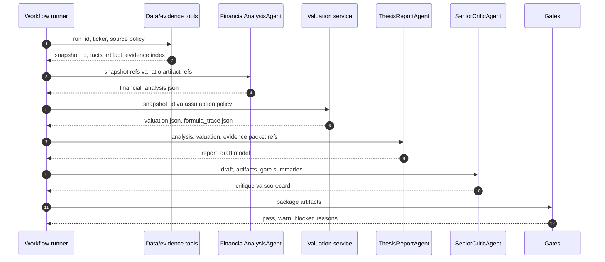

### Hinh 3.12. So do trang thai cua mot lan chay phan tich

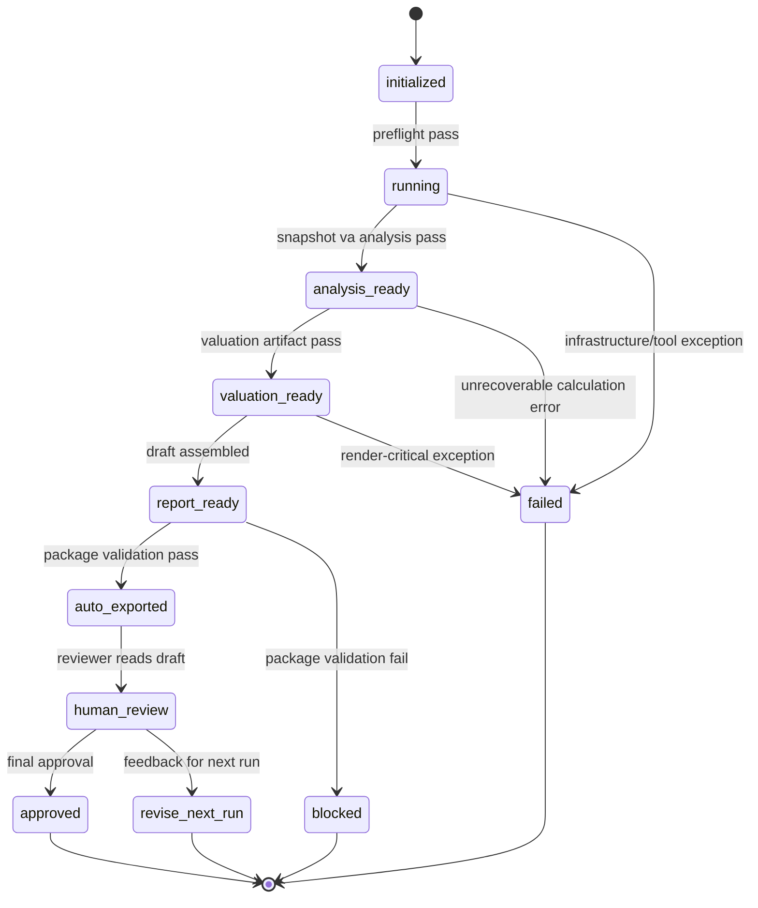

### Bang 3.15. Quy tac xu ly loi va chan xuat ban

| Loai loi | Vi du blocking reason | Cong phat hien | Hanh vi he thong |
|---|---|---|---|
| Thieu source trace | `missing_source_trace_for_material_claim` | Citation gate | Khong cho export neu claim trong yeu khong co nguon |
| Source yeu | `tier3_only_material_fact` | Source provenance gate | Block hoac warning tuy muc do trong yeu |
| Thieu formula trace | `missing_formula_trace` | Formula trace gate | Khong coi valuation la tai lap duoc |
| Forecast thieu driver | `missing_forecast_driver` | Forecast quality gate | Chan valuation/report neu driver trong yeu |
| Valuation con NA | `unresolved_na_in_valuation` | Valuation gate | Draft_only hoac blocked tuy anh huong |
| Citation chung chung | `generic_citation_only` | Citation gate | Yeu cau evidence ref cu the hon |
| LLM-only pass | `llm_only_evaluation_pass` | Package validation gate | Khong cho LLM override deterministic evidence |
| Snapshot khong khop | `report_not_linked_to_valuation_snapshot` | Package/export gate | Chan publishable model |

## Chapter 4 Tables And Evaluation Visuals

### Bang 4.1. Cau hinh moi truong thuc nghiem

| Hang muc | Gia tri can dien | Ghi chu |
|---|---|---|
| Ngon ngu backend | Python >= 3.10 | Theo README cua du an |
| Database | Supabase PostgreSQL | Luu metadata, facts, run state, gates |
| Object storage | Supabase Storage | Buckets `sources`, `runs`, `exports`, `archive` |
| Frontend | React/Vite | Dashboard bao cao va evaluation |
| OCR | Tesseract, Poppler, pytesseract | Can cho BCTC scan |
| Valuation engine | Python modules trong `backend/analytics/` | FCFF, FCFE, blend, multiples, sensitivity |
| Evaluation | Data, retrieval, financial, citation, agent, report, publication, observability eval | Doc tu `backend/evaluation/` va `eval/` |
| Pham vi ticker | Dien danh sach ticker thuc nghiem | Vi du DHG, DBD, DMC, DVN neu co ket qua |

### Bang 4.2. Danh muc co phieu thu nghiem

| Ticker | Ten cong ty | San | Nganh/phan nganh | Vai tro trong thuc nghiem | Trang thai du lieu |
|---|---|---|---|---|---|
| DHG | Dien ten cong ty | Dien san | Duoc pham | Case study chinh/MVP | Dien coverage/gate status |
| DBD | Dien ten cong ty | Dien san | Duoc pham | Benchmark hoac so sanh | Dien coverage/gate status |
| DMC | Dien ten cong ty | Dien san | Duoc pham | Benchmark hoac so sanh | Dien coverage/gate status |
| DVN | Dien ten cong ty | Dien san | Duoc pham | Benchmark hoac so sanh | Dien coverage/gate status |

### Bang 4.3. Ket qua dinh gia theo tung phuong phap

| Ticker | Gia thi truong | FCFF fair value | FCFE fair value | Multiples fair value | Blended fair value | Upside/downside | Khuyen nghi |
|---|---:|---:|---:|---:|---:|---:|---|
| Dien ticker | Dien so lieu | Dien so lieu | Dien so lieu | Dien so lieu | Dien so lieu | Dien so lieu | Dien khuyen nghi |

### Bang 4.4. Ket qua kiem dinh chat luong bao cao

| Gate/artifact | Chi tieu danh gia | Nguong chap nhan | Ket qua | Trang thai | Y nghia |
|---|---|---:|---:|---|---|
| `data_quality.json` | Core metric coverage | >= 95% | Dien ket qua | Pass/Warn/Fail | Do du day du cua facts trong yeu |
| `retrieval_eval.json` | Hit-rate@5 | >= 90% | Dien ket qua | Pass/Warn/Fail | Kha nang truy xuat evidence dung |
| `financial_eval.json` | Accounting/valuation invariants | 100% critical pass | Dien ket qua | Pass/Warn/Fail | Tinh dung cua cong thuc va invariant |
| `citation_eval.json` | Material claim citation coverage | 100% | Dien ket qua | Pass/Warn/Fail | Moi claim dinh luong trong yeu co nguon |
| `agent_eval.json` | Tool permission compliance | 100% | Dien ket qua | Pass/Warn/Fail | Tac tu khong goi tool ngoai quyen |
| `report_eval.json` | Report quality score | >= 85 | Dien ket qua | Pass/Warn/Fail | Chat luong institutional report |
| `publication_readiness.json` | Draft/final readiness | Theo policy | Dien ket qua | Pass/Warn/Fail | Dieu kien render final/client-facing |
| `observability_eval.json` | Manifest, lineage, cost ledger | Day du | Dien ket qua | Pass/Warn/Fail | Kha nang audit va tai lap |

### Hinh 4.1. Kien truc trien khai he thong

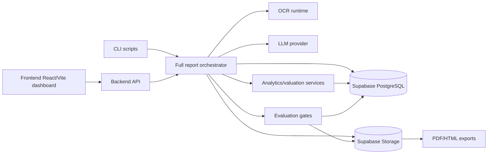

### Bieu do 4.1. Ty le du lieu day du/thieu theo nhom chi tieu

Dung bieu do cot trong cong cu ve bieu do cua do an; bang du lieu nguon nen co cau truc sau:

| Nhom chi tieu | So metric bat buoc | So metric co du lieu | Ty le day du | So metric thieu |
|---|---:|---:|---:|---:|
| Income statement | Dien so lieu | Dien so lieu | Dien ty le | Dien so lieu |
| Balance sheet | Dien so lieu | Dien so lieu | Dien ty le | Dien so lieu |
| Cash flow | Dien so lieu | Dien so lieu | Dien ty le | Dien so lieu |
| Market data | Dien so lieu | Dien so lieu | Dien ty le | Dien so lieu |
| Valuation inputs | Dien so lieu | Dien so lieu | Dien ty le | Dien so lieu |

### Bieu do 4.2. So sanh gia tri hop ly va gia thi truong

Dung bieu do cot nhom hoac dumbbell chart; bang du lieu nguon nen co cau truc sau:

| Ticker | Gia thi truong | Gia tri hop ly blended | Chenh lech tuyet doi | Upside/downside |
|---|---:|---:|---:|---:|
| Dien ticker | Dien so lieu | Dien so lieu | Dien so lieu | Dien ty le |

### Bieu do 4.3. Diem danh gia chat luong bao cao theo tieu chi

Dung radar chart hoac bar chart; bang du lieu nguon nen co cau truc sau:

| Tieu chi | Trong so | Diem dat duoc | Diem toi da | Nhan xet |
|---|---:|---:|---:|---|
| Data correctness | 25 | Dien diem | 25 | Dien nhan xet |
| Financial model integrity | 25 | Dien diem | 25 | Dien nhan xet |
| Domain depth | 15 | Dien diem | 15 | Dien nhan xet |
| Valuation transparency | 15 | Dien diem | 15 | Dien nhan xet |
| Citation quality | 10 | Dien diem | 10 | Dien nhan xet |
| Professional presentation | 10 | Dien diem | 10 | Dien nhan xet |

## Strategic Recommendations

### Danh sach toi thieu nen dua vao do an

| Thu tu uu tien | Bang/so do | Ly do nen giu |
|---:|---|---|
| 1 | Hinh 3.2. Quy trinh tu du lieu nguon den bao cao phan tich co phieu | Giai thich toan bo workflow mot cach de hieu |
| 2 | Hinh 3.5. Kien truc du lieu tong the cua he thong | Chung minh he thong co schema governance va storage contract |
| 3 | Hinh 3.7. Luong thuat toan phan tich tai chinh va dinh gia | Lam ro LLM khong tinh toan tai chinh |
| 4 | Hinh 3.8. Quy trinh truy xuat bang chung phuc vu sinh bao cao | The hien diem khac biet evidence-grounded report |
| 5 | Hinh 3.10. Mo hinh dieu phoi AI Agents trong pipeline co dinh | Mo ta dung ban chat agentic workflow co kiem soat |
| 6 | Bang 3.13. Vai tro, dau vao va dau ra cua cac tac tu/vai tro | Tranh nham lan sau YAML keys thanh sau LLM agents tu tri |
| 7 | Bang 3.14. Ma tran quyen goi cong cu | Chung minh co tool permission governance |
| 8 | Bang 4.3. Ket qua dinh gia theo tung phuong phap | Noi ket thuat toan voi ket qua thuc nghiem |
| 9 | Bang 4.4. Ket qua kiem dinh chat luong bao cao | Chung minh chat luong bang evaluation artifacts |
| 10 | Bieu do 4.2. So sanh gia tri hop ly va gia thi truong | Trinh bay ket qua dau ra de hoi dong doc nhanh |

### Canh bao trinh bay

| Noi dung de gay hieu nham | Cach viet nen dung |
|---|---|
| "Sau agent tu dong phoi hop toan bo he thong" | "He thong co sau vai tro cau hinh; trong do ba tac tu LLM ro rang, mot vai tro lai va hai vai tro quy trinh deterministic" |
| "Agent dinh gia tinh target price" | "Dich vu dinh gia Python tinh target price; tac tu chi dien giai gia dinh va ket qua da khoa" |
| "LLM danh gia bao cao dat nen xuat ban" | "Deterministic gates va package validation quyet dinh export readiness; human approval quyet dinh client-final" |
| "Bao cao doc file moi nhat trong output" | "Bao cao phai doc artifact theo `run_id`, `snapshot_id`, manifest va checksum" |
| "OCR sinh ra so lieu chinh thuc" | "OCR chi tao candidate; fact chi duoc dung sau validation, reconciliation va promotion" |
