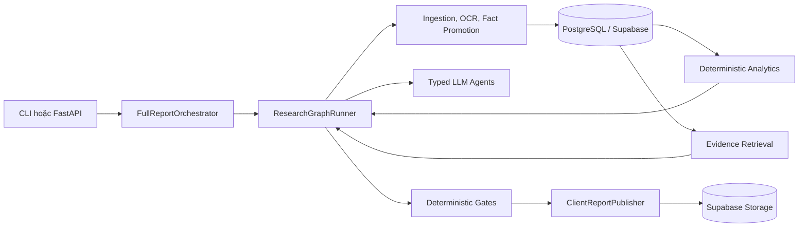
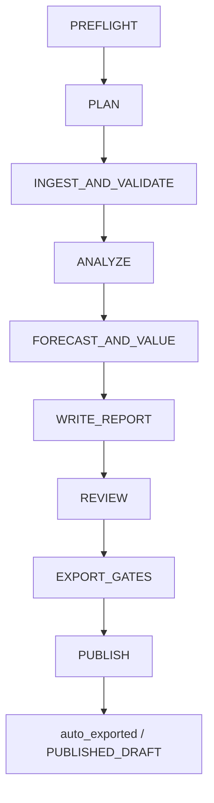
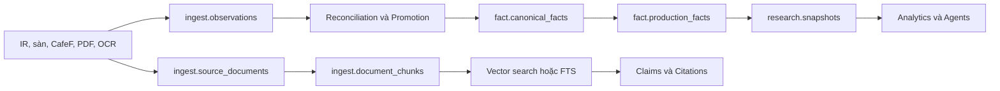

# Kiến trúc hệ thống Multi-Agent Equity Research

## Context

Hệ thống là một research operating system cho cổ phiếu dược phẩm và y tế Việt Nam, được thiết kế theo nguyên tắc **facts before narrative** và **Python computes, LLM drafts**. Một production run duy nhất có loại `full_report`, nhận một mã cổ phiếu, xây dựng snapshot dữ liệu có provenance, tính toán forecast/valuation bằng Python, dùng sáu vai trò agent để phân tích và soạn thảo, sau đó chỉ xuất báo cáo khi toàn bộ gate bắt buộc đạt yêu cầu.

Nguồn sự thật kiến trúc là code runtime tại `backend/harness/graph.py`, `backend/harness/runner.py`, các canonical DAL và migrations; các script độc lập ngoài `scripts/run_research.py` chủ yếu là công cụ phát triển, vận hành hoặc render lại.

## Problem Statement

Hệ thống phải đồng thời giải quyết bốn yêu cầu:

1. Thu thập và chuẩn hóa dữ liệu tài chính từ nguồn không đồng nhất nhưng vẫn giữ lineage tới tài liệu gốc.
2. Ngăn LLM tạo hoặc sửa số liệu tài chính; mọi forecast, valuation và reconciliation phải tái lập được.
3. Cho phép LLM tạo nội dung phân tích có cấu trúc mà không vượt quyền truy cập công cụ hoặc bỏ qua evidence.
4. Xuất HTML/PDF theo `run_id` với checksum, manifest và audit trail đủ để truy vết.

## Technical Deep-Dive

### 1. Kiến trúc tổng thể

| Lớp | Trách nhiệm chính | Thành phần nguồn |
|---|---|---|
| Interface | Khởi tạo và tra cứu run | `backend/api.py`, `scripts/run_research.py` |
| Orchestration | Điều phối lifecycle và chín stage cố định | `backend/orchestrator.py`, `backend/harness/runner.py` |
| Agent harness | Prompt, typed contract, tool permission, model adapter | `backend/harness/` |
| Data plane | Ingestion, OCR, reconciliation, canonical facts, snapshot | `backend/documents/`, `backend/facts/`, `backend/dataops/` |
| Analytics | Ratio, forecast, FCFF, FCFE, blend, sensitivity | `backend/analytics/` |
| Evidence và governance | Retrieval, citation, quality gate, evidence packet | `backend/retrieval.py`, `backend/citations/`, `backend/evaluation/` |
| Reporting | Assemble, view model, chart, HTML/PDF, publish | `backend/reporting/` |
| Persistence | Canonical warehouse metadata và private object storage | `backend/database/`, `backend/storage/` |

### 2. Entrypoint và execution model

| Entrypoint | Cách chạy | Đặc tính |
|---|---|---|
| CLI production | `python scripts/run_research.py --ticker DHG` | Chạy đồng bộ toàn bộ harness trong process hiện tại |
| API | `POST /research/start` | Tạo run rồi submit vào `ThreadPoolExecutor` trong process |
| Render lại | `python scripts/generate_fast_report.py --ticker DHG` | Chỉ render từ artifact đã tồn tại; không ingestion, agent hoặc gate |
| API đọc | `GET /research/{run_id}/status`, `/artifacts`, `/reports/{run_id}` | Đọc metadata từ PostgreSQL |

`FullReportOrchestrator` chỉ chấp nhận `run_type="full_report"` và chuyển `RunContext` sang `ResearchGraphRunner`. API executor là worker pool nội bộ, không phải durable queue; restart process có thể làm mất công việc đang chạy dù checkpoint đã được lưu.

### 3. Workflow production thực tế

| Stage | Xử lý chính | Agent hoặc service | Gate chính |
|---|---|---|---|
| `PREFLIGHT` | Kiểm tra schema, agent config, tool policy, OpenAI runtime | Service | Fail bằng exception |
| `PLAN` | Tạo research plan cố định | Deterministic planner, gắn vai trò Research Manager | Không có LLM |
| `INGEST_AND_VALIDATE` | Tái dùng snapshot dưới 24 giờ hoặc ingest; build facts và index song song | Data & Evidence tools | `DATA_QUALITY_GATE` |
| `ANALYZE` | Đọc snapshot/ratios và tạo phân tích tài chính | Financial Analysis Agent | `FINANCIAL_ANALYST_GATE` |
| `FORECAST_AND_VALUE` | Chạy forecast và valuation Python; khóa research artifacts | Forecast & Valuation tools/agent | Forecast, valuation, reconciliation |
| `WRITE_REPORT` | Tạo report draft và assemble `final_report_model` | Thesis & Report Agent + assembler | `REPORT_ASSEMBLY_GATE` |
| `REVIEW` | Đánh giá chất lượng và phản biện; không tự rewrite | Senior Critic Agent + tools | Completeness, critic, citation |
| `EXPORT_GATES` | Ghi evidence packet và kiểm tra package | Service | Manifest, formula trace, evidence, export |
| `PUBLISH` | Render client report, upload HTML/PDF/workings | Service | Lỗi render/publish làm run failed |

Gate critical thất bại đặt run thành `blocked` và dừng trước stage kế tiếp. Mỗi stage ghi `run_steps`, stable input/output hash, graph-state checkpoint và artifact manifest.

### 4. Ranh giới agent và deterministic service

Hệ thống cấu hình đúng sáu vai trò tại `config/agents/agents.yml`, nhưng không phải cả sáu đều luôn gọi LLM.

| Vai trò | Hành vi runtime | Quyền công cụ |
|---|---|---|
| Research Manager | Plan deterministic, không gọi LLM | Không có |
| Data & Evidence | Stage được runner điều phối bằng tool deterministic | `auto_ingest`, `build_facts`, `build_index` |
| Financial Analysis | LLM tạo phân tích từ snapshot và ratio artifacts | `read_snapshot`, `read_ratio_artifact` |
| Forecast & Valuation | Python tính forecast/valuation; LLM bổ sung forecast narrative ngoài draft fast path | `run_forecast`, `run_valuation`, `read_valuation_artifact` |
| Thesis & Report | LLM tạo report draft có typed contract | Không có |
| Senior Critic | LLM tạo scorecard; Python chạy quality evaluation | `evaluate_report_quality` |

`ToolRegistry` thực thi quyền sở hữu hai lớp: tool phải thuộc agent và phải xuất hiện trong `allowed_tools`. Agent nhận context đã compact theo stage; output JSON được chuẩn hóa và kiểm tra bằng Pydantic contract. Chi phí token được ghi vào `audit.cost_ledger`; Langfuse chỉ hoạt động khi đủ biến môi trường.

### 5. Luồng dữ liệu và evidence

- PDF có text được trích xuất trực tiếp; PDF scan đi qua Tesseract OCR, candidate validation, reconciliation với nguồn thứ cấp và promotion có điều kiện.
- `fact.production_facts` chỉ chứa canonical FY facts có `quality_status='accepted'` và confidence tối thiểu `0.80`.
- Snapshot đóng băng tập facts cho một run; snapshot active dưới 24 giờ có thể được tái dùng để giảm latency.
- `ingest.document_chunks` chứa page/chunk metadata và embedding `pgvector`; retrieval ưu tiên source tier rồi vector similarity, fallback sang PostgreSQL full-text search.
- Evidence packet, formula traces, claim ledger và citation gates tạo chuỗi truy vết từ báo cáo về artifact/fact/chunk nguồn.

### 6. Analytics và valuation

Toàn bộ số liệu tài chính được tính trong `backend/analytics/` và các tool Python. Luồng valuation chính tạo snapshot, chuẩn hóa đơn vị, tính ratio/forecast, FCFF, FCFE, blend DCF, multiples và sensitivity; artifact chứa assumption record và formula traces.

Mô hình DCF chính dùng blend `60% FCFF + 40% FCFE`; `dcf.py` là mô hình đơn giản để đối chiếu. Valuation stage hiện gọi `run_valuation(..., auto_approve_assumptions=True)` trực tiếp trong runner, vì vậy trạng thái assumption trong artifact không đại diện cho phê duyệt thủ công thực sự.

### 7. Persistence và artifact contract

| Nơi lưu | Dữ liệu chính |
|---|---|
| `ref.*` | Công ty, line item, formula, peer group |
| `ingest.*` | Source documents, observations, connector runs, document chunks |
| `fact.*` | Canonical facts, price history, catalyst events, production view |
| `research.*` | Runs, steps, snapshots, run artifacts, approvals, audit events |
| `valuation.*`, `report.*`, `audit.*` | Valuation records, report governance, gate/audit/cost records |
| `news.*` | News research subsystem tách biệt khỏi canonical financial facts |
| Supabase Storage | Private buckets `sources`, `runs`, `exports`, `archive` |

PostgreSQL giữ metadata và object reference; binary artifacts nằm trong Supabase Storage. Production run artifacts dùng key `{run_id}/{artifact_name}` trong bucket `runs`. Upload từ publisher có checksum guard và từ chối ghi đè nội dung khác checksum, qua đó giữ tính bất biến theo run.

### 8. Trạng thái và governance thực tế

DB status được ánh xạ sang API status; terminal state hiện tại của production graph là:

- Gate critical thất bại: `blocked` → API `BLOCKED`.
- Exception hoặc publish lỗi: `failed` → API `FAILED`.
- Render thành công: `auto_exported` → API `PUBLISHED_DRAFT`.

Runtime hiện **không có stage chờ phê duyệt con người** và không ghi `approved` trong production graph. `PUBLISH` render với mode `client_final`, nhưng runner vẫn gắn terminal status `auto_exported` vì chưa có human sign-off. Các bảng approval và một số reporting gate hỗ trợ HITL tồn tại ở data model, nhưng chưa được nối thành checkpoint trong workflow chín stage.

### 9. Đánh giá Iron Triangle

| Thuộc tính | Điểm mạnh hiện tại | Giới hạn chính |
|---|---|---|
| Scalability | Ingest build facts/index chạy song song; API có worker pool; snapshot reuse | Worker pool trong process, chưa có queue phân tán hoặc lease/idempotent worker |
| Reliability | Gate fail-closed, checkpoint, checksum, provenance, typed contracts, DB retry | Hai hệ gate reporting/harness còn cùng tồn tại; một số script và comment legacy gây sai lệch nhận thức |
| Latency | Snapshot TTL, compact LLM context, draft fast path, concurrent fact/index build | Full run vẫn tuần tự theo stage; OCR, LLM và PDF render là các điểm latency cao |

## Strategic Recommendations

1. **Ưu tiên P0: thống nhất ngữ nghĩa publish.** Hoặc bổ sung checkpoint assumptions/final approval và chỉ dùng `client_final` sau approval, hoặc đổi rõ output hiện tại thành draft rendering; không nên để mode `client_final` đi cùng `PUBLISHED_DRAFT`.
2. **Ưu tiên P1: tách execution khỏi API process.** Thay `ThreadPoolExecutor` bằng durable job queue có retry, lease và resume từ checkpoint để tăng reliability khi deploy nhiều replica.
3. **Ưu tiên P1: hợp nhất gate authority.** Chọn harness package validation làm nguồn quyết định export duy nhất; reporting gate nên là adapter hoặc preflight, tránh hai định nghĩa publishability.
4. **Ưu tiên P2: thu hẹp legacy surface.** Đánh dấu hoặc di chuyển các script/schema reference cũ còn nhắc `fact.financial_facts`, HITL bắt buộc hoặc workflow không còn tồn tại để giảm rủi ro vận hành sai.
5. **Duy trì ranh giới cốt lõi.** Không chuyển analytics, reconciliation, source promotion hoặc export decision sang LLM; agent chỉ nên lập luận và soạn nội dung trên artifact đã khóa.

