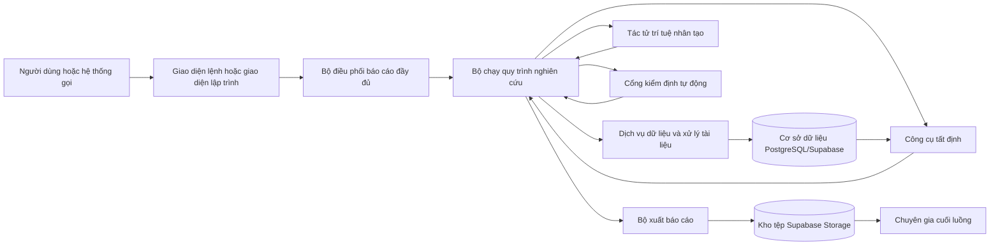
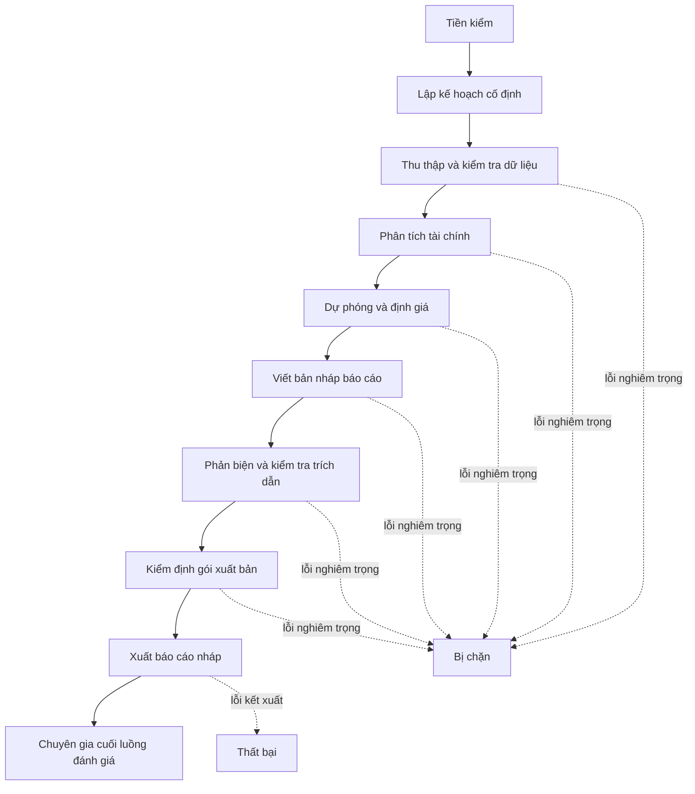
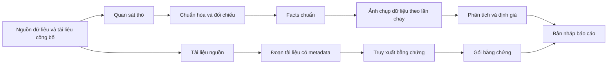
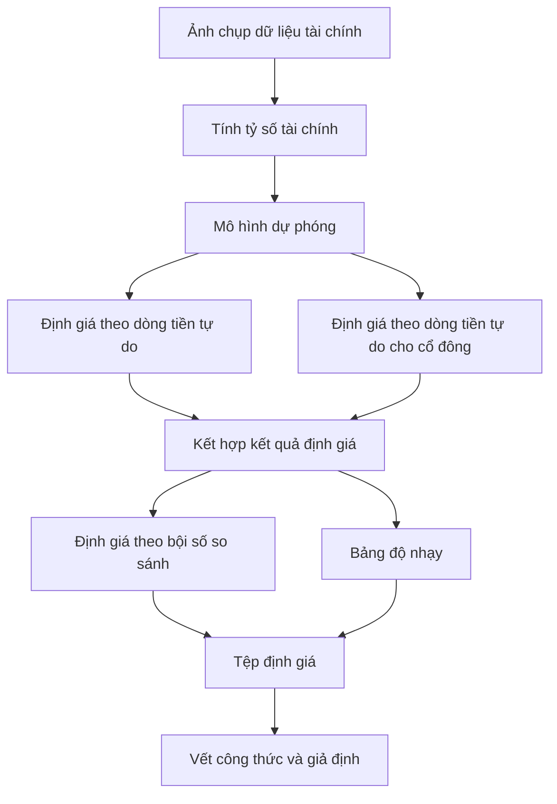
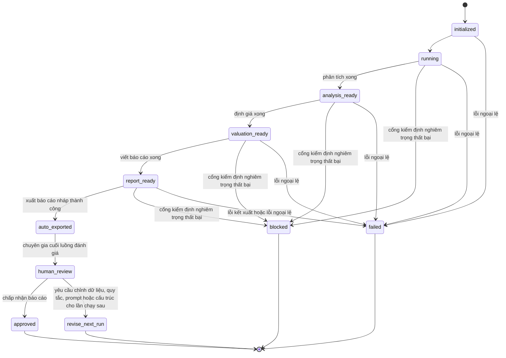
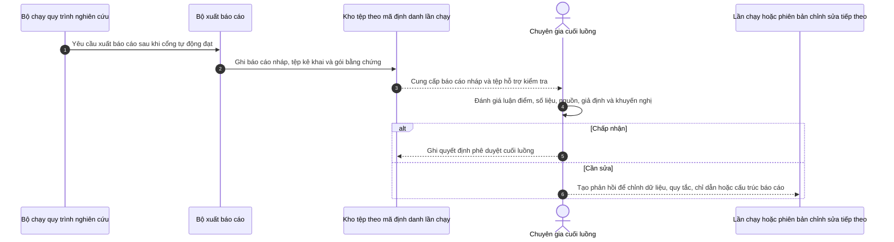

# Kiến trúc hệ thống nghiên cứu cổ phiếu có kiểm soát bằng tác tử trí tuệ nhân tạo

## 1. Bối cảnh

Hệ thống là một nền tảng hỗ trợ nghiên cứu và lập báo cáo phân tích cổ phiếu ngành dược phẩm, thiết bị y tế tại Việt Nam. Trọng tâm của hệ thống không phải là để mô hình ngôn ngữ lớn tự động viết toàn bộ báo cáo từ dữ liệu thô, mà là xây dựng một quy trình nghiên cứu có trạng thái, có kiểm định, có truy vết và có khả năng tái lập.

Nguyên tắc thiết kế cốt lõi của hệ thống là: dữ liệu và số liệu phải được chuẩn hóa trước khi sinh diễn giải; mọi tính toán tài chính phải do mã chương trình thực hiện; mô hình ngôn ngữ lớn chỉ được dùng cho các bước cần diễn giải, tổng hợp lập luận, viết bản nháp và phản biện nội dung dựa trên các tệp kết quả đã được khóa nguồn.

Vì vậy, kiến trúc hệ thống cần được mô tả chính xác là:

> Hệ thống workflow nghiên cứu tài chính có kiểm soát, kết hợp một số tác tử trí tuệ nhân tạo với các dịch vụ tất định, công cụ tất định, cổng kiểm định tự động và vòng chuyên gia cuối luồng.

Cách mô tả này chính xác hơn cách gọi ngắn gọn “hệ thống đa tác tử”, vì trong runtime hiện tại không phải mọi vai trò được cấu hình đều là tác tử trí tuệ nhân tạo thực sự.

---

## 2. Vấn đề kiến trúc cần giải quyết

Hệ thống phải đồng thời xử lý năm yêu cầu kỹ thuật:

1. Thu thập và chuẩn hóa dữ liệu tài chính từ nhiều nguồn khác nhau nhưng vẫn giữ được đường dẫn truy vết tới tài liệu gốc.
2. Ngăn mô hình ngôn ngữ lớn tạo mới hoặc sửa số liệu tài chính; các phép tính dự phóng, định giá và đối chiếu số liệu phải tái lập được bằng mã chương trình.
3. Cho phép mô hình ngôn ngữ lớn tạo nội dung phân tích có cấu trúc, nhưng không được vượt quá phạm vi dữ liệu, công cụ và bằng chứng được cấp.
4. Xuất báo cáo HTML/PDF theo từng mã định danh lần chạy, kèm tệp kê khai, gói bằng chứng, vết công thức và nhật ký kiểm định.
5. Đặt chuyên gia ở cuối luồng để đánh giá báo cáo nháp đã được hệ thống tạo ra, thay vì chặn thủ công ở từng chặng trung gian.

---

## 3. Quy ước thuật ngữ trong tài liệu

### 3.1. Tác tử trí tuệ nhân tạo

Trong tài liệu này, **tác tử trí tuệ nhân tạo** là thành phần có các đặc điểm sau:

- Có chỉ dẫn nhiệm vụ riêng.
- Nhận ngữ cảnh đầu vào đã được giới hạn theo chặng.
- Có hợp đồng đầu ra có kiểu dữ liệu rõ ràng.
- Có thể được cấp quyền gọi một số công cụ nhất định.
- Có lời gọi tới mô hình ngôn ngữ lớn trong runtime.
- Sinh ra kết quả có tính xác suất, vì vậy cần được kiểm tra bằng cổng kiểm định hoặc bộ lắp ráp phía sau.

Theo định nghĩa này, chỉ những vai trò thực sự gọi mô hình ngôn ngữ lớn để tạo phân tích, diễn giải, bản nháp hoặc phản biện mới được gọi là tác tử trí tuệ nhân tạo.

### 3.2. Vai trò quy trình

**Vai trò quy trình** là một đơn vị trách nhiệm được cấu hình để phục vụ phân quyền công cụ, ghi vết thực thi và tổ chức luồng xử lý. Vai trò quy trình có thể không gọi mô hình ngôn ngữ lớn. Một vai trò quy trình không nên được gọi là tác tử trí tuệ nhân tạo nếu trong runtime nó chỉ được thực hiện bằng mã chương trình tất định.

### 3.3. Công cụ tất định

**Công cụ tất định** là hàm hoặc mô-đun được bộ chạy quy trình gọi với đầu vào có cấu trúc và trả về đầu ra có cấu trúc. Công cụ tất định không tự lập luận mở rộng, không tự sinh luận điểm và không tự quyết định chặng tiếp theo. Ví dụ: thu thập tài liệu, xây dựng dữ liệu chuẩn hóa, đọc ảnh chụp dữ liệu, chạy mô hình định giá, đọc tệp định giá.

### 3.4. Dịch vụ tất định

**Dịch vụ tất định** là thành phần mã chương trình thực hiện một nhiệm vụ kỹ thuật ổn định, có thể kiểm thử và có hành vi dự đoán được với cùng một đầu vào. Ví dụ: bộ lập kế hoạch cố định, bộ lắp ráp báo cáo, bộ kết xuất HTML/PDF, bộ ghi tệp kê khai, bộ kiểm tra dữ liệu.

### 3.5. Cổng kiểm định tự động

**Cổng kiểm định tự động** là thành phần kiểm tra điều kiện chất lượng trước khi hệ thống đi sang chặng tiếp theo. Khi phát hiện lỗi nghiêm trọng, cổng kiểm định đặt lần chạy vào trạng thái bị chặn và ghi rõ lý do. Cổng kiểm định không phải là tác tử trí tuệ nhân tạo.

### 3.6. Chuyên gia cuối luồng

**Chuyên gia cuối luồng** là người đánh giá báo cáo nháp, giả định định giá, gói bằng chứng và kết quả kiểm định sau khi hệ thống đã hoàn thành đường chạy tự động. Vai trò này là vòng hậu kiểm và phê duyệt sản phẩm đầu ra, không phải một chặng chặn thủ công nằm giữa các bước tính toán của runtime hiện tại.

---

## 4. Kiến trúc tổng thể

Ý nghĩa chính của sơ đồ:

- Bộ điều phối chỉ nhận yêu cầu và chuyển ngữ cảnh chạy cho bộ chạy quy trình nghiên cứu.
- Bộ chạy quy trình nghiên cứu là thành phần kiểm soát trình tự chín chặng.
- Dữ liệu, công thức tài chính, định giá, kiểm định và xuất báo cáo nằm ở các dịch vụ hoặc công cụ tất định.
- Tác tử trí tuệ nhân tạo chỉ tham gia ở các chặng cần diễn giải tài chính, viết bản nháp và phản biện nội dung.
- Chuyên gia xuất hiện ở cuối luồng để đánh giá báo cáo nháp và các bằng chứng đi kèm.

---

## 5. Các lớp kiến trúc

| Lớp | Tên gọi chuẩn trong tài liệu | Trách nhiệm chính | Thành phần mã nguồn liên quan |
|---|---|---|---|
| Lớp giao tiếp | Giao diện lệnh và giao diện lập trình | Khởi tạo lần chạy, tra cứu trạng thái, tra cứu tệp kết quả | `scripts/run_research.py`, `backend/api.py` |
| Lớp điều phối | Bộ điều phối báo cáo đầy đủ | Nhận ngữ cảnh lần chạy và chuyển vào bộ chạy quy trình | `backend/orchestrator.py` |
| Lớp thực thi quy trình | Bộ chạy quy trình nghiên cứu | Thực thi chín chặng, ghi checkpoint, gọi công cụ, gọi tác tử, gọi cổng kiểm định | `backend/harness/runner.py`, `backend/harness/graph.py` |
| Lớp quản trị tác tử | Khung thực thi tác tử | Nạp cấu hình vai trò, chỉ dẫn nhiệm vụ, quyền công cụ, hợp đồng đầu ra và bộ gọi mô hình | `backend/harness/`, `config/agents/` |
| Lớp dữ liệu | Dịch vụ dữ liệu và xử lý tài liệu | Thu thập tài liệu, xử lý OCR, chuẩn hóa facts, tạo ảnh chụp dữ liệu, xây chỉ mục bằng chứng | `backend/documents/`, `backend/facts/`, `backend/dataops/` |
| Lớp định lượng | Dịch vụ phân tích và định giá tất định | Tính tỷ số, dự phóng, dòng tiền, định giá, độ nhạy và vết công thức | `backend/analytics/` |
| Lớp bằng chứng | Dịch vụ truy xuất và kiểm soát nguồn | Truy xuất đoạn tài liệu, quản lý trích dẫn, tạo gói bằng chứng, kiểm tra nguồn | `backend/retrieval.py`, `backend/citations/`, `backend/evaluation/` |
| Lớp báo cáo | Bộ lắp ráp và bộ xuất báo cáo | Kiểm tra mô hình báo cáo, dựng biểu đồ, kết xuất HTML/PDF, ghi tệp theo mã định danh lần chạy | `backend/reporting/` |
| Lớp lưu trữ | Cơ sở dữ liệu và kho tệp | Lưu metadata, trạng thái lần chạy, tệp kết quả, tài liệu nguồn và tệp xuất bản | `backend/database/`, `backend/storage/` |

---

## 6. Mô hình thực thi chín chặng

| Chặng runtime | Tên tiếng Việt dùng trong đồ án | Thành phần thực hiện | Có phải tác tử trí tuệ nhân tạo không? |
|---|---|---|---|
| `PREFLIGHT` | Tiền kiểm hệ thống | Dịch vụ tất định | Không |
| `PLAN` | Lập kế hoạch nghiên cứu cố định | Dịch vụ lập kế hoạch tất định | Không |
| `INGEST_AND_VALIDATE` | Thu thập, chuẩn hóa và kiểm tra dữ liệu | Công cụ tất định thuộc vai trò dữ liệu | Không |
| `ANALYZE` | Phân tích tài chính | Tác tử phân tích tài chính, có sử dụng công cụ đọc dữ liệu | Có |
| `FORECAST_AND_VALUE` | Dự phóng và định giá | Dịch vụ định lượng tất định, có thể có tác tử diễn giải dự phóng | Một phần |
| `WRITE_REPORT` | Viết bản nháp báo cáo | Tác tử viết báo cáo và bộ lắp ráp báo cáo | Có |
| `REVIEW` | Phản biện và kiểm tra chất lượng | Tác tử phản biện, công cụ đánh giá và cổng kiểm định | Có, nhưng không tự sửa báo cáo |
| `EXPORT_GATES` | Kiểm định gói xuất bản | Cổng kiểm định tự động | Không |
| `PUBLISH` | Xuất báo cáo nháp | Bộ xuất báo cáo tất định | Không |
| Sau `PUBLISH` | Chuyên gia cuối luồng | Người đánh giá/phê duyệt đầu ra | Không phải thành phần runtime tự động |

---

## 7. Phân loại sáu vai trò trong cấu hình hệ thống

Hệ thống có sáu vai trò được cấu hình trong tệp cấu hình tác tử. Tuy nhiên, sáu vai trò này không đồng nghĩa với sáu tác tử trí tuệ nhân tạo thực sự. Bảng dưới đây là cách gọi chuẩn nên dùng trong đồ án.

| Vai trò cấu hình | Tên gọi chuẩn trong đồ án | Phân loại | Hành vi runtime | Kết luận |
|---|---|---|---|---|
| `ResearchManagerAgent` | Vai trò lập kế hoạch nghiên cứu | Vai trò quy trình được thực thi bằng dịch vụ tất định | Tạo kế hoạch nghiên cứu từ mẫu cố định, không gọi mô hình ngôn ngữ lớn | Không gọi là tác tử trí tuệ nhân tạo trong runtime hiện tại |
| `DataEvidenceAgent` | Vai trò sở hữu công cụ dữ liệu và bằng chứng | Vai trò quy trình sở hữu công cụ tất định | Bộ chạy quy trình gọi trực tiếp các công cụ `auto_ingest`, `build_facts`, `build_index` | Không gọi là tác tử trí tuệ nhân tạo trong runtime hiện tại |
| `FinancialAnalysisAgent` | Tác tử phân tích tài chính | Tác tử trí tuệ nhân tạo | Đọc ảnh chụp dữ liệu và tệp tỷ số, sau đó sinh phân tích tài chính có cấu trúc | Là tác tử trí tuệ nhân tạo |
| `ForecastValuationAgent` | Vai trò dự phóng và định giá | Vai trò lai giữa dịch vụ định lượng và tác tử diễn giải | Dự phóng và định giá do mã chương trình thực hiện; mô hình ngôn ngữ lớn chỉ diễn giải dự phóng ở chế độ đầy đủ | Một phần là tác tử, nhưng phần định giá là dịch vụ tất định |
| `ThesisReportAgent` | Tác tử viết luận điểm và bản nháp báo cáo | Tác tử trí tuệ nhân tạo | Sinh bản nháp báo cáo từ dữ liệu, phân tích, dự phóng, định giá và bằng chứng đã được khóa | Là tác tử trí tuệ nhân tạo |
| `SeniorCriticAgent` | Tác tử phản biện cấp cao | Tác tử trí tuệ nhân tạo | Sinh bảng đánh giá, phát hiện lỗi lập luận, lỗi thiếu nguồn hoặc rủi ro chất lượng; không tự sửa báo cáo | Là tác tử trí tuệ nhân tạo |

Kết luận phân loại:

- Có ba tác tử trí tuệ nhân tạo rõ ràng: tác tử phân tích tài chính, tác tử viết luận điểm và bản nháp báo cáo, tác tử phản biện cấp cao.
- Có một vai trò lai: vai trò dự phóng và định giá, trong đó phần tính toán là dịch vụ tất định còn phần diễn giải có thể dùng mô hình ngôn ngữ lớn.
- Có hai vai trò không nên gọi là tác tử trí tuệ nhân tạo trong runtime hiện tại: vai trò lập kế hoạch nghiên cứu và vai trò sở hữu công cụ dữ liệu/bằng chứng.

---

## 8. Ranh giới giữa tác tử, công cụ và dịch vụ

### 8.1. Nguyên tắc phân loại

Một thành phần chỉ nên được gọi là tác tử trí tuệ nhân tạo khi nó thực sự gọi mô hình ngôn ngữ lớn để sinh nội dung phân tích, diễn giải hoặc phản biện. Nếu thành phần chỉ thực thi hàm, truy vấn dữ liệu, tính toán công thức, kiểm tra điều kiện hoặc kết xuất báo cáo, thì phải gọi là công cụ tất định, dịch vụ tất định hoặc cổng kiểm định.

### 8.2. Bảng phân loại thành phần

| Thành phần | Cách gọi chuẩn | Lý do |
|---|---|---|
| Bộ điều phối báo cáo đầy đủ | Bộ điều phối | Chỉ chuyển ngữ cảnh lần chạy vào bộ chạy quy trình; không tự phân tích |
| Bộ chạy quy trình nghiên cứu | Bộ chạy quy trình | Điều khiển trình tự chín chặng, gọi công cụ, gọi tác tử và ghi trạng thái |
| Bộ lập kế hoạch cố định | Dịch vụ tất định | Sinh kế hoạch nghiên cứu từ mẫu đã định nghĩa; không gọi mô hình ngôn ngữ lớn |
| `auto_ingest` | Công cụ tất định | Thu thập hoặc tái sử dụng tài liệu nguồn |
| `build_facts` | Công cụ tất định | Chuẩn hóa dữ liệu thành facts và ảnh chụp dữ liệu |
| `build_index` | Công cụ tất định | Xây chỉ mục truy xuất bằng chứng |
| `read_snapshot` | Công cụ đọc dữ liệu | Đọc ảnh chụp dữ liệu đã đóng băng |
| `read_ratio_artifact` | Công cụ đọc dữ liệu | Đọc tệp tỷ số tài chính đã tính sẵn |
| `run_forecast` | Công cụ định lượng tất định | Chạy mô hình dự phóng bằng mã chương trình |
| `run_valuation` | Công cụ định lượng tất định | Chạy định giá bằng mã chương trình |
| `read_valuation_artifact` | Công cụ đọc dữ liệu | Đọc tệp định giá đã được sinh ra |
| `evaluate_report_quality` | Công cụ đánh giá | Tạo tóm tắt kiểm định chất lượng báo cáo |
| Bộ lắp ráp báo cáo | Dịch vụ tất định | Kiểm tra và sắp xếp bản nháp thành mô hình báo cáo cuối; không sáng tạo nội dung mới |
| Cổng kiểm định dữ liệu | Cổng kiểm định tự động | Chặn dữ liệu chưa đạt chất lượng |
| Cổng kiểm định định giá | Cổng kiểm định tự động | Kiểm tra tính hợp lệ của mô hình định giá và vết công thức |
| Cổng kiểm định trích dẫn | Cổng kiểm định tự động | Chặn claim thiếu nguồn hoặc nguồn không hợp lệ |
| Cổng kiểm định gói xuất bản | Cổng kiểm định tự động | Kiểm tra tệp kê khai, gói bằng chứng, quyền công cụ và điều kiện xuất bản |
| Bộ xuất báo cáo | Dịch vụ tất định | Kết xuất HTML/PDF và ghi tệp vào kho lưu trữ |
| Chuyên gia cuối luồng | Người đánh giá/phê duyệt | Đọc báo cáo nháp và bằng chứng sau khi hệ thống đã xuất bản nháp |

---

## 9. Luồng dữ liệu và bằng chứng

Quy tắc vận hành:

- Báo cáo không đọc trực tiếp dữ liệu sống từ nguồn bên ngoài.
- Báo cáo sử dụng ảnh chụp dữ liệu đã đóng băng theo từng lần chạy.
- Số liệu tài chính chỉ được sử dụng sau khi vượt qua kiểm tra chất lượng và được thăng cấp thành fact chuẩn.
- OCR chỉ tạo dữ liệu ứng viên; dữ liệu OCR không được dùng trực tiếp trong định giá nếu chưa qua kiểm tra, đối chiếu và thăng cấp.
- Các claim trong báo cáo phải truy ngược được về fact, tệp định giá, đoạn tài liệu hoặc gói bằng chứng.

---

## 10. Luồng định lượng và định giá

Toàn bộ phép tính tài chính được thực hiện bằng mã chương trình. Mô hình ngôn ngữ lớn không được phép tính nhẩm doanh thu, lợi nhuận, dòng tiền, chi phí vốn, giá trị vốn chủ sở hữu hoặc giá mục tiêu.

Nguyên tắc kiểm soát:

- Dự phóng, định giá, bảng độ nhạy và vết công thức là kết quả của dịch vụ định lượng tất định.
- Tác tử chỉ được diễn giải kết quả đã có, không được tạo mới số liệu.
- Tệp định giá là nguồn đầu vào đã khóa cho bước viết báo cáo.
- Nếu cổng kiểm định định giá hoặc cổng đối chiếu định giá phát hiện lỗi nghiêm trọng, lần chạy phải bị chặn trước khi viết hoặc xuất báo cáo.

---

## 11. Luồng tác tử trí tuệ nhân tạo

### 11.1. Tác tử phân tích tài chính

Tác tử phân tích tài chính nhận ảnh chụp dữ liệu và các tỷ số đã tính sẵn. Nhiệm vụ của tác tử là diễn giải xu hướng tài chính, nhận diện điểm mạnh/yếu và tạo phân tích có cấu trúc. Tác tử này không được tự tính toán lại chỉ tiêu tài chính nếu chỉ tiêu đó chưa tồn tại trong dữ liệu đầu vào.

### 11.2. Vai trò dự phóng và định giá

Vai trò dự phóng và định giá là vai trò lai. Phần dự phóng và định giá được thực hiện bằng mã chương trình. Trong chế độ đầy đủ, mô hình ngôn ngữ lớn có thể được gọi để giải thích logic dự phóng hoặc tóm tắt giả định, nhưng không được thay đổi kết quả định lượng.

### 11.3. Tác tử viết luận điểm và bản nháp báo cáo

Tác tử viết luận điểm và bản nháp báo cáo nhận kế hoạch nghiên cứu, facts chuẩn, phân tích tài chính, tệp định giá và gói bằng chứng. Nhiệm vụ của tác tử là tạo bản nháp có cấu trúc, có luận điểm, có trích dẫn và không vượt ra ngoài dữ liệu được cấp.

Sau khi bản nháp được sinh ra, bộ lắp ráp báo cáo kiểm tra cấu trúc, claim, bản đồ trích dẫn và sự tồn tại của các tệp đầu vào bắt buộc. Bộ lắp ráp không tự viết thêm nội dung phân tích.

### 11.4. Tác tử phản biện cấp cao

Tác tử phản biện cấp cao đánh giá bản nháp báo cáo, phát hiện lỗi về độ đầy đủ, chất lượng lập luận, rủi ro thiếu nguồn và sự không nhất quán giữa nội dung với dữ liệu. Tác tử này chỉ tạo phát hiện và bảng đánh giá. Nó không tự sửa báo cáo trong runtime hiện tại.

---

## 12. Luồng kiểm định và trạng thái

Trong runtime tự động, trạng thái xuất báo cáo thành công là `auto_exported` và được giao diện công khai hiểu là báo cáo nháp đã được xuất sau khi vượt qua các cổng tự động. Trạng thái này không đồng nghĩa với việc chuyên gia đã phê duyệt cuối cùng.

---

## 13. Vị trí của chuyên gia cuối luồng

Chuyên gia không tham gia như một cổng chặn thủ công giữa các chặng tự động. Vai trò của chuyên gia nằm sau khi hệ thống đã tạo đầy đủ:

- báo cáo HTML/PDF dạng nháp;
- tệp kê khai;
- gói bằng chứng;
- tệp định giá;
- vết công thức;
- kết quả kiểm định chất lượng;
- lý do bị chặn nếu lần chạy không đạt.

Cách trình bày này giúp phân biệt rõ hai lớp kiểm soát:

- Kiểm định tự động trong runtime: do cổng kiểm định thực hiện.
- Đánh giá chuyên gia cuối luồng: do người đánh giá thực hiện sau khi có báo cáo nháp và bằng chứng đầy đủ.

---

## 14. Quy tắc đặt tên trong đồ án

### 14.1. Nên dùng

| Cách gọi nên dùng | Trường hợp sử dụng |
|---|---|
| Tác tử trí tuệ nhân tạo | Thành phần có gọi mô hình ngôn ngữ lớn để phân tích, viết hoặc phản biện |
| Vai trò quy trình | Thành phần được cấu hình để tổ chức trách nhiệm nhưng không nhất thiết gọi mô hình |
| Công cụ tất định | Hàm hoặc mô-đun được gọi để thu thập, đọc, tính toán hoặc đánh giá dữ liệu |
| Dịch vụ tất định | Thành phần mã chương trình thực hiện nhiệm vụ ổn định, có thể kiểm thử |
| Cổng kiểm định tự động | Thành phần kiểm tra điều kiện chất lượng và chặn lỗi nghiêm trọng |
| Bộ điều phối | Thành phần chuyển ngữ cảnh lần chạy vào quy trình |
| Bộ chạy quy trình | Thành phần điều khiển thứ tự chặng, ghi trạng thái và gọi các thành phần khác |
| Chuyên gia cuối luồng | Người đánh giá báo cáo nháp và bằng chứng sau khi hệ thống đã xuất đầu ra |

### 14.2. Không nên dùng

| Cách gọi không nên dùng | Lý do |
|---|---|
| Sáu tác tử tự động phối hợp | Không đúng vì không phải cả sáu vai trò đều gọi mô hình ngôn ngữ lớn |
| Tác tử quản lý tự điều phối toàn bộ hệ thống | Runtime hiện tại do bộ chạy quy trình điều phối theo graph cố định |
| Tác tử dữ liệu tự thu thập và đánh giá dữ liệu | Chặng dữ liệu do công cụ tất định được runner gọi trực tiếp |
| Tác tử định giá tự tạo giá mục tiêu | Định giá do mã chương trình thực hiện; mô hình chỉ diễn giải nếu được gọi |
| Hệ thống phê duyệt thủ công trước khi xuất báo cáo | Runtime hiện tại xuất báo cáo nháp tự động sau các cổng kiểm định; chuyên gia ở cuối luồng |
| Mô hình ngôn ngữ lớn là nguồn sự thật tài chính | Trái với nguyên tắc dữ liệu và định giá phải tái lập được bằng mã chương trình |

---

## 15. Nhận định về mức độ đa tác tử

Hệ thống có yếu tố đa tác tử vì có nhiều vai trò sử dụng mô hình ngôn ngữ lớn trong các nhiệm vụ khác nhau: phân tích tài chính, viết báo cáo và phản biện. Tuy nhiên, hệ thống không phải là một hệ đa tác tử tự trị hoàn toàn.

Cách mô tả chính xác là:

> Hệ thống sử dụng các tác tử trí tuệ nhân tạo theo vai trò trong một quy trình cố định có trạng thái. Các tác tử chỉ tham gia ở những chặng cần diễn giải, tổng hợp hoặc phản biện. Các tác vụ dữ liệu, tính toán tài chính, kiểm định và xuất báo cáo được thực hiện bằng dịch vụ tất định và công cụ tất định.

Cách mô tả này phù hợp với yêu cầu của bài toán tài chính vì nó giảm rủi ro sai số, tăng khả năng kiểm thử, tăng khả năng truy vết và giúp phân biệt rõ giữa dữ liệu, giả định, suy luận và phần trình bày.

---

## 16. Đánh giá theo ba tiêu chí kỹ thuật

| Tiêu chí | Điểm mạnh | Giới hạn hiện tại | Hướng cải thiện |
|---|---|---|---|
| Khả năng mở rộng | Có tái sử dụng ảnh chụp dữ liệu, có xây facts và chỉ mục bằng chứng song song | Bộ thực thi nền hiện còn nằm trong tiến trình ứng dụng, chưa phải hàng đợi bền vững | Chuyển sang hàng đợi công việc có cơ chế thuê việc, thử lại và khôi phục từ checkpoint |
| Độ tin cậy | Có cổng kiểm định, checkpoint, tệp kê khai, gói bằng chứng và vết công thức | Ngữ nghĩa giữa báo cáo nháp tự xuất và báo cáo đã phê duyệt cần phân biệt rõ | Tách rõ bucket hoặc trạng thái cho báo cáo nháp và báo cáo đã được chuyên gia duyệt |
| Độ trễ | Luồng phù hợp với nghiên cứu tài chính, không yêu cầu phản hồi thời gian thực | OCR, gọi mô hình ngôn ngữ lớn và kết xuất PDF là các điểm tốn thời gian | Giữ tái sử dụng ảnh chụp dữ liệu, giảm lời gọi mô hình không cần thiết, kết xuất lại từ artifact đã tồn tại |

---

## 17. Kết luận kiến trúc

Hệ thống nên được trình bày là một quy trình nghiên cứu tài chính tự động có kiểm soát, không phải một hệ đa tác tử tự trị. Các tác tử trí tuệ nhân tạo được sử dụng có chọn lọc ở những bước cần năng lực ngôn ngữ và lập luận, trong khi dữ liệu, số liệu, định giá, kiểm định và xuất báo cáo được thực hiện bằng mã chương trình tất định.

Cách phân loại này giúp tài liệu kiến trúc chính xác hơn, tránh thổi phồng vai trò của tác tử, đồng thời bảo vệ được giá trị kỹ thuật cốt lõi của dự án: dữ liệu có nguồn, tính toán tái lập được, báo cáo có bằng chứng, kiểm định tự động và chuyên gia đánh giá cuối luồng.
