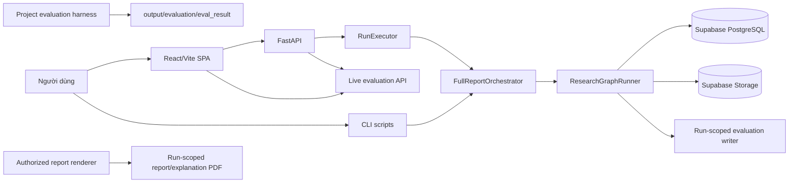

# Trạng thái hiện hành và cập nhật dự án

Cập nhật: 2026-06-14

## Context

Tài liệu này là bản tóm tắt trạng thái nghiệm thu 9/10 của dự án `multi-agent-equity-research`. Khi tài liệu cũ hoặc ghi chú triển khai mâu thuẫn với file này, nên ưu tiên trạng thái trong tài liệu này cho mục đích viết đồ án, trình bày kiến trúc, mô tả product surface và diễn giải kết quả đánh giá.

## Problem Statement

Dự án đã vượt khỏi trạng thái prototype và được đóng gói thành một nền tảng nghiên cứu cổ phiếu có kiểm soát gồm research runtime, deterministic valuation, source provenance, evaluation harness, reporting governance, frontend dashboard và deploy kit. Vấn đề còn lại không phải là thiếu core capability, mà là phân biệt chính xác giữa **draft-publishable research output**, **client-final output đã có phê duyệt**, và **roadmap productionization** cho vận hành quy mô lớn.

## Technical Deep-Dive

### 1. Bản đồ sản phẩm đã nghiệm thu



### 2. Các cập nhật chức năng đã hoàn thành

| Khu vực | Trạng thái nghiệm thu | Entry point |
|---|---|---|
| Frontend | SPA có route `/reports` và `/eval`; cả hai ưu tiên dữ liệu live từ backend, mock chỉ dùng fixture development/test. | `frontend/src/App.tsx`, `frontend/src/pages/ReportsPage.tsx`, `frontend/src/pages/EvalDashboardPage.tsx` |
| Danh mục báo cáo | `/reports` hiển thị universe 53 ticker, ưu tiên run manifest/artifact lineage và fallback local preview khi thiếu object production. | `backend/api.py`, `backend/reporting/output_inventory.py` |
| Report files | API trả report, explanation và preview theo lineage của run; local output chỉ là preview/cache, không phải source of truth. | `backend/api.py`, `backend/reporting/output_inventory.py` |
| Research execution | API tạo run deterministic, submit executor và ghi trạng thái theo từng stage; CLI hỗ trợ batch/reproduce. | `backend/api.py`, `backend/executor.py`, `scripts/run_research.py` |
| Runtime graph | Workflow `full_report` gồm chín stage cố định, có checkpoint, artifact contract và gate contract rõ ràng. | `backend/harness/graph.py`, `backend/harness/runner.py` |
| `PUBLISH` | Xác nhận locked publishable model, ghi evaluation artifacts/manifest và đặt status `auto_exported` khi mọi gate bắt buộc pass. | `backend/harness/runner.py` |
| Client-final | Render fail-closed khi có run approved, final approval, locked model, package gate, report quality và snapshot match. | `backend/reporting/publication_readiness.py`, `backend/reporting/final_report_renderer.py` |
| Post-render audit | Kiểm tra nội dung nội bộ, kỳ tài chính, overflow bảng, chart source/takeaway, kích thước ảnh, clipping, font và orphan page. | `backend/reporting/post_render_audit.py` |
| Runtime evaluation | Mỗi research run tạo tám evaluation artifacts và một packet tổng hợp đủ dùng cho frontend và thesis evidence. | `backend/evaluation/run_evaluation.py` |
| Project evaluation | Chạy tám plan, tạo scorecard theo data, RAG, finance, citation, agent, report, observability và publication readiness. | `scripts/run_project_evaluation.py`, `backend/evaluation/project_evaluator.py` |
| Eval dashboard | Route `/eval` đọc live evaluation artifacts qua backend; mock artifact không còn là dữ liệu mặc định. | `frontend/src/pages/EvalDashboardPage.tsx`, `backend/api.py` |
| Scheduling | App runtime vẫn tách khỏi scheduler; DAG/Astro dùng cho deploy kit và batch orchestration. | `dags/`, `astro/` |

### 3. Luồng research runtime

```text
PREFLIGHT
-> PLAN
-> INGEST_AND_VALIDATE
-> ANALYZE
-> FORECAST_AND_VALUE
-> WRITE_REPORT
-> REVIEW
-> EXPORT_GATES
-> PUBLISH
```

| Stage | Logic đáng chú ý |
|---|---|
| `PLAN` | Tạo plan deterministic, không gọi LLM. |
| `INGEST_AND_VALIDATE` | Tái sử dụng snapshot còn mới hoặc auto-ingest; sau đó chạy `build_facts` và `build_index` với source-tier validation. |
| `ANALYZE` | Đọc snapshot/ratios, gọi financial-analysis agent, tạo `company_research_pack` và `analyst_insight_pack`. |
| `FORECAST_AND_VALUE` | Forecast và valuation là deterministic tools; FCFF/FCFE/blend/multiples/sensitivity đều có formula trace. |
| `WRITE_REPORT` | Agent tạo draft từ artifact đã khóa; assembler ánh xạ chart/table sang source artifacts và claim ledger. |
| `REVIEW` | Chạy completeness, critic, citation và report-quality diagnostics; promote review-passed model khi đủ điều kiện. |
| `EXPORT_GATES` | Chạy report-quality, evidence-packet, formula-trace, tool-permission và package-validation gates; promote locked publishable model. |
| `PUBLISH` | Ghi evaluation artifacts, manifest và trạng thái `auto_exported` cho draft publishable. |

### 4. Gate và trạng thái sau nghiệm thu

| Tình huống | Hành vi nghiệm thu |
|---|---|
| Tool trả `blocking_reason` tại stage trọng yếu | Runner ghi checkpoint, đóng step với trạng thái không đạt và không promote artifact downstream. |
| Exception trong stage | Run chuyển thành `failed`, lưu `blocking_reason` và checkpoint phục vụ retry. |
| Gate bắt buộc fail trước publish | Run chuyển thành `blocked` hoặc không được promote lên `publishable_final_report_model`. |
| Thiếu publishable model tại `PUBLISH` | Run chuyển thành `blocked`. |
| Gate pass | Kết quả được ghi vào `gate_results`, package validation và evaluation packet. |
| Client-final thiếu điều kiện governance | `authorize_client_final` fail-closed và từ chối render. |

Thiết kế sau nghiệm thu phân biệt ba lớp kiểm soát: deterministic gates bảo vệ artifact promotion, project evaluation bảo vệ scorecard đồ án, và client-final authorization bảo vệ việc render báo cáo đã phê duyệt.

### 5. Hai đường evaluation

| Đường | Mục tiêu | Output |
|---|---|---|
| Run-scoped evaluation | Chuyển state của một research run thành tám domain artifacts và frontend-compatible packet. | Run artifacts/manifest |
| Project evaluation | Đánh giá control coverage của repository theo tám plan và kiểm tra runtime evidence hiện có. | `output/evaluation/eval_result/` |

Project evaluation giữ nguyên nguyên tắc fail-closed: test pass không thay thế evidence run-specific; metric chỉ được ghi `pass` khi artifact hoặc evaluator tương ứng có bằng chứng đo được.

### 6. Luồng giao diện

```mermaid
flowchart TD
    A[/reports] --> B[Load 53 ticker từ frontend universe]
    B --> C[GET /reports]
    C --> D[Merge manifest lineage, artifact inventory và local preview]
    D --> F[Preview/download/generate]
    F --> G[POST /research/start]
    G --> H[Poll GET /research/{run_id}/status]

    I[/eval] --> J[GET /eval/framework]
    J --> K[GET /eval/artifacts/{artifact_name}]
    K --> L[Hiển thị 8 lớp evaluation và publication readiness]
```

## Strategic Recommendations

| Ưu tiên | Khuyến nghị | Lý do |
|---|---|---|
| P0 | Trong đồ án, dùng `DRAFT_PUBLISHABLE` để mô tả kết quả tự động và `client_final` cho kết quả đã có phê duyệt | Giữ đúng ranh giới governance và giảm rủi ro diễn giải quá mức |
| P0 | Dùng MVP5 làm phạm vi định lượng chính, dùng 53 ticker làm readiness matrix | Tránh làm loãng evidence bằng các ticker chưa cần phân tích sâu ở mức thesis |
| P1 | Khi trình bày dashboard, nhấn mạnh live evaluation artifacts thay vì UI demo | Chứng minh hệ thống có observability thật |
| P1 | Khi trình bày rủi ro, giữ residual roadmap 1/10 gồm queue bền vững, CI/CD đa môi trường và SLA | Tạo kết luận cân bằng giữa thành tựu kỹ thuật và giới hạn sản phẩm |
