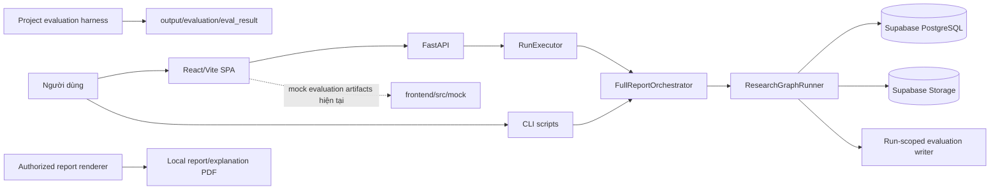

# Trạng thái hiện hành và cập nhật dự án

Cập nhật: 2026-06-14

## Context

Tài liệu này là bản tóm tắt trạng thái code hiện hành của dự án. Khi nội dung trong tài liệu cũ, kế hoạch hoặc sơ đồ mâu thuẫn với tài liệu này, cần kiểm tra lại các entrypoint được dẫn chiếu bên dưới trước khi triển khai.

## Problem Statement

Dự án đã mở rộng từ pipeline backend thành một sản phẩm gồm research runtime, evaluation harness, reporting governance, giao diện web và deploy kit theo lịch. Một số thuật ngữ cũ như “publish”, “gate fail” hoặc “evaluation dashboard” có thể gây hiểu sai nếu không phân biệt rõ artifact nháp, client-final, diagnostic gate và dữ liệu mock.

## Technical Deep-Dive

### 1. Bản đồ sản phẩm hiện tại



### 2. Các cập nhật chức năng chính

| Khu vực | Trạng thái hiện hành | Entry point |
|---|---|---|
| Frontend | SPA có hai route `/reports` và `/eval`; FastAPI phục vụ `frontend/dist/` sau khi API routes đã đăng ký | `frontend/src/App.tsx`, `backend/api.py` |
| Danh mục báo cáo | `/reports` luôn hiển thị toàn bộ 53 ticker từ universe; dữ liệu API chỉ bổ sung trạng thái artifact, lỗi API thì fallback về universe-only | `frontend/src/pages/ReportsPage.tsx`, `backend/reporting/output_inventory.py` |
| Report files | API đọc file local theo convention `output/{TICKER}_report.pdf`, `output/{TICKER}_explanation.pdf` và preview PNG | `backend/api.py`, `backend/reporting/output_inventory.py` |
| Research execution | API tạo run deterministic và submit vào `ThreadPoolExecutor`; CLI chạy đồng bộ | `backend/api.py`, `backend/executor.py`, `scripts/run_research.py` |
| Runtime graph | Một workflow `full_report`, chín stage cố định | `backend/harness/graph.py`, `backend/harness/runner.py` |
| `PUBLISH` | Không render HTML/PDF; xác nhận model, ghi evaluation artifacts/manifest và đặt status `auto_exported` | `backend/harness/runner.py` |
| Client-final | Chỉ render khi có authorization fail-closed: run approved, final approval, locked model, package gate, report quality và snapshot match | `backend/reporting/publication_readiness.py`, `backend/reporting/final_report_renderer.py` |
| Post-render audit | Kiểm tra ngôn ngữ nội bộ, kỳ tài chính, overflow bảng, chart source/takeaway, kích thước ảnh, clipping, font và orphan page | `backend/reporting/post_render_audit.py` |
| Runtime evaluation | Mỗi research run tạo tám evaluation artifacts và một packet fail-closed | `backend/evaluation/run_evaluation.py` |
| Project evaluation | Chạy tuần tự tám plan, test scope riêng và kiểm tra runtime evidence; không suy diễn metric của run từ test pass | `scripts/run_project_evaluation.py`, `backend/evaluation/project_evaluator.py` |
| Eval dashboard | Route `/eval` hiện đọc mock artifacts đúng schema; backend chưa expose `/eval/framework` hoặc runtime evaluation API | `frontend/src/pages/EvalDashboardPage.tsx`, `frontend/src/mock/`, `backend/api.py` |
| Scheduling | App runtime không chứa scheduler nội bộ; DAG/Astro là deploy kit tách biệt | `dags/`, `astro/` |

### 3. Luồng research runtime

```text
PREFLIGHT
-> PLAN
-> INGEST_AND_VALIDATE
-> ANALYZE
-> FORECAST_AND_VALUE
-> WRITE_REPORT
-> REVIEW
-> EXPORT_GATES
-> PUBLISH
```

| Stage | Logic đáng chú ý |
|---|---|
| `PLAN` | Tạo plan deterministic, không gọi LLM |
| `INGEST_AND_VALIDATE` | Tái sử dụng snapshot còn mới nếu có; nếu không thì auto-ingest, sau đó chạy `build_facts` và `build_index` song song |
| `ANALYZE` | Đọc snapshot/ratios, gọi financial-analysis agent, tạo `company_research_pack` và `analyst_insight_pack` |
| `FORECAST_AND_VALUE` | Forecast và valuation là deterministic tools; draft mode có thể dùng narrative deterministic |
| `WRITE_REPORT` | Agent tạo draft; spec builder ánh xạ chart/table sang source artifacts; assembler tạo candidate model |
| `REVIEW` | Chạy completeness, critic và citation diagnostics; promote review-passed model |
| `EXPORT_GATES` | Chạy report-quality và package-validation diagnostics; promote locked publishable model |
| `PUBLISH` | Ghi evaluation artifacts và manifest; không render report |

### 4. Semantics của gate và trạng thái

`ResearchGraphRunner._record_gate` hiện ghi kết quả gate để quan sát nhưng không tự đặt `state.status = blocked`. Vì vậy:

| Tình huống | Hành vi hiện tại |
|---|---|
| Tool trả `blocking_reason` tại một số stage | Runner raise exception; run chuyển thành `failed` |
| Exception trong stage | Run chuyển thành `failed`, lưu `blocking_reason` và checkpoint |
| Thiếu publishable model tại `PUBLISH` | Run chuyển thành `blocked` |
| Gate trả `passed=false` | Được ghi vào `gate_results`; không mặc định dừng stage |
| Client-final thiếu điều kiện governance | `authorize_client_final` fail-closed và từ chối render |

Đây là khoảng cách quan trọng giữa “diagnostic gate” và “runtime-enforced blocker”. Khi yêu cầu deterministic gate phải dừng pipeline trước `auto_exported`, cần bổ sung enforcement trong runner và regression test tương ứng.

### 5. Hai đường evaluation

| Đường | Mục tiêu | Output |
|---|---|---|
| Run-scoped evaluation | Chuyển state của một research run thành tám domain artifacts và frontend-compatible packet | Run artifacts/manifest |
| Project evaluation | Đánh giá control coverage của repository theo tám plan và kiểm tra runtime evidence hiện có | `output/evaluation/eval_result/` |

Project evaluation tuân thủ fail-closed: test pass không được dùng để giả định một metric run-specific đã đạt; metric thiếu evidence vẫn là `not_measured`, `fail` hoặc `blocked`.

### 6. Luồng giao diện

```mermaid
flowchart TD
    A[/reports] --> B[Load 53 ticker từ frontend universe]
    B --> C[GET /reports]
    C --> D[Merge live inventory với universe]
    C -. API lỗi .-> E[Fallback universe-only]
    D --> F[Preview/download/generate]
    F --> G[POST /research/start]
    G --> H[Poll GET /research/{run_id}/status]

    I[/eval] --> J[Đọc frontend/src/mock]
    J --> K[Hiển thị 8 lớp evaluation]
```

## Strategic Recommendations

| Ưu tiên | Khuyến nghị | Lý do |
|---|---|---|
| P0 | Quyết định rõ gate fail có phải chặn `auto_exported` hay chỉ chặn client-final | Contract hiện tại ghi diagnostic nhưng tên gate và một số tài liệu dễ tạo kỳ vọng fail-closed sớm hơn thực tế |
| P0 | Không mô tả `/eval` là live dashboard cho đến khi backend có evaluation endpoints và frontend bỏ mock loader | Tránh hiểu sai trạng thái chất lượng runtime |
| P1 | Chuyển report inventory từ local filename convention sang run manifest hoặc artifact API | Local inventory thuận tiện cho MVP nhưng không bảo đảm lineage production |
| P1 | Giữ `auto_exported` và `approved/client_final` là hai trạng thái sản phẩm tách biệt | Giảm rủi ro công bố nhầm draft |
| P1 | Đồng bộ `docs/SEQUENCE.md` mỗi khi thay đổi stage hoặc render boundary | Đây là tài liệu dễ bị dùng làm nguồn kiến trúc chính |
