# Kiểm định sequence và flow của hệ thống

Cập nhật theo mã nguồn hiện tại: 2026-06-13

## Context

Tài liệu này mô tả các luồng chính đang được triển khai trong dự án `multi-agent-equity-research`. Nội dung được đối chiếu với các điểm thực thi chính: `scripts/run_research.py`, `backend/api.py`, `backend/orchestrator.py`, `backend/harness/graph.py`, `backend/harness/runner.py`, `backend/harness/gates.py`, `backend/runtime_store.py`, `backend/storage/layout.py` và lớp xuất báo cáo.

Mục tiêu của tài liệu là cung cấp bộ sơ đồ đủ chi tiết để đưa vào đồ án, nhưng mỗi sơ đồ chỉ mô tả một lát cắt nghiệp vụ hoặc kỹ thuật rõ ràng. Cách chia này giúp người đọc hiểu hệ thống theo từng tầng: đầu vào, dữ liệu, kiểm định, định giá, báo cáo, xuất bản và hậu kiểm chuyên gia.

## Problem Statement

Luồng hiện tại không phải là một hệ thống trò chuyện đơn lẻ và cũng không phải một quy trình phê duyệt thủ công nhiều tầng. Hệ thống là một pipeline nghiên cứu tự động có điều phối trạng thái, công cụ tất định, agent chuyên trách, cổng kiểm định tự động, tệp kết quả theo `run_id`, gói bằng chứng và báo cáo HTML/PDF.

Pipeline sản xuất hiện có đúng chín chặng:

```text
PREFLIGHT
-> PLAN
-> INGEST_AND_VALIDATE
-> ANALYZE
-> FORECAST_AND_VALUE
-> WRITE_REPORT
-> REVIEW
-> EXPORT_GATES
-> PUBLISH
```

Khi một cổng kiểm định nghiêm trọng thất bại, bộ chạy nghiên cứu (`ResearchGraphRunner`) đặt trạng thái run thành `blocked`, ghi `blocking_reason`, lưu checkpoint và dừng trước chặng tiếp theo. Khi toàn bộ cổng kiểm định đạt yêu cầu, chặng `PUBLISH` tự xuất báo cáo, lưu `report.html` và `report.pdf` trong bucket `runs`, sau đó trạng thái cơ sở dữ liệu chuyển thành `auto_exported`; API ánh xạ trạng thái này thành `PUBLISHED_DRAFT`. Tên `auto_exported` thể hiện rõ đây là báo cáo tự xuất sau khi cổng tự động đạt, không phải chữ ký phê duyệt thủ công.

Đánh giá chuyên gia sau đầu ra là hoạt động hậu kiểm, không phải cổng chặn nằm giữa `EXPORT_GATES` và `PUBLISH`. Điều này cần được trình bày rõ trong đồ án để tránh nhầm giữa kiểm định tự động trong runtime và phản hồi chuyên gia sau khi báo cáo đã được tạo.

## Technical Deep-Dive

### 1. Bản đồ tổng quan hệ thống

Sơ đồ này mô tả các khối lớn của hệ thống, không đi sâu vào từng agent.

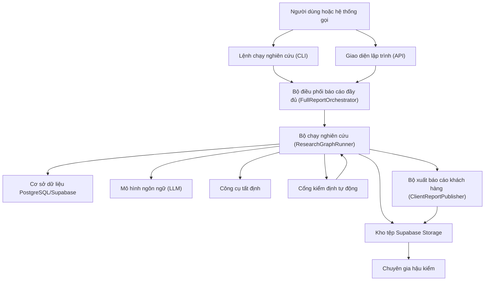

Ý nghĩa chính: orchestration chỉ là lớp điều phối, còn toàn bộ trình tự thực thi và dừng chặn nằm trong `ResearchGraphRunner`.

### 2. Luồng khởi tạo bằng CLI

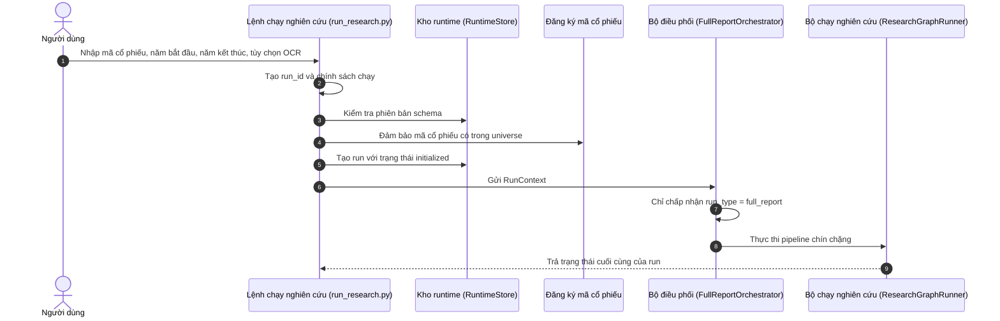

Đặc điểm của CLI là chạy đồng bộ: lệnh chờ pipeline hoàn thành hoặc dừng lỗi.

### 3. Luồng khởi tạo bằng API

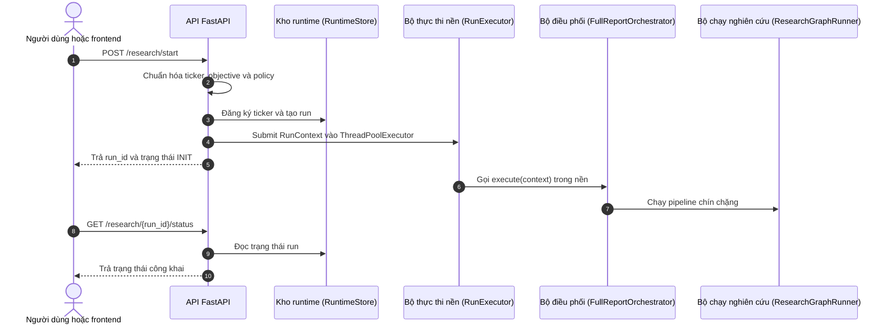

Đặc điểm của API là trả `run_id` sớm; người dùng theo dõi tiến độ bằng endpoint trạng thái.

### 4. Bản đồ chín chặng runtime

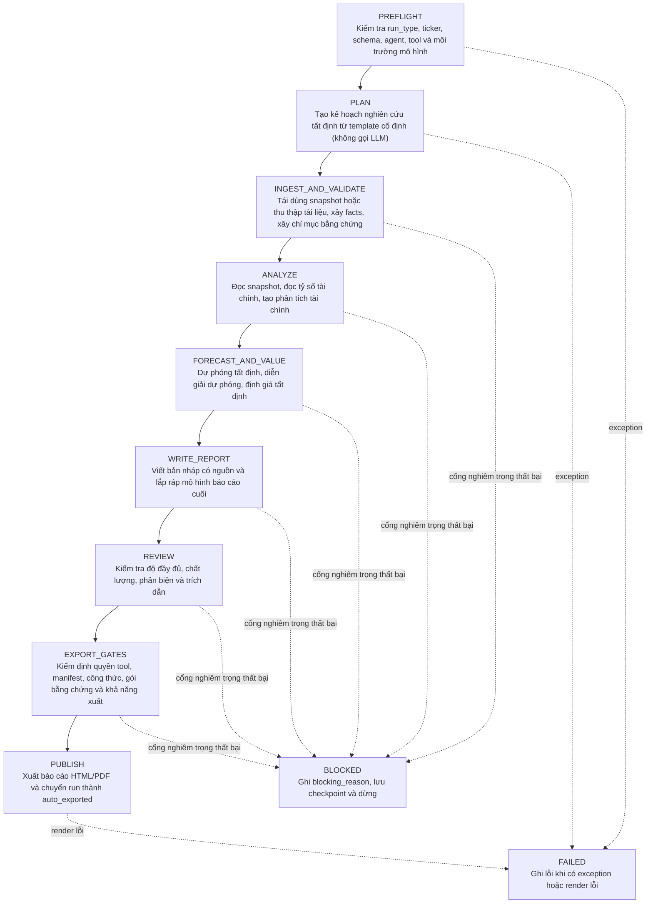

### 5. Luồng tiền kiểm và lập kế hoạch

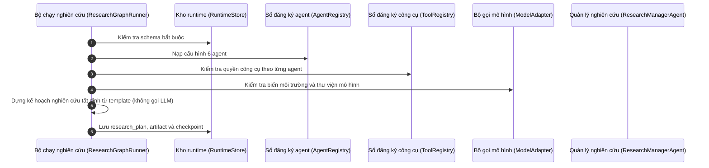

Chặng `PLAN` dựng kế hoạch nghiên cứu tất định từ template cố định (`_deterministic_research_plan`), không gọi LLM. Vai trò `research_manager` vẫn được cấu hình trong registry nhưng không được gọi ở chặng này. Kế hoạch vẫn tuân theo hợp đồng `ResearchManagerArtifact`.

### 6. Luồng dữ liệu có tái dùng snapshot

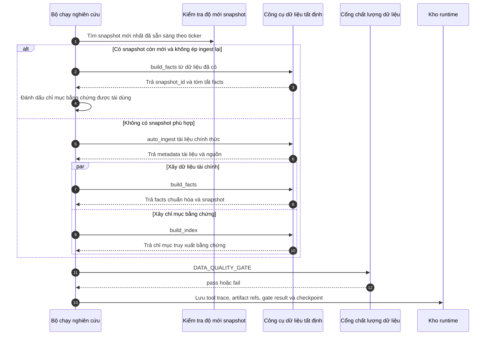

Trong runtime hiện tại, `DataEvidenceAgent` là vai trò sở hữu công cụ, nhưng runner gọi trực tiếp các công cụ tất định; không có lời gọi LLM riêng cho `DataEvidenceAgent` ở chặng này.

### 7. Luồng OCR và thăng cấp facts

Sơ đồ này mô tả nhánh dữ liệu tài liệu khi gặp PDF quét hoặc PDF không có lớp chữ đáng tin cậy.

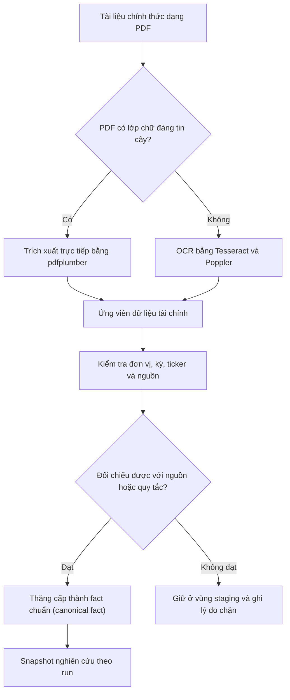

OCR chỉ tạo dữ liệu ứng viên. Số liệu chỉ được dùng cho báo cáo sau khi vượt qua kiểm tra và được thăng cấp thành fact chuẩn.

### 8. Luồng fact, snapshot và bằng chứng

```mermaid
flowchart LR
    A["Nguồn chính thức và dữ liệu thị trường"]
    B["Tài liệu nguồn (source_documents)"]
    C["Quan sát thô (observations)"]
    D["Fact chuẩn (canonical_facts)"]
    E["Snapshot nghiên cứu"]
    F["Tệp phân tích và định giá"]
    G["Gói bằng chứng (evidence_pack.json)"]
    H["Báo cáo có trích dẫn"]

    A --> B
    B --> C
    C --> D
    D --> E
    E --> F
    F --> G
    G --> H
```

Quy tắc quan trọng: báo cáo không đọc dữ liệu sống trực tiếp. Báo cáo dùng snapshot đã đóng băng và artifact theo `run_id`.

### 9. Luồng phân tích tài chính

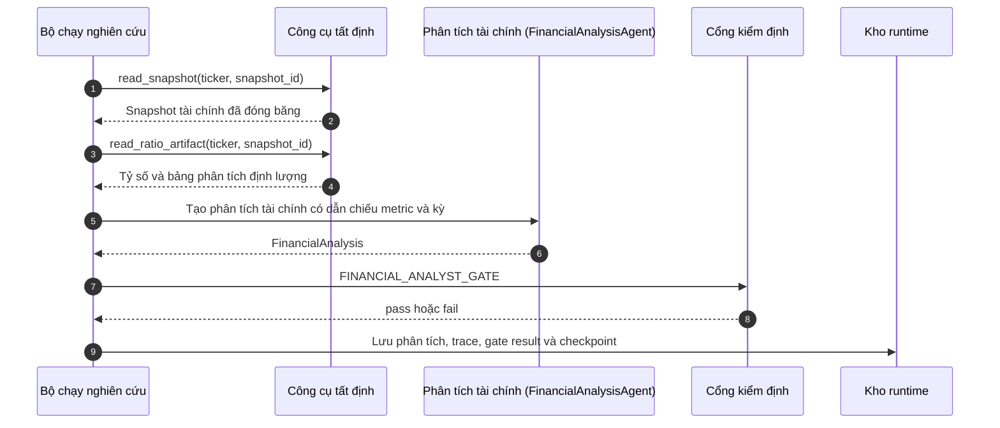

Agent được dùng để diễn giải và cấu trúc nhận định; phép tính số liệu chính vẫn do công cụ Python thực hiện.

### 10. Luồng dự phóng và định giá

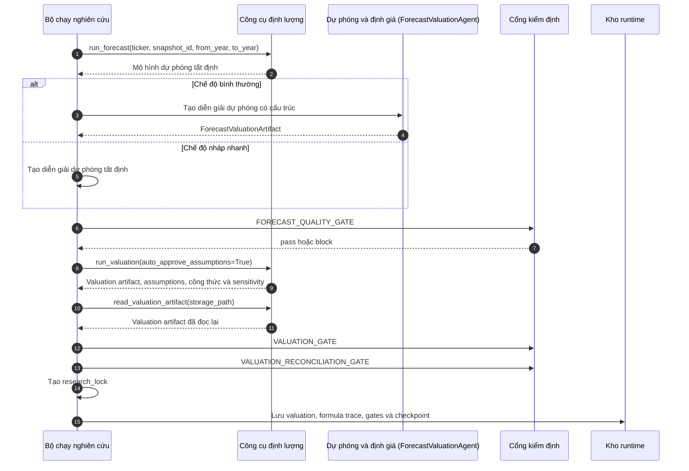

Runtime hiện tại không dừng để chờ chuyên gia phê duyệt giả định định giá. Cờ `auto_approve_assumptions` trong CLI policy được ghi vào policy, nhưng lời gọi valuation trong runner đang truyền `auto_approve_assumptions=True`.

### 11. Luồng viết báo cáo

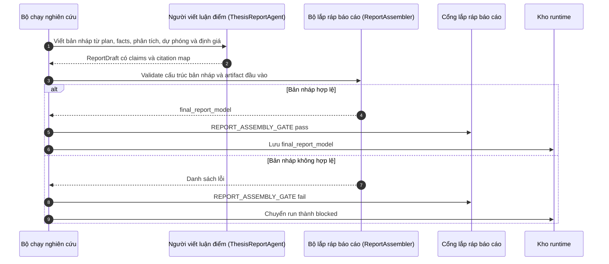

`ReportAssembler` không tự sáng tạo nội dung mới; nhiệm vụ của nó là kiểm tra và sắp xếp các đầu vào đã có thành mô hình báo cáo cuối.

### 12. Luồng review (phản biện, không tự sửa)

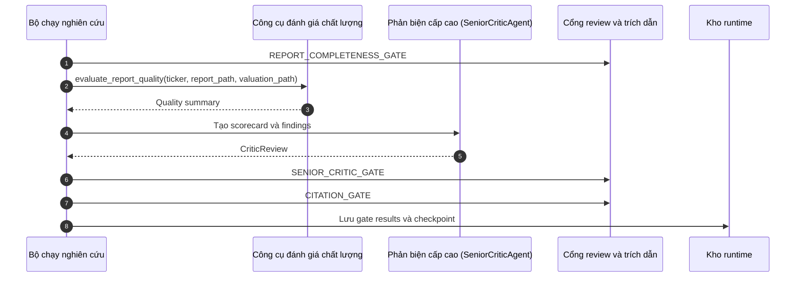

Chặng REVIEW không tự sửa báo cáo. Phản biện cấp cao chỉ tạo `findings`; nếu có phát hiện nghiêm trọng thì `SENIOR_CRITIC_GATE` chặn run. Nhánh tự sửa một lần (auto-repair) đã được loại bỏ vì bản sửa trước đây không được chạy lại qua assembler và các cổng nên không bao giờ tới khâu render.

### 13. Luồng kiểm định xuất bản

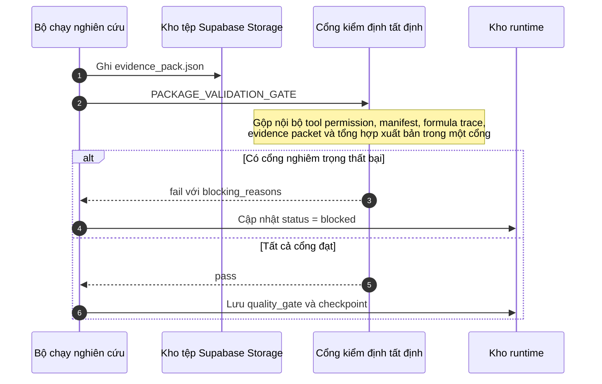

`PACKAGE_VALIDATION_GATE` không hỏi phê duyệt con người. Cổng này chạy nội bộ các kiểm tra tool permission, manifest, formula trace và evidence packet, rồi tổng hợp lỗi từ kết quả đánh giá chất lượng, liên kết snapshot, trạng thái formula trace và các điều kiện xuất bản định lượng — tất cả gói trong một kết quả cổng duy nhất.

### 14. Luồng xuất báo cáo

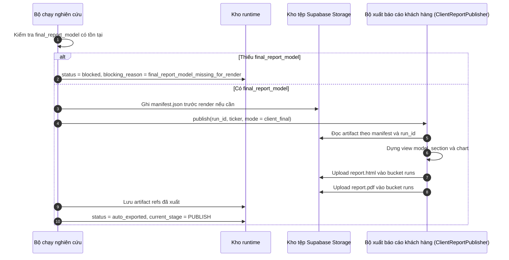

Đường xuất báo cáo hiện tại ghi HTML/PDF vào bucket `runs` theo khóa `{run_id}/report.html` và `{run_id}/report.pdf`. Bucket `exports` vẫn tồn tại trong storage contract, nhưng publish path hiện tại của runner không ghi bản sao vào bucket này.

### 15. Luồng artifact theo run_id

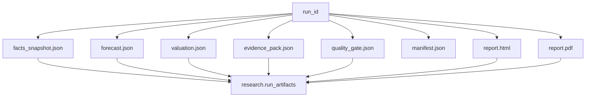

Quy tắc trình bày trong đồ án: mọi artifact sản xuất phải được truy theo `run_id` và manifest. Không dùng cách tìm tệp mới nhất theo timestamp để dựng báo cáo.

### 16. Luồng trạng thái runtime

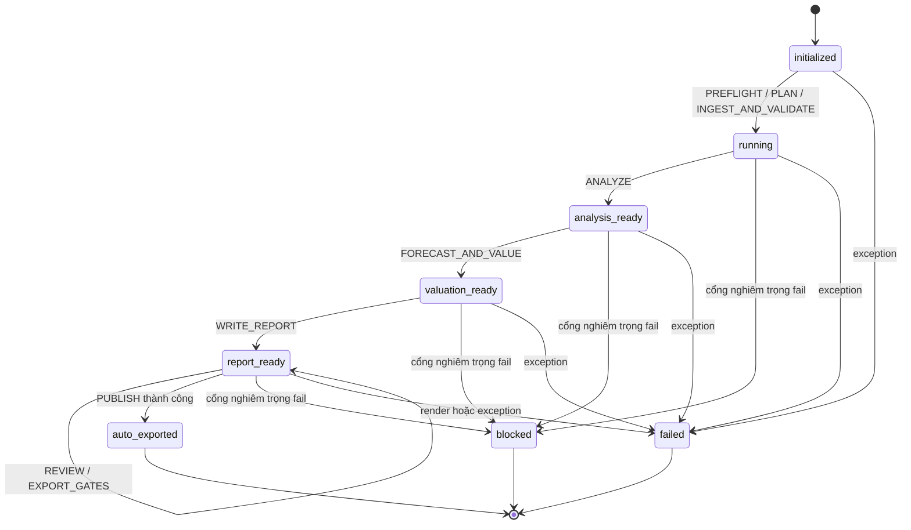

`needs_human_review` không phải trạng thái runtime hiện tại của `ResearchGraphState`. Trạng thái bị chặn hiện tại là `blocked`.

### 17. Luồng ánh xạ trạng thái API

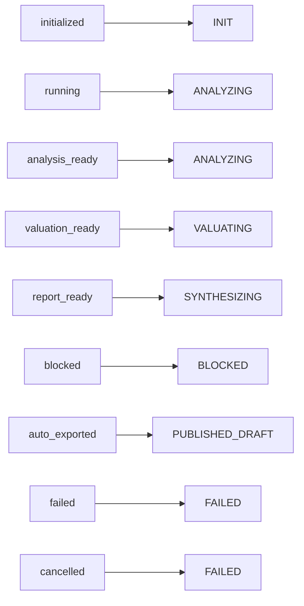

Trong giao diện công khai, `auto_exported` của cơ sở dữ liệu được hiển thị là `PUBLISHED_DRAFT`. Tên này nên được hiểu là run đã vượt qua cổng tự động và đã xuất báo cáo, không phải chữ ký phê duyệt thủ công của chuyên gia. Các run cũ trước migration 035 còn trạng thái `approved` vẫn ánh xạ về `PUBLISHED`.

### 18. Luồng tham gia của agent và công cụ

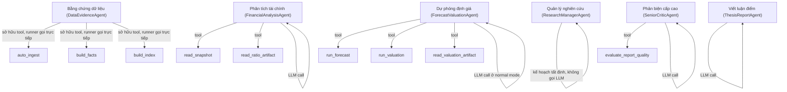

Tên “six-agent workflow” phản ánh sáu vai trò được cấu hình và kiểm soát quyền. Điều này không có nghĩa cả sáu agent đều được gọi qua LLM trong mọi chặng.

### 19. Luồng cổng kiểm định theo chặng

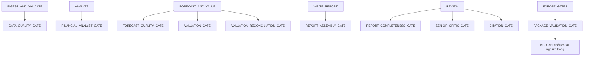

| Stage | Cổng kiểm định chính | Khi fail nghiêm trọng |
|---|---|---|
| `INGEST_AND_VALIDATE` | `DATA_QUALITY_GATE` | `blocked` |
| `ANALYZE` | `FINANCIAL_ANALYST_GATE` | `blocked` |
| `FORECAST_AND_VALUE` | `FORECAST_QUALITY_GATE`, `VALUATION_GATE`, `VALUATION_RECONCILIATION_GATE` | `blocked`, trừ cảnh báo không nghiêm trọng |
| `WRITE_REPORT` | `REPORT_ASSEMBLY_GATE` | `blocked` |
| `REVIEW` | `REPORT_COMPLETENESS_GATE`, `SENIOR_CRITIC_GATE`, `CITATION_GATE` | `blocked` |
| `EXPORT_GATES` | `PACKAGE_VALIDATION_GATE` (gộp tool permission, manifest, formula trace, evidence packet và tổng hợp xuất bản) | `blocked` |
| `PUBLISH` | Không có cổng phê duyệt thủ công | Render thành công thì `auto_exported`; render lỗi thì `failed` |

### 20. Luồng hậu kiểm chuyên gia sau báo cáo

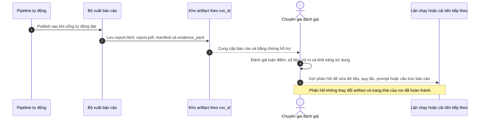

Hậu kiểm chuyên gia là vòng phản hồi cho chất lượng sản phẩm, không phải một chặng runtime bắt buộc trước khi xuất báo cáo.

### 21. Luồng xử lý khi bị chặn

```mermaid
sequenceDiagram
    autonumber
    participant G as Cổng kiểm định
    participant R as Bộ chạy nghiên cứu
    participant S as Kho runtime
    participant ST as Kho artifact
    actor A as Người vận hành

    G-->>R: fail, severity = critical, blocking_reasons
    R->>R: Đặt state.status = blocked
    R->>R: Ghi state.blocking_reason
    R->>S: update_run_state(run_id, blocked, current_stage)
    R->>ST: Ghi graph_state_snapshot và evidence_pack nếu có thể
    A->>S: Xem trạng thái và blocking_reason
    A->>ST: Xem artifact liên quan để xác định nguyên nhân
```

Thiết kế này ưu tiên khả năng truy vết. Khi bị chặn, hệ thống giữ lại trạng thái, lý do và artifact để người vận hành biết cần sửa nguồn dữ liệu, công thức, prompt hay cấu hình nào.

### 22. Luồng lỗi ngoài cổng kiểm định

```mermaid
flowchart TD
    A["Stage đang chạy"]
    B{"Có exception?"}
    C["Tiếp tục stage tiếp theo"]
    D["state.status = failed"]
    E["blocking_reason = stage + lỗi"]
    F["Đóng step với status failed"]
    G["update_run_state failed"]
    H["Lưu checkpoint"]

    A --> B
    B -- "Không" --> C
    B -- "Có" --> D
    D --> E
    E --> F
    F --> G
    G --> H
```

Khác biệt chính: fail do cổng kiểm định thường là `blocked`; fail do exception hoặc render lỗi là `failed`.

### 23. Luồng dữ liệu lưu trữ theo bucket

```mermaid
flowchart TD
    A["sources"]
    B["official_documents/{ticker}/{year}/{source_doc_id}.pdf"]
    C["runs"]
    D["{run_id}/manifest.json"]
    E["{run_id}/valuation.json"]
    F["{run_id}/evidence_pack.json"]
    G["{run_id}/report.html"]
    H["{run_id}/report.pdf"]
    I["exports"]
    J["approved_reports/{ticker}/{run_id}/report.pdf"]
    K["archive"]
    L["legacy, debug, failed_runs"]

    A --> B
    C --> D
    C --> E
    C --> F
    C --> G
    C --> H
    I --> J
    K --> L
```

Bucket `exports` là một phần của storage contract, nhưng luồng publish hiện tại của `ResearchGraphRunner` dùng `ClientReportPublisher` và ghi báo cáo vào bucket `runs`.

### 24. Luồng IPO cho đồ án

```mermaid
flowchart LR
    A["Đầu vào<br/>Ticker, khoảng năm, objective, OCR flag, policy, nguồn dữ liệu"]
    B["Xử lý<br/>CLI/API, orchestrator, runner chín chặng, agent, tool, gates, checkpoint"]
    C["Đầu ra<br/>Snapshot, facts, forecast, valuation, evidence pack, manifest, HTML/PDF hoặc blocking_reason"]
    D["Hậu kiểm<br/>Chuyên gia đánh giá báo cáo đã xuất và tạo phản hồi cải tiến"]

    A --> B --> C --> D
```

Đây là sơ đồ ngắn nhất nên dùng khi cần giải thích hệ thống trong một slide tổng quan.

### 25. Các khẳng định đã kiểm định

| Nội dung | Trạng thái hiện tại |
|---|---|
| Có hai cửa vào chính: CLI và API | Đúng |
| Orchestrator là lớp điều phối mỏng | Đúng |
| Runtime có 9 stage trong `GRAPH_STAGES` | Đúng |
| Cổng nghiêm trọng fail thì trạng thái là `blocked` | Đúng |
| `needs_human_review` là trạng thái runtime hiện tại | Sai |
| Có cổng phê duyệt con người trước `PUBLISH` | Sai |
| `PUBLISH` dùng `ClientReportPublisher` trong đường chạy hiện tại | Đúng |
| Báo cáo HTML/PDF được ghi vào bucket `runs` | Đúng |
| Hậu kiểm chuyên gia diễn ra sau khi báo cáo đã xuất | Đúng theo ranh giới runtime hiện tại |

## Strategic Recommendations

### 1. Cách chọn sơ đồ đưa vào đồ án

Nên dùng bộ sơ đồ theo ba tầng:

| Tầng trình bày | Sơ đồ nên dùng | Mục tiêu |
|---|---|---|
| Tổng quan sản phẩm | Bản đồ tổng quan, IPO, trạng thái runtime | Giúp hội đồng hiểu hệ thống làm gì và dừng ở đâu |
| Kỹ thuật pipeline | CLI/API, chín chặng, dữ liệu, phân tích, định giá, báo cáo, export gates, publish | Chứng minh luồng thực thi có cấu trúc và kiểm soát |
| Kiểm soát rủi ro | OCR, fact promotion, artifact theo run_id, gate inventory, blocked flow, hậu kiểm chuyên gia | Chứng minh hệ thống có truy vết, chống sai số và có vòng phản hồi |

### 2. Cách diễn đạt đúng về HITL

Trong đồ án, nên mô tả HITL là “đánh giá chuyên gia sau đầu ra”. Không nên mô tả chuyên gia như một cổng bắt buộc giữa định giá và viết báo cáo, hoặc giữa `EXPORT_GATES` và `PUBLISH`, vì runner hiện tại không thực thi các cổng đó.

### 3. Các sơ đồ không nên dùng

Không nên dùng các sơ đồ mô tả:

- `VALUATION_PROPOSAL` và `ASSUMPTION_APPROVAL` như stage sản xuất.
- Phê duyệt con người trước publish như một bước runtime.
- `needs_human_review` như trạng thái runtime hiện tại.
- DataEvidenceAgent như một LLM agent được gọi trong chặng ingest.
- Xuất báo cáo production trực tiếp vào bucket `exports`.

### 4. Kết luận kiến trúc

Luồng cốt lõi của hệ thống là pipeline chín chặng tự động, kết hợp agent chuyên trách, công cụ tất định, cổng kiểm định, artifact lineage, manifest, evidence packet và xuất báo cáo theo `run_id`. Thiết kế này ưu tiên khả năng tái lập, khả năng truy vết và kiểm soát sai số tài chính hơn là tốc độ thời gian thực. Vai trò chuyên gia được đặt ở vòng hậu kiểm để đánh giá chất lượng báo cáo đã xuất và tạo tín hiệu cải tiến cho các lần chạy tiếp theo.
