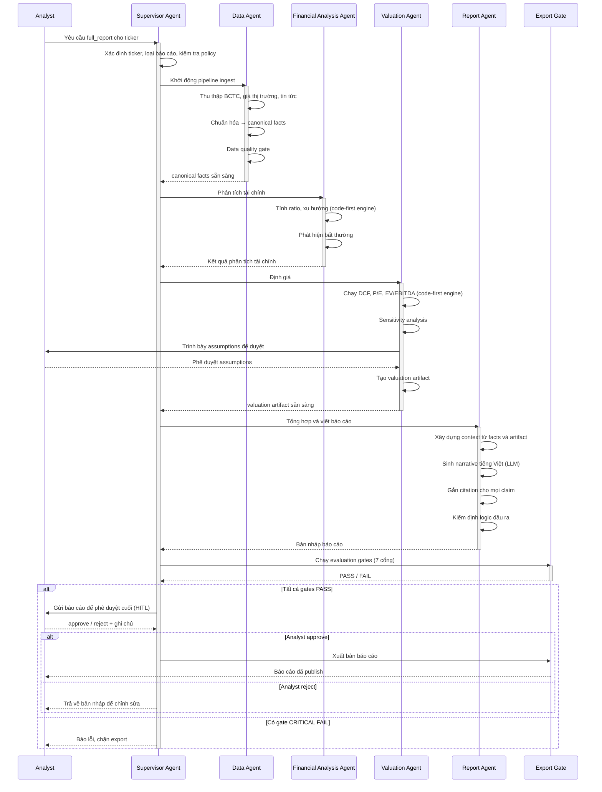
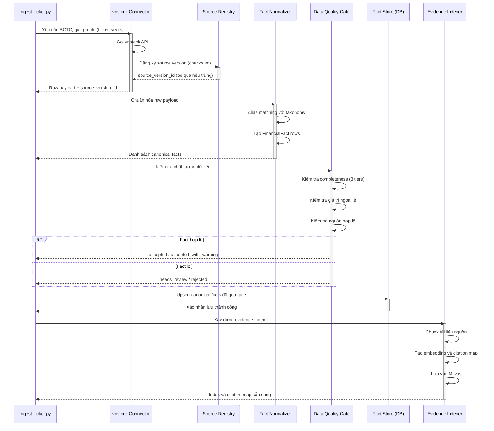
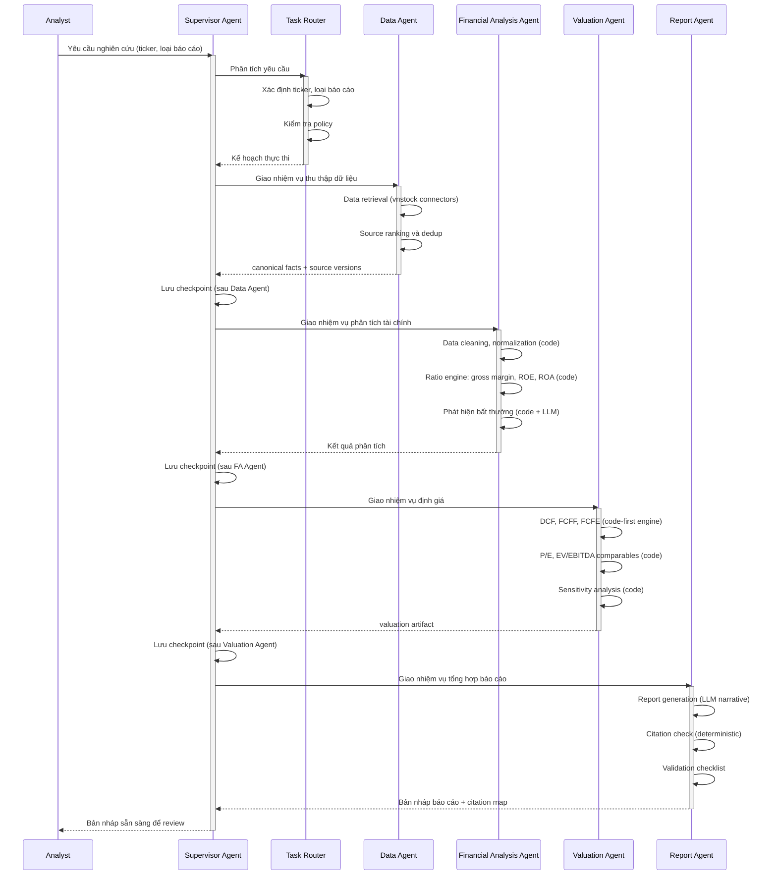
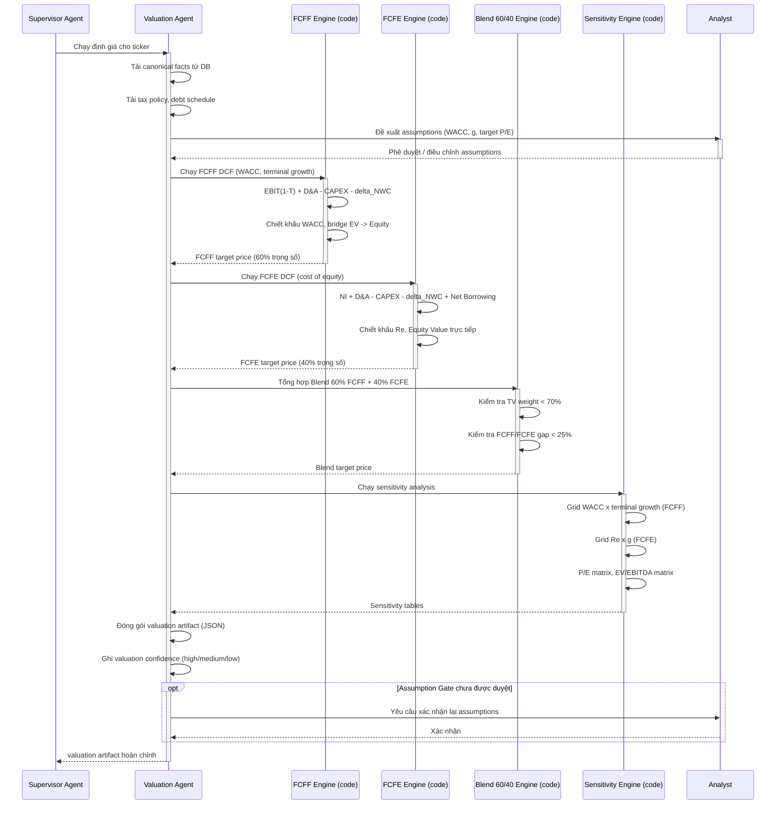
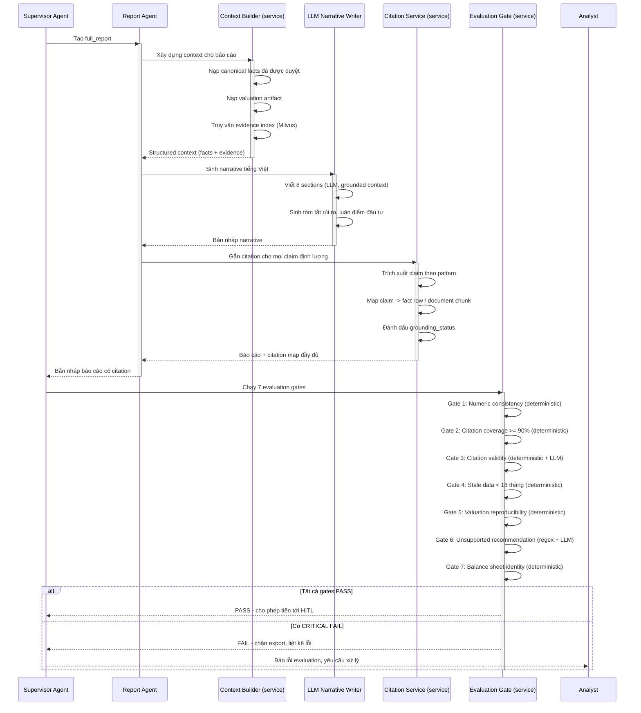
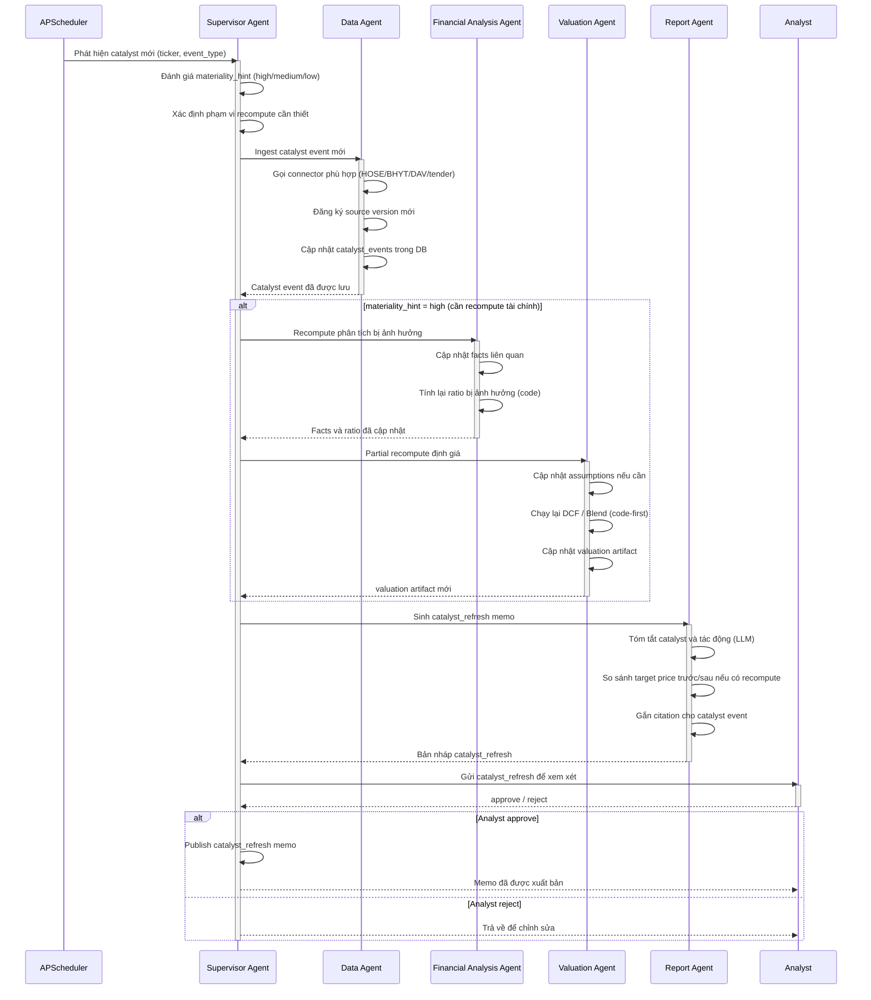

# Vietnam Pharma Equity Research Agent — Sơ đồ tuần tự UML

> Tài liệu này tổng hợp 6 sơ đồ tuần tự mô tả các luồng nghiệp vụ chính của hệ thống.
> Mọi tính toán tài chính được thực hiện bởi code-first engine xác định, không phải LLM.

---

## 01 — Luồng tạo Full Report

**Tiêu đề:** `01_full_report_sequence`

**Mô tả:** Mô tả toàn bộ hành trình từ khi Analyst yêu cầu báo cáo đến khi báo cáo được phê duyệt và xuất bản. Bao gồm các bước từ ingestion → canonical facts → valuation → report → evaluation gate → HITL approval → export.

**Mô tả tuần tự cách hoạt động:** Hệ thống multi-agent bắt đầu khi Analyst gửi yêu cầu tạo `full_report` cho một mã cổ phiếu cụ thể. Supervisor Agent là tác tử điều phối trung tâm, tiếp nhận yêu cầu, xác định ticker, nhận diện loại báo cáo cần sinh và kiểm tra yêu cầu có nằm trong phạm vi chính sách của hệ thống hay không. Nếu yêu cầu hợp lệ, Supervisor Agent khởi động pipeline ingest và chuyển nhiệm vụ sang Data Agent; nếu yêu cầu không hợp lệ hoặc nằm ngoài phạm vi đề tài, hệ thống dừng sớm để tránh tiêu tốn tài nguyên tính toán và hạn chế rủi ro sinh báo cáo không phù hợp.

Ở bước dữ liệu, Data Agent kiểm tra dữ liệu sẵn có, thu thập báo cáo tài chính, dữ liệu giá thị trường, tin tức và các tài liệu hỗ trợ từ những nguồn được phép sử dụng. Data Agent đồng thời tạo danh mục nguồn, loại bỏ dữ liệu trùng lặp và chuẩn bị payload đầu vào cho lớp xử lý dữ liệu. Sau đó, dịch vụ xử lý dữ liệu nội bộ thực hiện trích xuất, chuẩn hóa và chuyển đổi dữ liệu thô thành `canonical facts`, tức tập dữ kiện có cấu trúc thống nhất để các bước phân tích phía sau có thể sử dụng nhất quán. Các dữ kiện này phải vượt qua data quality gate, bao gồm kiểm tra tính đầy đủ, tính hợp lệ, tính nhất quán định lượng và khả năng truy xuất nguồn; nếu dữ liệu chưa đủ, hệ thống có thể đánh dấu thiếu dữ liệu thay vì tiếp tục với giả định không được kiểm chứng.

Khi `canonical facts` đã sẵn sàng, Supervisor Agent giao nhiệm vụ cho Financial Analysis Agent. Tác tử này sử dụng các engine tính toán xác định để tính chỉ số tài chính, phân tích xu hướng theo thời gian và phát hiện các bất thường trong dữ liệu, chẳng hạn biến động biên lợi nhuận, đòn bẩy tài chính, dòng tiền hoặc hiệu quả sử dụng vốn. Điều kiện chuyển bước là kết quả phân tích phải nhất quán với dữ liệu nguồn và có thể đối chiếu lại với các fact đã được lưu; các phép tính trọng yếu không được sinh tự do bởi LLM mà phải dựa trên code-first engine để bảo đảm khả năng tái lập.

Sau khi phân tích tài chính hoàn tất, Supervisor Agent chuyển artifact phân tích sang Valuation Agent. Valuation Agent xây dựng mô hình định giá, bao gồm DCF, P/E, EV/EBITDA và phân tích độ nhạy theo các giả định chính như WACC, tốc độ tăng trưởng dài hạn hoặc bội số so sánh. Trước khi tạo valuation artifact chính thức, hệ thống trình bày các assumption quan trọng cho Analyst phê duyệt theo cơ chế human-in-the-loop. Điều kiện chuyển bước là giả định phải được hiển thị minh bạch, kết quả định giá phải có thể tái tính, và khoảng giá trị hợp lý phải gắn với các tham số đầu vào cụ thể thay vì chỉ là nhận định định tính.

Khi valuation artifact được tạo, Supervisor Agent giao nhiệm vụ tổng hợp cho Report Agent. Report Agent xây dựng context từ `canonical facts`, kết quả phân tích tài chính và valuation artifact, sau đó sử dụng LLM để sinh narrative tiếng Việt cho bản nháp báo cáo. Mỗi nhận định quan trọng, đặc biệt là nhận định định lượng, khuyến nghị đầu tư, luận điểm rủi ro và diễn giải định giá, phải được gắn citation hoặc ánh xạ về nguồn dữ liệu hỗ trợ. Trước khi trả bản nháp về Supervisor Agent, Report Agent thực hiện kiểm định logic đầu ra nhằm phát hiện mâu thuẫn nội bộ, thiếu nguồn hoặc diễn giải vượt quá bằng chứng.

Cuối cùng, Supervisor Agent gửi bản nháp sang Export Gate để chạy các evaluation gates trước khi cho phép xuất bản. Export Gate không phải một agent độc lập mà là lớp kiểm định và chặn xuất bản, chịu trách nhiệm đánh giá tính nhất quán số liệu, độ phủ citation, tính hợp lệ của nguồn, độ mới của dữ liệu, khả năng tái lập định giá, tính hợp lệ của khuyến nghị và các ràng buộc kế toán cơ bản. Nếu tất cả gates đạt trạng thái PASS, báo cáo được gửi cho Analyst phê duyệt cuối; nếu Analyst approve, hệ thống xuất bản báo cáo, còn nếu Analyst reject, bản nháp được trả về để chỉnh sửa. Nếu có gate ở mức CRITICAL FAIL, Supervisor Agent chặn export và thông báo lỗi cho Analyst, bảo đảm báo cáo không được công bố khi chưa đạt chuẩn kiểm định tối thiểu.

---

## 02 — Luồng Data Pipeline

**Tiêu đề:** `02_data_pipeline_sequence`

**Mô tả:** Mô tả chi tiết quá trình thu thập dữ liệu từ vnstock, chuẩn hóa thành canonical facts, kiểm tra chất lượng dữ liệu, và xây dựng retrieval index cho evidence. Đây là foundation cho mọi luồng phân tích.

---

## 03 — Luồng phối hợp Multi-Agent

**Tiêu đề:** `03_multi_agent_orchestration_sequence`

**Mô tả:** Thể hiện cách 5 agent tương tác và phân công nhiệm vụ qua Supervisor Agent. Phân biệt rõ vai trò agent (LLM-assisted reasoning) với service xác định (code-first). Supervisor điều phối toàn bộ workflow và quản lý checkpoint.

---

## 04 — Luồng Định giá và HITL Approval

**Tiêu đề:** `04_valuation_hitl_sequence`

**Mô tả:** Mô tả chi tiết quá trình Valuation Agent chạy các mô hình định giá xác định, đề xuất assumptions, và yêu cầu Analyst phê duyệt trước khi tạo valuation artifact chính thức. Toàn bộ tính toán là code-first, không dùng LLM.

---

## 05 — Luồng Sinh báo cáo, Citation và Evaluation Gate

**Tiêu đề:** `05_report_citation_evaluation_sequence`

**Mô tả:** Mô tả chi tiết quá trình Report Agent sinh narrative, gắn citation cho từng claim, và hệ thống chạy 7 evaluation gates xác định trước khi mở Export Gate. Phân biệt rõ bước LLM (narrative) và bước deterministic (citation, numeric check).

---

## 06 — Luồng Catalyst Refresh

**Tiêu đề:** `06_catalyst_refresh_sequence`

**Mô tả:** Mô tả luồng xử lý khi có sự kiện catalyst mới (tin tức, chính sách, kết quả đấu thầu). Hệ thống thực hiện partial recompute chỉ những phần bị ảnh hưởng thay vì chạy lại toàn bộ pipeline, sau đó sinh catalyst_refresh memo.

