# SEQUENCE — Sơ đồ kiến trúc & luồng chạy

> Tài liệu mô tả kiến trúc hệ thống, use-case, luồng dữ liệu, multi-agent supervisor/worker,
> và các luồng xử lý chính của **Vietnam Pharma Equity Research Agent**.
> Mọi sơ đồ đều là Mermaid — copy trực tiếp vào [mermaid.live](https://mermaid.live) để vẽ.

---

## 0. Biểu đồ tuần tự hệ thống đầy đủ (Master Sequence Diagram)

> Sơ đồ này mô tả **toàn bộ hệ thống** từ góc độ tương tác giữa tất cả components:
> Analyst → CLI → Supervisor → LangGraph Runner → Data Services → LLM Agents →
> Valuation Engine → Report Engine → Evaluation → HITL → Export.

```mermaid
sequenceDiagram
  autonumber

  participant Analyst
  participant CLI as CLI / API<br/>(run_research.py)
  participant SUP as Supervisor<br/>(orchestrator.py)
  participant RUN as ResearchGraphRunner<br/>(harness/runner.py)
  participant STORE as RuntimeStore<br/>(runtime_store.py)
  participant BUDGET as BudgetGuard<br/>(services.py)
  participant INGEST as AutoIngestTool<br/>(documents/)
  participant VNSTOCK as VnstockConnector<br/>(connectors/)
  participant FACTS as BuildFactsTool<br/>(facts/ + reconciliation/)
  participant INDEX as BuildIndexTool<br/>(retrieval.py)
  participant LLM as OpenAIModelAdapter<br/>(harness/model_adapter.py)
  participant LANGFUSE as Langfuse<br/>(tracing)
  participant VAL as ValuationEngine<br/>(analytics/)
  participant REPORT as ReportEngine<br/>(reporting/)
  participant EVAL as EvaluationService<br/>(evaluation/ + harness/gates.py)

  %% ─────────────────────────────────────────────
  Note over Analyst,EVAL: PHASE 0 — KHỞI ĐỘNG RUN
  %% ─────────────────────────────────────────────

  Analyst->>CLI: python run_research.py<br/>--ticker DHG --report-type full_report
  CLI->>SUP: Supervisor.execute(RunContext)
  SUP->>RUN: ResearchGraphRunner.execute(context)
  RUN->>STORE: create_run(run_id, ticker, run_type,<br/>status=initialized)
  STORE-->>RUN: run_id confirmed

  RUN->>RUN: PREFLIGHT — validate policy,<br/>budget config, ticker whitelist
  RUN->>STORE: update_run_state(running, PREFLIGHT)
  RUN->>STORE: add_step(PREFLIGHT, status=completed)

  %% ─────────────────────────────────────────────
  Note over Analyst,EVAL: PHASE 1 — LẬP KẾ HOẠCH (SUPERVISOR PLAN)
  %% ─────────────────────────────────────────────

  RUN->>STORE: add_step(SUPERVISOR_PLAN, agent=supervisor)
  RUN->>LLM: model_adapter.run_agent(<br/>agent=supervisor,<br/>task="Create execution plan & HITL routing policy")
  LLM->>LANGFUSE: trace(run_id, agent, model, tokens)
  LLM->>BUDGET: charge(run_id, SUPERVISOR_PLAN,<br/>prompt_tokens, completion_tokens)
  BUDGET-->>LLM: BudgetDecision(allow=True)
  LLM-->>RUN: AgentResult{plan, policy, requires_human=False}
  RUN->>STORE: save_artifact(supervisor_plan, payload=plan)
  RUN->>STORE: close_step(SUPERVISOR_PLAN, completed)

  %% ─────────────────────────────────────────────
  Note over Analyst,EVAL: PHASE 2 — THU THẬP DỮ LIỆU (DATA_RETRIEVAL_RUN)
  %% ─────────────────────────────────────────────

  RUN->>STORE: add_step(DATA_RETRIEVAL_RUN)
  RUN->>STORE: update_run_state(running, DATA_RETRIEVAL_RUN)

  Note over INGEST: Step 2a — Ingest tài liệu chính thức
  RUN->>INGEST: auto_ingest_tool(ticker, from_year, to_year, ocr=False)
  INGEST->>INGEST: OfficialDocumentDiscovery<br/>discover candidate URLs<br/>(SSC / HNX / HOSE / IR)
  INGEST->>INGEST: DocumentFetcher<br/>download PDFs → data/official_documents/
  INGEST->>INGEST: PDFExtractor / OCR<br/>extract text + tables
  INGEST->>INGEST: SourceMetadata<br/>save source_id, checksum, tier=1
  INGEST-->>RUN: ServiceNodeResult{status=completed,<br/>docs_found, pages_extracted}
  RUN->>STORE: save_artifact(auto_ingest, summary)

  Note over FACTS: Step 2b — Build canonical facts
  RUN->>FACTS: build_facts_tool(ticker, from_year, to_year)
  FACTS->>VNSTOCK: VnstockConnector.fetch(<br/>financial_statements, FY 2021–2025)
  VNSTOCK-->>FACTS: raw income_stmt, balance_sheet, cashflow
  FACTS->>FACTS: FactNormalizer<br/>map raw → FactEntry<br/>{metric_name, value, unit,<br/>source_id, source_tier, confidence}
  FACTS->>FACTS: FinancialFactReconciler<br/>cross-source conflict detection<br/>Tier-1 overrides Tier-3
  FACTS->>FACTS: DataQualityGates<br/>coverage_gate / core_keys_gate<br/>source_validation_gate / valuation_gate
  FACTS->>STORE: persist canonical facts → facts_db
  FACTS-->>RUN: ServiceNodeResult{snapshot_id,<br/>periods_available, valuation_gate=pass}
  RUN->>STORE: save_artifact(build_facts, summary)
  RUN->>STORE: update_run_state(data_ready)

  Note over INDEX: Step 2c — Build evidence index
  RUN->>INDEX: build_index_tool(ticker, from_year, to_year)
  INDEX->>INDEX: DocumentChunker<br/>split PDFs + API text → chunks<br/>{chunk_id, source_id, text,<br/>section, fiscal_year}
  INDEX->>INDEX: Embedder<br/>vector embeddings → Milvus / SQLite
  INDEX-->>RUN: ServiceNodeResult{chunks_indexed, sources_covered}
  RUN->>STORE: save_artifact(index, summary)

  Note over LLM: Step 2d — Data retrieval agent review
  RUN->>LLM: run_agent(data_retrieval,<br/>"Review data inventory & retrieval readiness")
  LLM->>LANGFUSE: trace(tokens, latency, cost)
  LLM->>BUDGET: charge(DATA_RETRIEVAL_RUN)
  BUDGET-->>LLM: allow=True
  LLM-->>RUN: AgentResult{coverage_assessment,<br/>data_gaps, confidence}
  RUN->>STORE: save_artifact(data_retrieval_review)
  RUN->>STORE: close_step(DATA_RETRIEVAL_RUN, completed)

  %% ─────────────────────────────────────────────
  Note over Analyst,EVAL: PHASE 3 — QUALITY GATE: DATA
  %% ─────────────────────────────────────────────

  RUN->>EVAL: data_quality_gate(build_facts_summary)
  EVAL->>EVAL: check valuation_gate == pass<br/>check snapshot_id present<br/>check coverage_gate / core_keys_gate
  alt gate PASS
    EVAL-->>RUN: {gate=data_quality, passed=True, severity=none}
    RUN->>STORE: add_step(DATA_QUALITY_GATE, completed)
  else gate FAIL
    EVAL-->>RUN: {passed=False, blocking_reasons=[...]}
    RUN->>STORE: update_run_state(failed, DATA_QUALITY_GATE)
    RUN-->>CLI: BLOCKED — data quality insufficient
  end

  %% ─────────────────────────────────────────────
  Note over Analyst,EVAL: PHASE 4 — PHÂN TÍCH TÀI CHÍNH (FINANCIAL_ANALYST_RUN)
  %% ─────────────────────────────────────────────

  RUN->>LLM: run_agent(financial_analyst,<br/>"Interpret ratio tables,<br/>identify traceable diagnostics")
  LLM->>LANGFUSE: trace(tokens, latency)
  LLM->>BUDGET: charge(FINANCIAL_ANALYST_RUN)
  BUDGET-->>LLM: allow=True / fallback_model if soft budget hit
  LLM-->>RUN: AgentResult{financial_tables,<br/>diagnostics, confidence}
  RUN->>STORE: save_artifact(financial_analyst_review)
  RUN->>EVAL: financial_analyst_gate(financial_tables)
  EVAL-->>RUN: gate result (pass / fail)

  %% ─────────────────────────────────────────────
  Note over Analyst,EVAL: PHASE 5 — ĐỊNH GIÁ (VALUATION_RUN)
  %% ─────────────────────────────────────────────

  RUN->>VAL: run_valuation_tool(ticker, from_year, to_year)
  Note over VAL: Deterministic Python — no LLM arithmetic
  VAL->>VAL: FCFF DCF<br/>(EBIT × (1−tax) + D&A − CAPEX − ΔNWC)
  VAL->>VAL: FCFE DCF<br/>(NI + D&A − CAPEX − ΔNWC + NetBorrowing)
  VAL->>VAL: Blend DCF = 60% Price_FCFF + 40% Price_FCFE
  VAL->>VAL: P/E Multiples (peer median × EPS_FY1)
  VAL->>VAL: EV/EBITDA Multiples (peer median × EBITDA)
  VAL->>VAL: Sensitivity Table (WACC × Terminal Growth grid)
  VAL->>STORE: save ValuationArtifact JSON<br/>{assumptions, input_facts,<br/>output_values, sensitivity_table}
  VAL-->>RUN: ServiceNodeResult{snapshot_id,<br/>dcf_price, pe_price, ev_price, blend_price}
  RUN->>STORE: save_artifact(valuation, summary)

  RUN->>LLM: run_agent(valuation,<br/>"Review outputs, assumptions, model limitations")
  LLM->>BUDGET: charge(VALUATION_RUN)
  LLM-->>RUN: AgentResult{review, warnings, confidence}
  RUN->>STORE: save_artifact(valuation_review)

  RUN->>EVAL: valuation_gate(valuation_outputs)
  EVAL->>EVAL: check dcf_completeness<br/>check sensitivity_completeness<br/>check snapshot_id present
  EVAL-->>RUN: gate result
  RUN->>STORE: update_run_state(valuation_ready, VALUATION_GATE)

  %% ─────────────────────────────────────────────
  Note over Analyst,EVAL: PHASE 6 — HITL CHECKPOINT 1: ASSUMPTIONS APPROVAL
  %% ─────────────────────────────────────────────

  RUN->>STORE: update_run_state(needs_human_review,<br/>WAITING_ASSUMPTIONS_APPROVAL)
  RUN->>RUN: PAUSE — set requires_human=True<br/>next_resume_stage=VALUATION_LOCKED
  STORE-->>Analyst: 🔔 Awaiting valuation assumptions approval<br/>run_id, valuation_artifact, assumptions

  Analyst->>CLI: approve_report.py --run-id X<br/>--stage assumptions --decision approve<br/>[--feedback-patch {...}]
  CLI->>SUP: Supervisor.handle_approval(run_id, assumptions, approved)
  SUP->>RUN: handle_approval(run_id, stage, decision, reviewer, patch)
  RUN->>STORE: add_approval(valuation_assumptions, approved, reviewer)

  alt approved
    RUN->>STORE: lock_artifacts(run_id, [valuation_draft])<br/>is_locked=True — no further changes
    RUN->>STORE: add_audit_event(assumptions_approved)
    Note over RUN: Resume from VALUATION_LOCKED

  else rejected
    RUN->>STORE: mark_artifacts_stale(<br/>["valuation_draft","full_report_draft",<br/>"quality","citation_gate"])
    RUN->>STORE: update_run_state(needs_human_review, NEEDS_REVIEW)
    STORE-->>Analyst: ⚠ Assumptions rejected — please revise<br/>invalidated_sections listed
  end

  %% ─────────────────────────────────────────────
  Note over Analyst,EVAL: PHASE 7 — SINH BÁO CÁO (REPORT_WRITER_CRITIC_RUN)
  %% ─────────────────────────────────────────────

  RUN->>STORE: update_run_state(running, VALUATION_LOCKED)
  RUN->>REPORT: generate_report_tool(ticker, snapshot_id, mode=draft)
  REPORT->>REPORT: ReportDataLoader<br/>load facts + valuation artifact + retrieval context
  REPORT->>INDEX: Retriever.search(claim, top_k=5, tier_priority)
  INDEX-->>REPORT: EvidencePack{chunks, source_ids, support_scores}
  REPORT->>REPORT: SectionBuilder<br/>build 8 sections from grounded evidence<br/>(Executive Summary → Appendix)
  REPORT->>REPORT: CitationMap<br/>map claims → source_id<br/>compute coverage_ratio
  REPORT->>REPORT: HTMLRenderer (Jinja2 → HTML)<br/>ChartGenerator (matplotlib → 6 charts)
  REPORT->>REPORT: PDFRenderer (HTML → PDF)
  REPORT->>STORE: save ReportArtifact<br/>{sections, citation_map, approval_status=draft}
  REPORT-->>RUN: ServiceNodeResult{report_path, citation_map, coverage_ratio}
  RUN->>STORE: save_artifact(report, summary)

  RUN->>LLM: run_agent(report_writer_critic,<br/>"Check citations, numeric consistency, readiness")
  LLM->>BUDGET: charge(REPORT_WRITER_CRITIC_RUN)
  LLM-->>RUN: AgentResult{review_notes, warnings, confidence}
  RUN->>STORE: save_artifact(report_writer_critic_review)

  %% ─────────────────────────────────────────────
  Note over Analyst,EVAL: PHASE 8 — ĐÁNH GIÁ CHẤT LƯỢNG (QUALITY_EVALUATION)
  %% ─────────────────────────────────────────────

  RUN->>EVAL: evaluate_quality_tool(report_path, ticker)
  EVAL->>EVAL: numeric_consistency<br/>compare report numbers vs canonical facts
  EVAL->>EVAL: citation_coverage<br/>coverage_ratio ≥ threshold?<br/>all quantitative claims cited?
  EVAL->>EVAL: citation_validity<br/>citation content matches claim?
  EVAL->>EVAL: stale_data<br/>fiscal_year freshness, published_date check
  EVAL->>EVAL: valuation_reproducibility<br/>DCF recomputable from assumptions + input_facts?
  EVAL-->>RUN: EvalResult{gate, passed, severity, issues[]}
  RUN->>STORE: save_artifact(quality_evaluation)

  RUN->>EVAL: citation_gate(coverage_ratio, invalid_citations)
  EVAL-->>RUN: gate result (pass / warn / fail)

  RUN->>EVAL: export_gate(all_gate_results)
  alt all critical gates pass
    EVAL-->>RUN: {passed=True} — report publishable
    RUN->>STORE: update_run_state(report_ready, EXPORT_GATE)
  else critical gate fail
    EVAL-->>RUN: {passed=False, blocking_reasons}
    RUN->>STORE: update_run_state(needs_human_review)
    RUN-->>CLI: BLOCKED — cannot export, fix citations/numeric errors
  end

  %% ─────────────────────────────────────────────
  Note over Analyst,EVAL: PHASE 9 — HITL CHECKPOINT 2: FINAL APPROVAL
  %% ─────────────────────────────────────────────

  RUN->>STORE: update_run_state(needs_human_review,<br/>WAITING_FINAL_APPROVAL)
  RUN->>RUN: PAUSE — requires_human=True
  STORE-->>Analyst: 🔔 Awaiting final report approval<br/>report HTML + eval summary attached

  Analyst->>CLI: approve_report.py --run-id X<br/>--stage final_report --decision approve
  CLI->>SUP: handle_approval(final_report, approved)
  SUP->>RUN: handle_approval(run_id, final_report, approved)
  RUN->>STORE: add_approval(final_report, approved)

  alt approved
    RUN->>STORE: update_run_state(approved, PUBLISHED)
    RUN->>STORE: save ApprovalRecord{reviewer, timestamp, decision}
    RUN->>REPORT: publish artifacts<br/>(HTML + PDF → reports/ folder)
    RUN->>RUN: _write_evidence_packet()<br/>_write_run_manifest()
    RUN->>STORE: add_audit_event(final_report_published)
    STORE-->>Analyst: ✅ Report published<br/>reports/DHG_YYYYMMDD.html<br/>reports/DHG_YYYYMMDD.pdf

  else rejected
    RUN->>STORE: mark_artifacts_stale(<br/>["full_report_draft","quality","citation_gate"])
    RUN->>STORE: update_run_state(needs_human_review, NEEDS_REVIEW)
    STORE-->>Analyst: ⚠ Final rejected — revise report and regenerate
  end

  %% ─────────────────────────────────────────────
  Note over Analyst,EVAL: PHASE 10 — BUDGET GUARD (chạy song song ở mọi LLM call)
  %% ─────────────────────────────────────────────

  Note over BUDGET,LANGFUSE: BudgetGuard.charge() được gọi sau mỗi LLM response.<br/>Nếu run_total > soft_budget → dùng fallback_model cho bước tiếp theo.<br/>Nếu run_total > hard_budget → block run, escalate HITL.
```

---

## 1. System Context — Tổng quan hệ thống (C4 Level 1)

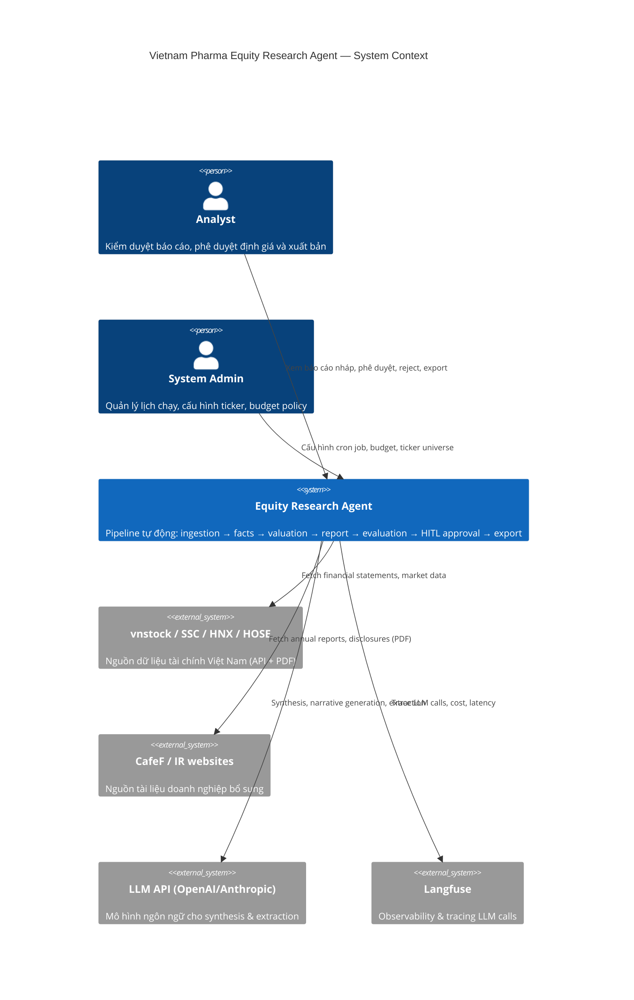

---

## 2. Use Case Diagram

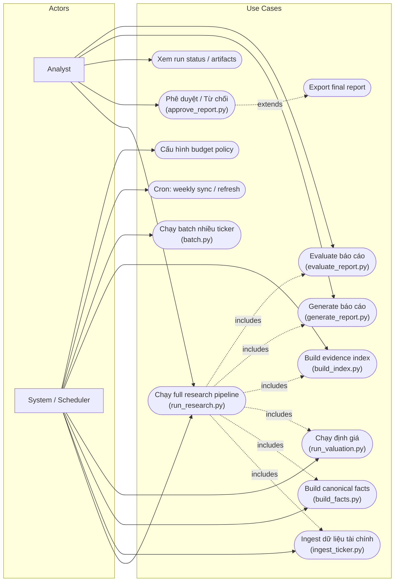

---

## 3. Pipeline Workflow — Luồng pipeline cốt lõi

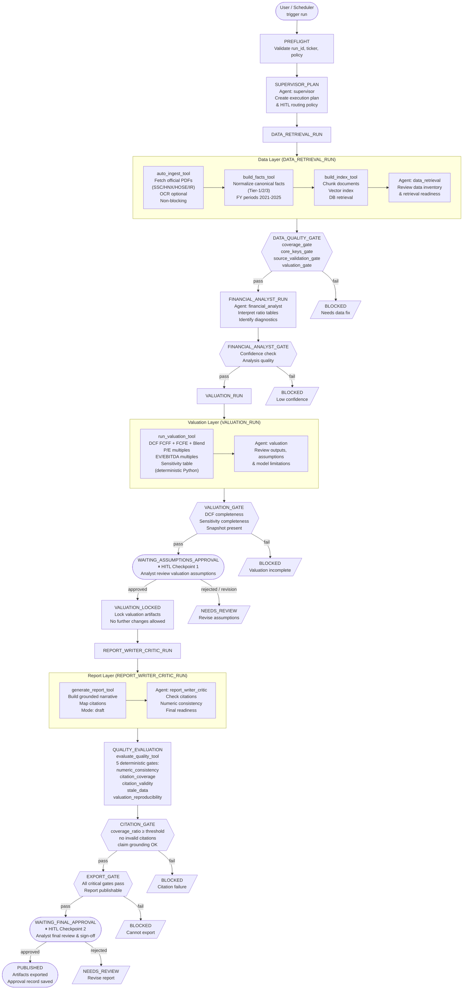

---

## 4. Data Architecture — Kiến trúc dữ liệu

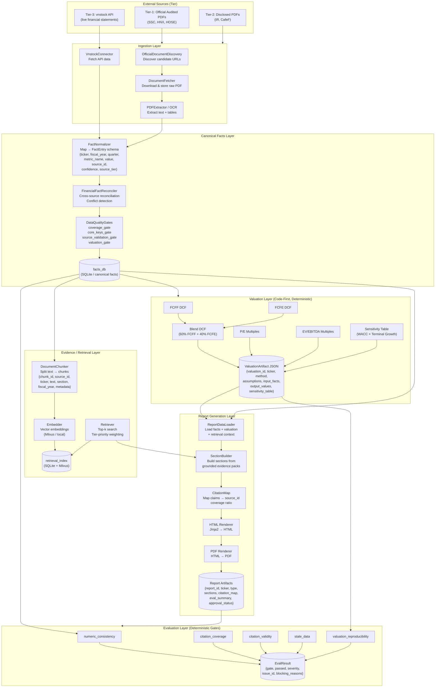

---

## 5. Multi-Agent Architecture — Supervisor & Worker Agents

```mermaid
graph TB
  subgraph ORCHESTRATION["Orchestration Layer"]
    SUPERVISOR["Supervisor\n(orchestrator.py)\nFacade → ResearchGraphRunner\nHITL routing\nRecompute planning\nOffline evaluation"]
    RUNNER["ResearchGraphRunner\n(harness/runner.py)\nLangGraph state machine\nStage execution\nBudget enforcement\nCheckpointing"]
    BUDGET["BudgetGuard\n(services.py)\nSoft/hard budget\nFallback model trigger\nCost ledger"]
    STORE["RuntimeStore\n(runtime_store.py)\nRun state\nArtifact registry\nApproval records\nAudit log\nStep trace"]
    SUPERVISOR --> RUNNER
    RUNNER --> BUDGET
    RUNNER --> STORE
  end

  subgraph AGENTS["LLM Agent Workers (model_adapter.py)"]
    AG_SUP["supervisor agent\nPlan execution\nHITL routing policy"]
    AG_DATA["data_retrieval agent\nReview data inventory\nSource coverage check"]
    AG_FA["financial_analyst agent\nInterpret ratio tables\nIdentify diagnostics\n(No arithmetic!)"]
    AG_VAL["valuation agent\nReview DCF outputs\nCheck assumptions\nFlag model limitations"]
    AG_REPORT["report_writer_critic agent\nCheck narrative grounding\nCitation consistency\nFinal readiness"]
  end

  subgraph SERVICES["Deterministic Service Tools"]
    SVC_INGEST["auto_ingest_tool\nFetch official PDFs\nOCR pipeline"]
    SVC_FACTS["build_facts_tool\nCanonical fact normalization\nDQ gate validation"]
    SVC_INDEX["build_index_tool\nChunking + embedding\nVector index"]
    SVC_VAL["run_valuation_tool\nDCF / P-E / EV-EBITDA\nSensitivity table"]
    SVC_REPORT["generate_report_tool\nSection builder\nCitation mapper\nHTML + PDF render"]
    SVC_EVAL["evaluate_quality_tool\n5 evaluation gates"]
  end

  subgraph GATES["Quality Gates (gates.py)"]
    G_DQ["data_quality_gate"]
    G_FA["financial_analyst_gate"]
    G_VAL["valuation_gate"]
    G_CIT["citation_gate"]
    G_EXP["export_gate"]
  end

  RUNNER -- "SUPERVISOR_PLAN" --> AG_SUP
  RUNNER -- "DATA_RETRIEVAL_RUN" --> SVC_INGEST & SVC_FACTS & SVC_INDEX
  RUNNER -- "DATA_RETRIEVAL_RUN" --> AG_DATA
  RUNNER -- "DATA_QUALITY_GATE" --> G_DQ
  RUNNER -- "FINANCIAL_ANALYST_RUN" --> AG_FA
  RUNNER -- "FINANCIAL_ANALYST_GATE" --> G_FA
  RUNNER -- "VALUATION_RUN" --> SVC_VAL
  RUNNER -- "VALUATION_RUN" --> AG_VAL
  RUNNER -- "VALUATION_GATE" --> G_VAL
  RUNNER -- "REPORT_WRITER_CRITIC_RUN" --> SVC_REPORT
  RUNNER -- "REPORT_WRITER_CRITIC_RUN" --> AG_REPORT
  RUNNER -- "QUALITY_EVALUATION" --> SVC_EVAL
  RUNNER -- "CITATION_GATE" --> G_CIT
  RUNNER -- "EXPORT_GATE" --> G_EXP

  LANGFUSE["Langfuse\nTracing & cost logging"]
  AG_SUP & AG_DATA & AG_FA & AG_VAL & AG_REPORT -.-> LANGFUSE
```

---

## 6. Run Lifecycle State Machine

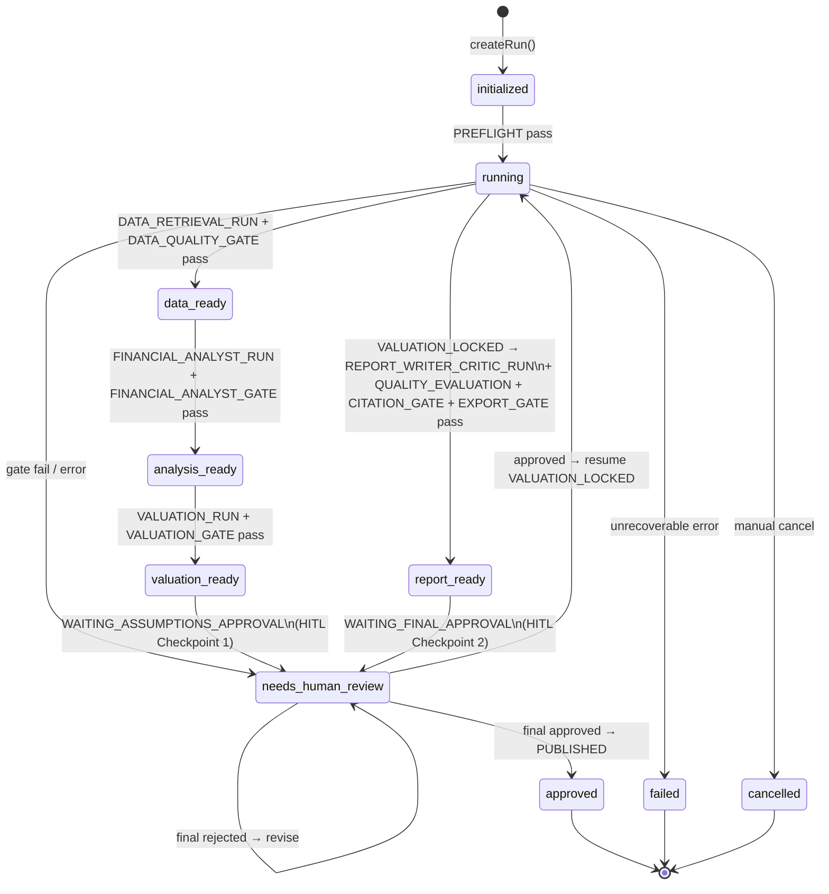

---

## 7. HITL Approval Flow — Luồng phê duyệt của analyst

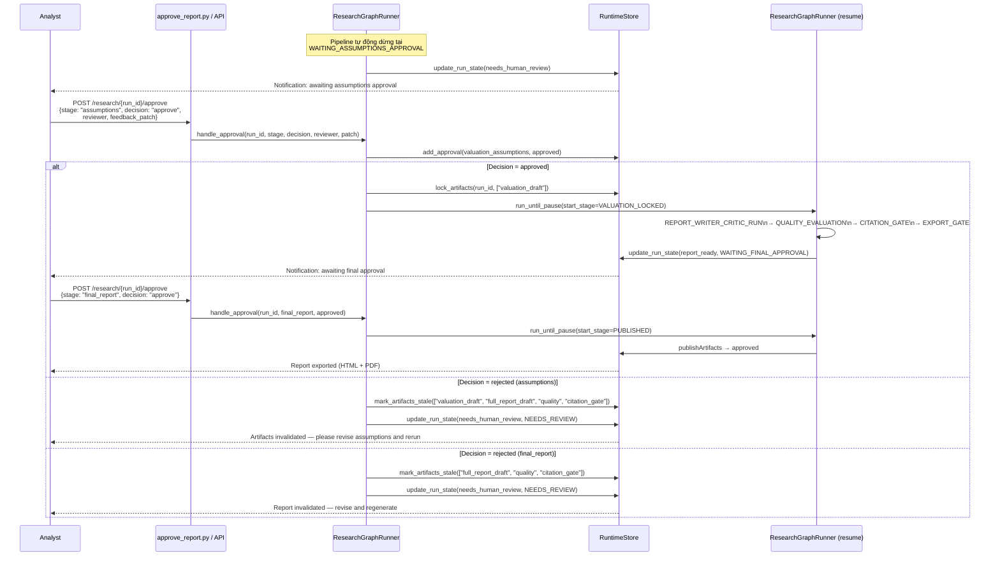

---

## 8. Budget Guardrails Flow

```mermaid
flowchart TD
  STEP[LLM Agent Call\n(model_adapter.py)] --> CHARGE

  CHARGE["BudgetGuard.charge(\n  run_id, step_name,\n  model_name,\n  prompt_tokens, completion_tokens\n)"]

  CHARGE --> CALC["cost_usd =\n(prompt_tokens × 0.2 +\n completion_tokens × 0.8)\n/ 1_000_000"]

  CALC --> TOTAL["run_total =\nstore.run_cost_usd(run_id)\n+ cost_usd"]

  TOTAL --> HARD{run_total >\nhard_budget_usd?}

  HARD -->|Yes| STOP["BudgetDecision(allow=False)\nstop_reason: hard_budget_exceeded\nRunner blocks stage → escalate HITL"]

  HARD -->|No| SOFT{run_total >\nsoft_budget_usd?}

  SOFT -->|Yes| FALLBACK["BudgetDecision(allow=True)\nfallback_model = settings.fallback_model\nDowngrade model for next steps"]

  SOFT -->|No| ALLOW["BudgetDecision(allow=True)\nContinue with primary model"]

  CHARGE --> LOG["store.add_budget_entry(\n  cost_usd, fallback_model, stop_reason\n)"]
```

---

## 9. Partial Recompute Decision Flow

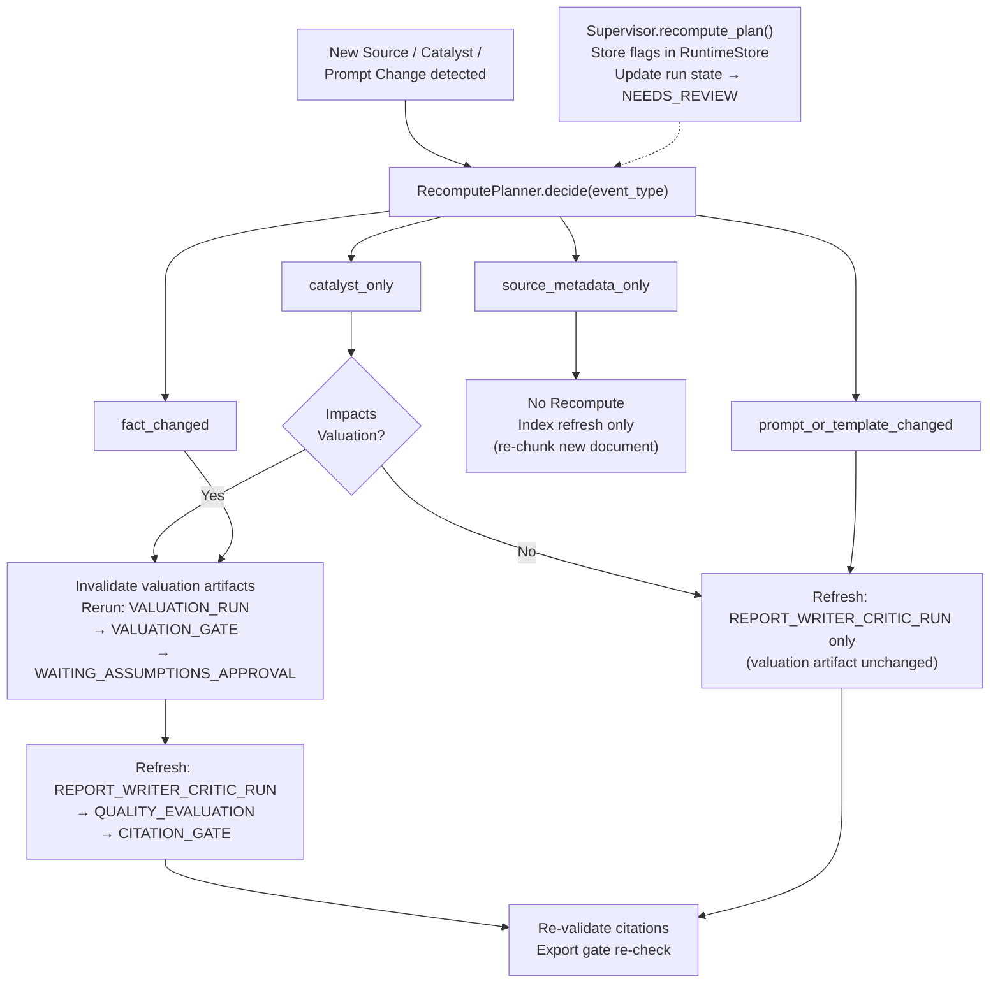

---

## 10. Evaluation Gate Flow

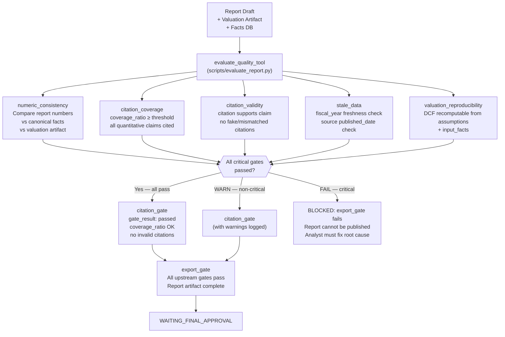

---

## 11. Full Research Sequence (End-to-End)

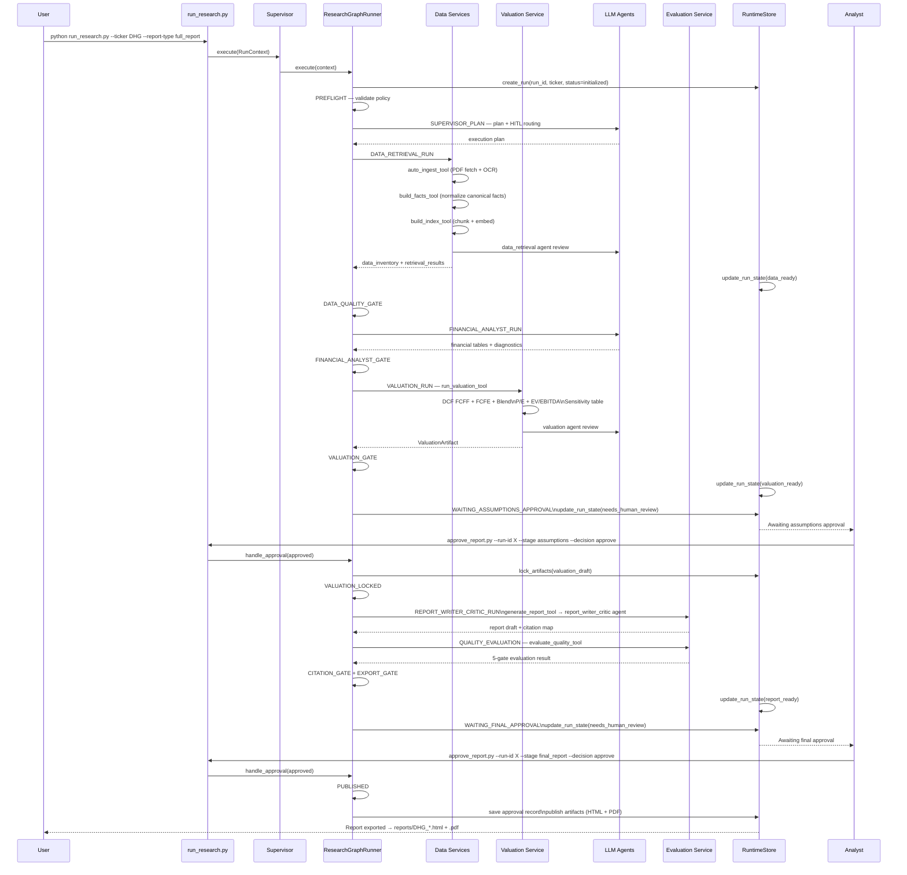

---

## 12. Agent Registry — Vai trò từng Agent

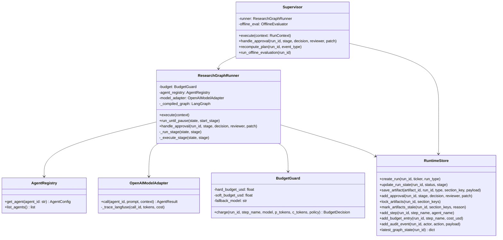

---

## 13. Data Model — Artifact Contracts

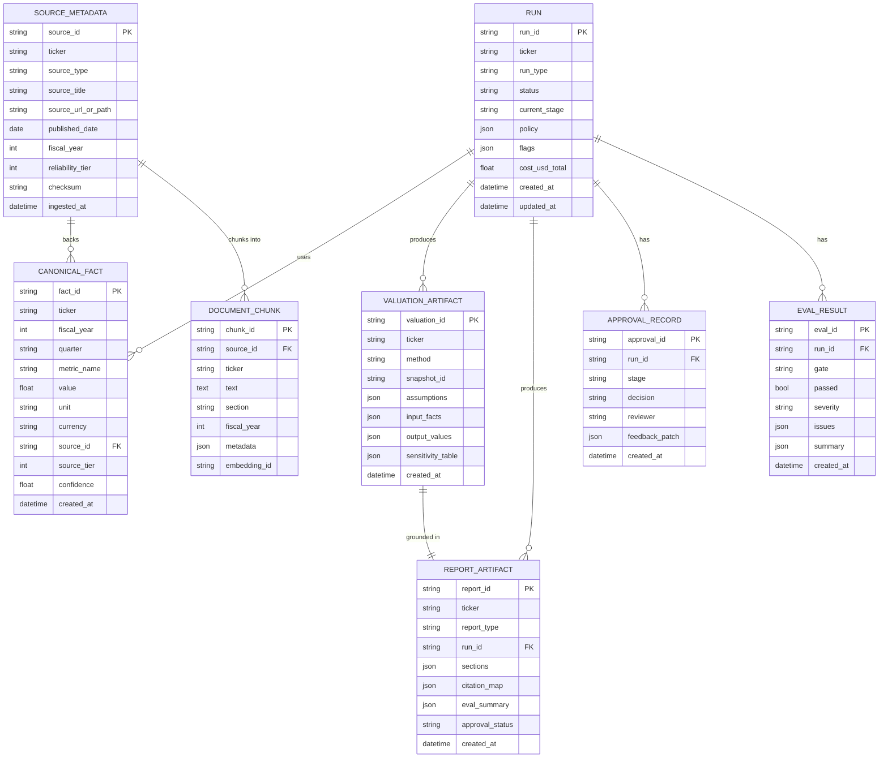

---

## 14. Offline Evaluation Gate Flow (CI/CD)

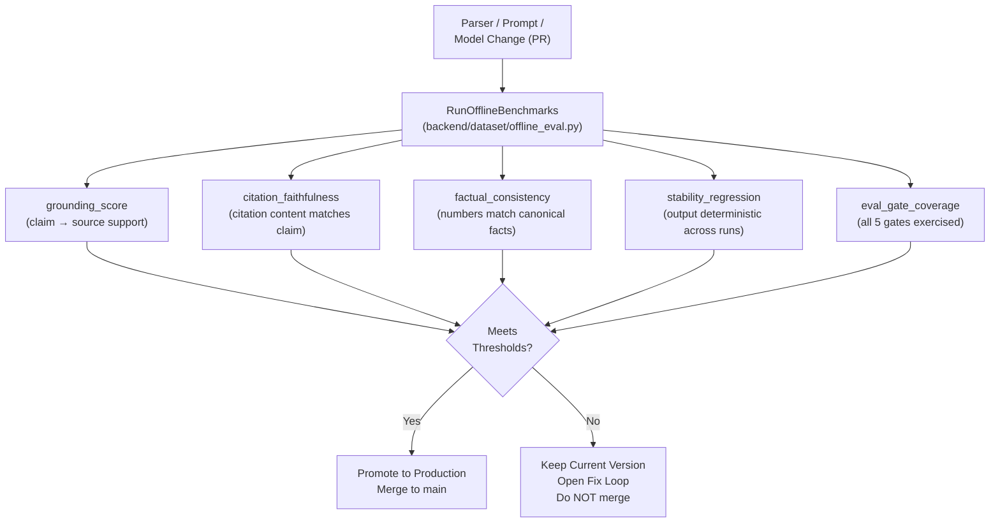

---

## Ghi chú

- Mọi sơ đồ đều dùng Mermaid — paste vào [mermaid.live](https://mermaid.live) hoặc xem trong VSCode với extension Mermaid Preview.
- **LLM agents không được tính số liệu tài chính** — chỉ synthesis, interpretation, review.
- **Valuation artifacts bị lock** sau khi analyst approve tại checkpoint 1 — không thể sửa sau đó.
- **Export gate là hard block** — nếu bất kỳ critical gate nào fail, báo cáo không được publish.
- Sơ đồ phản ánh code thực tại `backend/harness/runner.py`, `backend/harness/graph.py`, `backend/orchestrator.py`, và `backend/services.py`.
