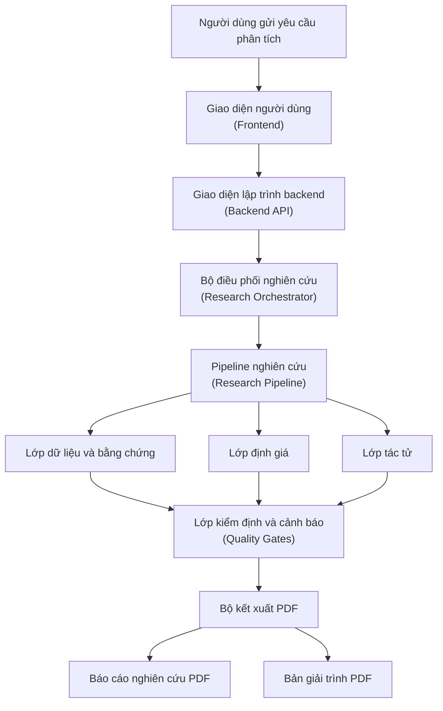
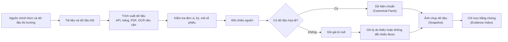
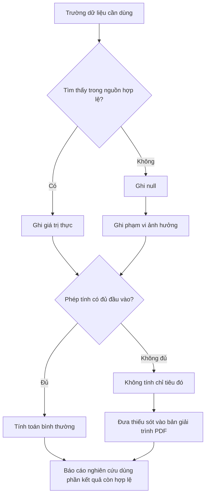
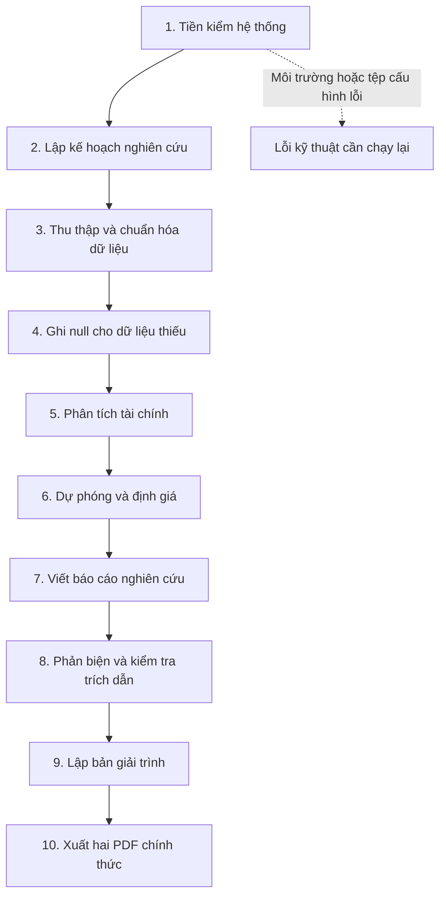
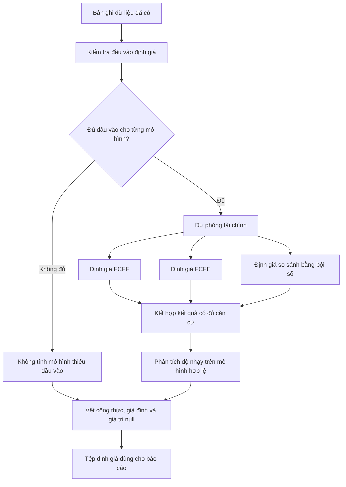
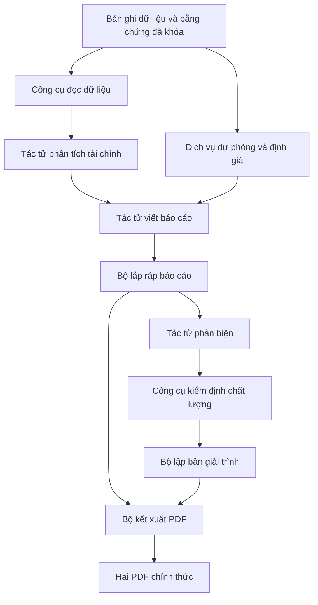
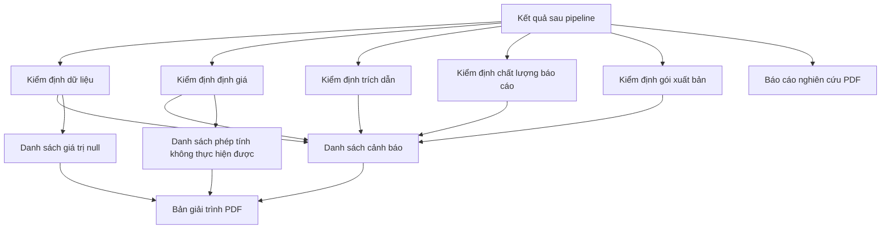
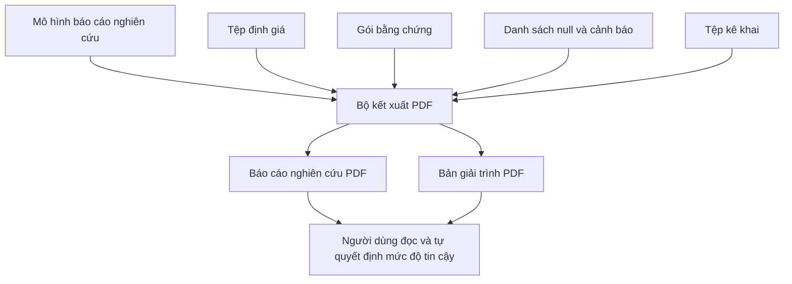
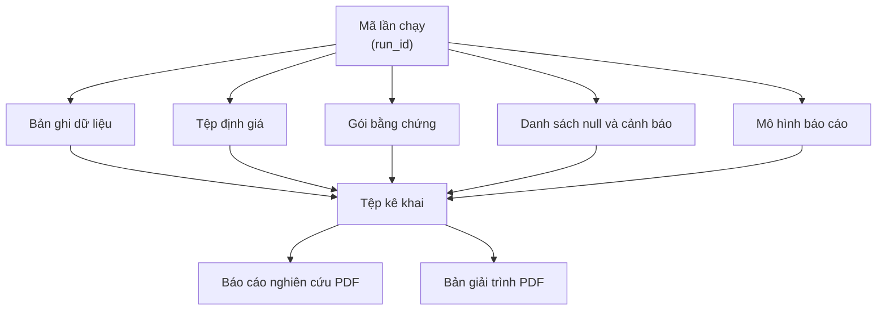

# Luồng tuần tự và sơ đồ tổng quan của hệ thống

Cập nhật: 2026-06-15

## Context

Tài liệu này mô tả các luồng chính của hệ thống nghiên cứu cổ phiếu từ thời điểm người dùng yêu cầu phân tích đến khi hệ thống trả về hai đầu ra chính thức:

| Đầu ra | Mục đích |
|---|---|
| Báo cáo nghiên cứu PDF | Trình bày luận điểm đầu tư, phân tích tài chính, định giá, rủi ro và khuyến nghị theo dữ liệu thực có |
| Bản giải trình PDF | Giải thích dữ liệu đã dùng, công thức, giả định được khai báo, giá trị `null`, cách tính toán, logic kiểm định và các thiếu sót còn lại |

Hệ thống không xuất HTML như một sản phẩm cuối cho người dùng. HTML nếu tồn tại chỉ là lớp trung gian kỹ thuật phục vụ kết xuất PDF, không phải đầu ra nghiệp vụ. Trong luồng sản phẩm chính, hệ thống không tạo bản nháp cho người dùng: mỗi lần chạy hợp lệ về mặt kỹ thuật sẽ xuất trực tiếp hai PDF chính thức. Nếu thiếu dữ liệu, hệ thống không tự giả định hoặc nội suy thay; trường dữ liệu đó được ghi là `null`, được loại khỏi phép tính không đủ đầu vào, và được giải thích rõ trong bản giải trình PDF.

## Problem Statement

Các sơ đồ trước đó mô tả đúng tinh thần kiểm soát chất lượng nhưng chưa đúng logic sản phẩm cần trình bày trong đồ án. Hệ thống không dùng cổng phê duyệt để dừng xuất bản do thiếu dữ liệu nghiệp vụ; thay vào đó, hệ thống xuất báo cáo trên phần dữ liệu có thật, đánh dấu phần không tính được là `null`, và đưa toàn bộ giới hạn vào bản giải trình để người đọc tự quyết định mức độ sử dụng báo cáo.

| Vấn đề cần sửa | Hệ quả nếu giữ nguyên | Logic mới |
|---|---|---|
| Dùng nhánh dừng xuất bản cho thiếu dữ liệu | Người đọc hiểu sai rằng hệ thống không xuất báo cáo khi dữ liệu chưa hoàn hảo | Thiếu dữ liệu được ghi `null` và giải trình, không dừng xuất bản |
| Gọi cổng kiểm định là cổng phê duyệt | Làm sai bản chất: kiểm định chỉ ghi nhận chất lượng, không quyết định có xuất báo cáo hay không | Đổi thành cổng kiểm định và cảnh báo chất lượng |
| Dùng từ “giả định” cho dữ liệu không có | Tạo rủi ro học thuật vì hệ thống có vẻ tự bịa dữ liệu | Chỉ dùng giả định khi được khai báo trong cấu hình hoặc có nguồn; dữ liệu không có luôn là `null` |
| Trộn báo cáo nghiên cứu và giải trình | Người đọc khó phân biệt kết luận phân tích với mức độ tin cậy của dữ liệu | Tách thành hai PDF chính thức: báo cáo nghiên cứu và bản giải trình |

## Technical Deep-Dive

### 1. Bản đồ luồng cần vẽ trong đồ án

| Nhóm luồng | Có trong tài liệu | Mục đích |
|---|---|---|
| Luồng tổng quan từ yêu cầu đến hai PDF | Có | Cho thấy toàn bộ hành trình sản phẩm |
| Luồng thu thập và chuẩn hóa dữ liệu | Có | Chứng minh dữ liệu không đi thẳng vào báo cáo |
| Luồng xử lý dữ liệu thiếu | Có | Chứng minh hệ thống dùng `null`, không tự giả định |
| Luồng pipeline nghiên cứu lõi | Có | Cho thấy thứ tự xử lý chính |
| Luồng định giá và kiểm định tài chính | Có | Chứng minh LLM không tính toán định giá |
| Luồng tác tử, công cụ và dịch vụ | Có | Chứng minh không gọi bừa mọi thứ là agent |
| Luồng kiểm định và cảnh báo chất lượng | Có | Cho thấy kiểm định tạo cảnh báo và thiếu sót, không dừng xuất bản |
| Luồng xuất hai PDF chính thức | Có | Mô tả rõ báo cáo nghiên cứu và bản giải trình |

Các luồng vận hành phụ có thể nằm ở tài liệu vận hành hoặc governance riêng. Tài liệu này chỉ giữ các luồng cần thiết để giải thích hành trình tạo báo cáo chính thức.

### 2. Luồng tổng quan từ yêu cầu đến đầu ra

Ý nghĩa chính: hệ thống không tạo một bản nháp chờ duyệt. Người dùng nhận hai PDF chính thức sau mỗi lần chạy hoàn tất: báo cáo nghiên cứu trình bày kết luận trên dữ liệu có thật, còn bản giải trình trình bày cách tính, nguồn dữ liệu, giá trị `null`, cảnh báo chất lượng và thiếu sót để người đọc tự đánh giá độ tin cậy.

### 3. Luồng thu thập và chuẩn hóa dữ liệu

Luồng này là điểm kiểm soát quan trọng nhất của dự án. Dữ liệu thô không được dùng trực tiếp cho định giá hoặc báo cáo. Dữ liệu có thật được chuẩn hóa thành dữ kiện chuẩn; dữ liệu không có, không đọc được, lệch kỳ hoặc không đối chiếu được sẽ trở thành `null`, kèm lý do trong snapshot và bản giải trình PDF. Hệ thống không dùng giá trị trung bình, giá trị ngành hoặc suy đoán LLM để lấp chỗ trống, trừ khi đó là giả định thủ công đã được khai báo rõ trong cấu hình.

### 4. Luồng xử lý dữ liệu thiếu

Nguyên tắc vận hành là “không có dữ liệu thì không bịa dữ liệu”. Khi một chỉ tiêu không đủ đầu vào, chỉ tiêu đó không được tính và không được trình bày như một kết quả hợp lệ. Báo cáo nghiên cứu vẫn được xuất trên các phần còn đủ căn cứ; bản giải trình sẽ nêu rõ phần nào không tính được, vì sao không tính được và tác động của thiếu sót đó đối với kết luận.

### 5. Luồng pipeline nghiên cứu lõi

Pipeline chỉ dừng khi có lỗi kỹ thuật khiến hệ thống không thể hoàn tất lần chạy, ví dụ lỗi môi trường, lỗi tệp cấu hình bắt buộc hoặc lỗi kết xuất PDF. Thiếu dữ liệu nghiệp vụ không làm pipeline dừng; nó được chuẩn hóa thành `null`, lan truyền vào phần tính toán liên quan và xuất hiện trong bản giải trình.

### 6. Luồng định giá và kiểm định tài chính

Mô hình ngôn ngữ lớn (LLM) không tính giá mục tiêu, WACC, FCFF, FCFE hoặc bảng độ nhạy. Các phép tính định giá do dịch vụ tất định thực hiện. Nếu một mô hình thiếu đầu vào, hệ thống không thay số bằng giả định ngầm; mô hình đó được đánh dấu là không tính được, còn các mô hình đủ đầu vào vẫn được tính và đưa vào báo cáo với cảnh báo tương ứng trong bản giải trình.

### 7. Luồng tác tử, dịch vụ và công cụ

Không phải mọi thành phần trong sơ đồ là agent. Có ba nhóm trách nhiệm:

| Nhóm | Vai trò |
|---|---|
| Tác tử LLM | Phân tích tài chính, viết báo cáo, phản biện nội dung và kiểm tra tính nhất quán diễn giải |
| Dịch vụ tất định | Dự phóng, định giá, lắp ráp báo cáo, tạo bản giải trình, kết xuất PDF |
| Công cụ và cổng kiểm định | Đọc dữ liệu, kiểm tra nguồn, kiểm tra công thức, kiểm tra trích dẫn, ghi cảnh báo chất lượng |

### 8. Luồng kiểm định và ghi nhận thiếu sót

Cổng kiểm định ở đây không phải cổng phê duyệt thủ công và cũng không phải cơ chế dừng xuất bản do thiếu dữ liệu nghiệp vụ. Nó là cơ chế tạo bằng chứng kiểm soát chất lượng cho bản giải trình. Nếu phát hiện thiếu dữ liệu, công thức không đủ đầu vào, trích dẫn yếu hoặc giới hạn phương pháp, hệ thống vẫn xuất báo cáo nhưng phải ghi rõ vào bản giải trình để người đọc biết phần nào dùng được, phần nào cần thận trọng.

| Nhóm kiểm định | Cách xử lý khi có vấn đề |
|---|---|
| Dữ liệu | Ghi `null`, ghi nguồn đã thử, ghi lý do thiếu hoặc không đối chiếu được |
| Định giá | Không tính mô hình thiếu đầu vào; giữ mô hình đủ đầu vào; ghi ảnh hưởng đến giá mục tiêu |
| Trích dẫn | Gắn cảnh báo cho luận điểm thiếu nguồn mạnh; không trình bày dữ kiện yếu như kết luận chắc chắn |
| Báo cáo | Giữ cấu trúc báo cáo chính thức; nêu giới hạn trong bản giải trình |
| Gói xuất bản | Xuất hai PDF cùng `run_id`, cùng snapshot và cùng tệp kê khai nếu kết xuất kỹ thuật thành công |

### 9. Luồng xuất hai PDF chính thức

Hai PDF có mục tiêu khác nhau:

| PDF | Nội dung chính |
|---|---|
| Báo cáo nghiên cứu | Luận điểm, phân tích doanh nghiệp, phân tích tài chính, định giá trên phần đủ dữ liệu, khuyến nghị, rủi ro |
| Bản giải trình | Nguồn dữ liệu, công thức tính, giả định được khai báo, giá trị `null`, phép tính không thực hiện được, cảnh báo kiểm định, thiếu sót và giới hạn sử dụng |

Bản giải trình không ghi lại suy luận ẩn từng token của mô hình. Nó trình bày logic có thể kiểm tra: dữ liệu nào được dùng, dữ liệu nào không có, công thức nào được áp dụng, giả định nào được khai báo trong cấu hình, phần nào không tính được, cảnh báo nào còn tồn tại và vì sao người đọc cần cân nhắc trước khi dùng báo cáo.

### 10. Luồng lưu trữ và truy vết

Luồng truy vết giúp chứng minh báo cáo không được dựng từ file mới nhất hoặc dữ liệu sống. Mỗi báo cáo và bản giải trình phải có quan hệ với cùng một `run_id`, cùng snapshot và cùng tệp kê khai. Khi có giá trị `null`, bản giải trình có thể truy ngược đến trường dữ liệu thiếu, nguồn đã kiểm tra và phần tính toán bị ảnh hưởng.

## Strategic Recommendations

| Mục tiêu trình bày | Sơ đồ nên dùng |
|---|---|
| Giải thích hệ thống từ yêu cầu đến đầu ra | Luồng tổng quan từ yêu cầu đến đầu ra |
| Chứng minh dữ liệu được kiểm soát | Luồng thu thập và chuẩn hóa dữ liệu |
| Chứng minh không tự giả định dữ liệu thiếu | Luồng xử lý dữ liệu thiếu |
| Chứng minh pipeline đầy đủ | Luồng pipeline nghiên cứu lõi |
| Chứng minh định giá không do LLM tính | Luồng định giá và kiểm định tài chính |
| Chứng minh kiến trúc agent không bị thổi phồng | Luồng tác tử, dịch vụ và công cụ |
| Chứng minh thiếu sót được minh bạch hóa | Luồng kiểm định và ghi nhận thiếu sót |
| Chứng minh đầu ra chính thức | Luồng xuất hai PDF chính thức |
| Chứng minh khả năng truy vết | Luồng lưu trữ và truy vết |

Kết luận: bộ sơ đồ này mô tả hệ thống theo đúng logic sản phẩm: không có bản nháp, không có giả định ngầm cho dữ liệu thiếu, không dừng xuất bản chỉ vì thiếu dữ liệu nghiệp vụ. Hệ thống xuất hai PDF chính thức; báo cáo nghiên cứu trình bày kết quả trên phần đủ căn cứ, còn bản giải trình trình bày cách tính toán, giả định được khai báo, giá trị `null`, thiếu sót và rủi ro để người đọc tự quyết định mức độ sử dụng.
