# Tách sơ đồ sequence và flow cho đồ án

## 1. Kết luận kiểm định lại

Bản `SEQUENCE.md` mô tả đúng trục production chính của hệ thống: `scripts/run_research.py` gọi `FullReportOrchestrator`, sau đó `ResearchGraphRunner` thực thi `GRAPH_STAGES`; orchestrator chỉ quản lý vòng đời run và chuyển tiếp approval, còn runner sở hữu stage execution, checkpoint, gate, lineage, manifest, evidence packet và render/publish.

Tuy nhiên, nếu đưa vào đồ án thì không nên dồn toàn bộ luồng vào một sequence diagram lớn. Cách trình bày tốt hơn là tách thành các sơ đồ con theo từng mạch nghiệp vụ/kỹ thuật. Mỗi sơ đồ chỉ nên có 4-6 participant, mô tả một ý chính, đặt thuật ngữ tiếng Việt ngắn gọn và mở ngoặc tên tiếng Anh.

Các điểm đã đủ và nên giữ:

| Nội dung | Trạng thái | Ghi chú |
|---|---:|---|
| Production entrypoint | Đủ | Chỉ dùng `run_research.py` cho production full report. |
| Orchestrator và runner | Đủ | `FullReportOrchestrator` quản lý lifecycle; `ResearchGraphRunner` chạy stage/gate/checkpoint. |
| Sáu agent active | Đủ | Không mô tả supervisor agent nếu production hiện tại không dùng supervisor. |
| Tool governance | Đủ nhưng cần thể hiện rõ | Agent chỉ gọi công cụ được cấp quyền qua `ToolRegistry`/allowed tools. |
| Artifact lineage | Đủ | Artifact phải gắn `run_id`, version, checksum, producer. |
| Manifest và evidence packet | Đủ | Đây là audit output xuyên suốt run, không phải file phụ rời rạc. |
| Forecast gate | Đủ sau khi bổ sung | Forecast có stage và gate riêng trước valuation proposal. |
| Duyệt giả định | Bắt buộc có | Sau `VALUATION_PROPOSAL`, trước `VALUATION_EXECUTION`. |
| Duyệt cuối | Bắt buộc có | Sau `FINAL_EXPORT_GATE` và `CITATION_GATE`, trước `RENDER_AND_PUBLISH`. |
| One-pass revision | Bắt buộc có | Chỉ cho sửa báo cáo một lần nếu critic yêu cầu, không lặp vô hạn. |
| Publish condition | Bắt buộc có | Chỉ publish khi final approval và post-approval gate đều pass. |

Các điểm cần chỉnh so với sơ đồ cũ:

1. Không vẽ một sequence duy nhất quá dài.
2. Không gộp hai approval checkpoint thành một mũi tên chung.
3. Không để `Render/Publish` xuất hiện trước final gate/final approval.
4. Không mô tả LLM là nơi tính valuation hoặc quyết định pass gate.
5. Không mô tả `generate_report.py` hoặc `render_report.py` là production path.
6. Không bỏ nhánh fail: `Gate fail -> Needs Human Review`.

---

## 2. Quy ước thuật ngữ trong sơ đồ

| Thuật ngữ nên hiển thị | Ý nghĩa |
|---|---|
| Nhà phân tích (Analyst) | Người khởi tạo run, duyệt giả định và duyệt báo cáo cuối. |
| Lệnh chạy nghiên cứu (run_research.py) | Cửa vào production để chạy full report. |
| Bộ điều phối báo cáo (FullReportOrchestrator) | Quản lý vòng đời run và chuyển tiếp approval. |
| Bộ chạy nghiên cứu (ResearchGraphRunner) | Thực thi stage cố định, checkpoint, gate và artifact persistence. |
| Kho runtime (RuntimeStore) | Lưu state, steps, artifacts, approvals, audit events. |
| Tác tử quản lý nghiên cứu (ResearchManagerAgent) | Lập kế hoạch nghiên cứu, kiểm tra scope, policy, budget routing. |
| Tác tử dữ liệu và bằng chứng (DataEvidenceAgent) | Ingest, build facts, build index, tóm tắt nguồn và limitation. |
| Tác tử phân tích tài chính (FinancialAnalysisAgent) | Diễn giải ratio/facts đã được tính bằng code. |
| Tác tử dự phóng và định giá (ForecastValuationAgent) | Lập forecast, đề xuất giả định, gọi valuation deterministic sau approval. |
| Tác tử viết báo cáo (ThesisReportAgent) | Viết draft/final report model từ locked artifacts. |
| Tác tử phản biện cấp cao (SeniorCriticAgent) | Kiểm tra quality, numeric, citation, valuation logic, narrative. |
| Công cụ tất định (Deterministic Tools) | Code/tool tính toán, ingest, validation, valuation, export gate. |
| Cổng kiểm soát (Gate) | Kiểm định tự động trả pass/fail/needs_human_review. |
| Bản kê artifact (Manifest) | Danh sách artifact refs explicit theo `run_id`. |
| Gói bằng chứng (Evidence Packet) | Gói audit gồm evidence refs, artifact refs, gates, limitations, trace summary. |
| Phê duyệt con người (Human Approval) | Reviewer/analyst approve hoặc reject checkpoint. |
| Bộ xuất bản báo cáo (FinalReportPublisher) | Render và persist HTML/PDF sau khi đủ điều kiện. |

---

## 3. Sequence 1 — Khởi tạo run và preflight

Dùng sơ đồ này trong phần “Luồng khởi tạo yêu cầu nghiên cứu”. Mục tiêu là chứng minh production path bắt đầu từ `run_research.py`, không phải từ script render/generate legacy.

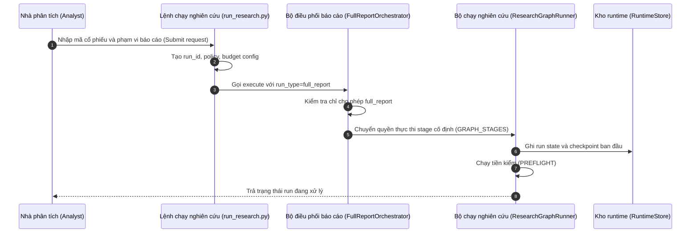

### IPO của Sequence 1

| Input | Process | Output |
|---|---|---|
| Ticker, kỳ dữ liệu, policy, OCR flag, budget. | Tạo `run_id`, xác nhận `full_report`, khởi tạo runtime state, chạy preflight. | Run state, checkpoint ban đầu, policy snapshot. |

---

## 4. Sequence 2 — Lập kế hoạch nghiên cứu

Dùng sơ đồ này để mô tả vai trò của `ResearchManagerAgent`. Agent này lập kế hoạch và routing policy, nhưng không tự phê duyệt và không ghi artifact publishable.

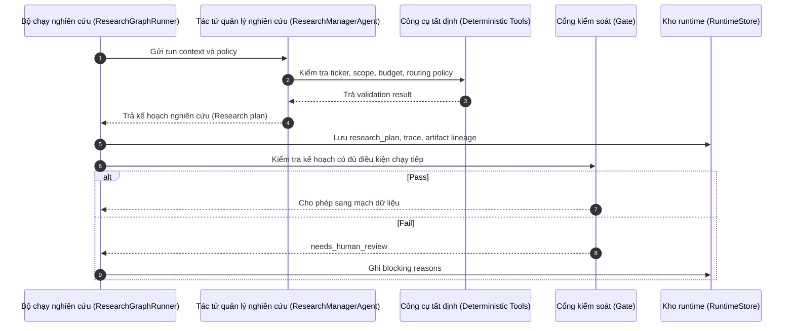

### IPO của Sequence 2

| Input | Process | Output |
|---|---|---|
| Run context, ticker, scope, policy, budget. | ResearchManagerAgent lập kế hoạch, kiểm scope và routing. | Research plan, HITL routing policy, trace. |

---

## 5. Sequence 3 — Dữ liệu và bằng chứng

Dùng sơ đồ này trong phần data pipeline. Trọng tâm là dữ liệu thô phải qua ingest, chuẩn hóa, index và data quality gate trước khi downstream sử dụng.

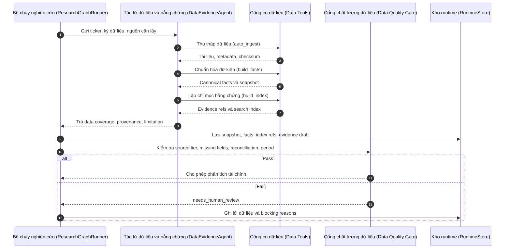

### IPO của Sequence 3

| Input | Process | Output |
|---|---|---|
| Ticker, kỳ dữ liệu, BCTC, báo cáo thường niên, tin tức, market data. | `auto_ingest`, `build_facts`, `build_index`, data quality gate. | Snapshot, canonical facts, evidence refs, data inventory, limitation. |

---

## 6. Sequence 4 — Phân tích tài chính và forecast

Dùng sơ đồ này để chứng minh LLM không tự tính số liệu cuối. Agent chỉ diễn giải trên artifact deterministic, còn forecast phải qua gate riêng.

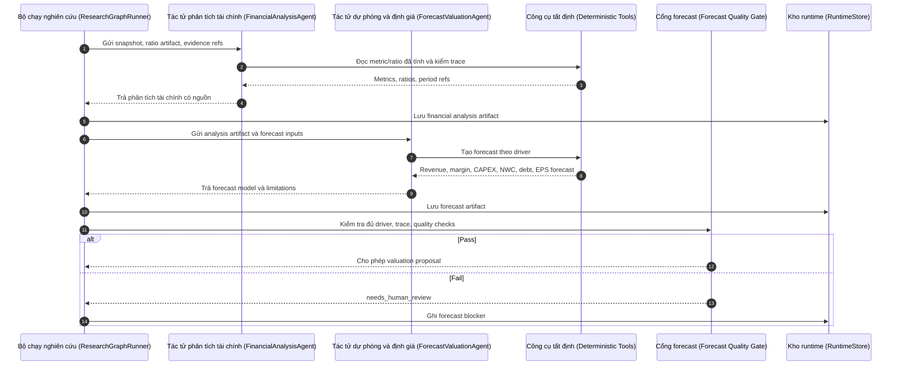

### IPO của Sequence 4

| Input | Process | Output |
|---|---|---|
| Snapshot, ratio artifact, evidence refs, forecast horizon. | Diễn giải financials, tạo driver-based forecast, forecast quality gate. | Financial analysis artifact, forecast model, limitations. |

---

## 7. Sequence 5 — Đề xuất và duyệt giả định định giá

Dùng sơ đồ này để thể hiện checkpoint quan trọng nhất: định giá deterministic chỉ được chạy sau khi analyst duyệt giả định.

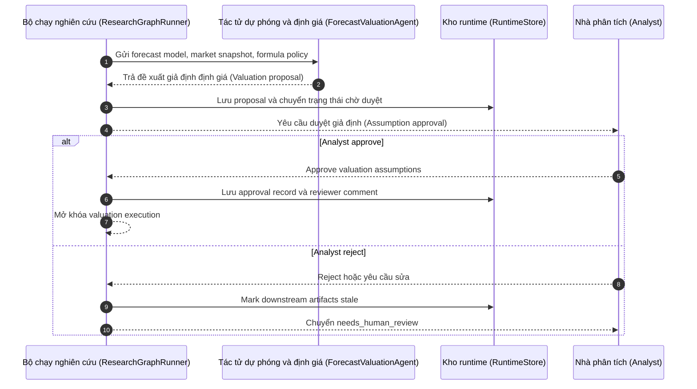

### IPO của Sequence 5

| Input | Process | Output |
|---|---|---|
| Forecast model, market snapshot, WACC/growth/method weights/scenario draft. | ForecastValuationAgent tạo proposal; analyst approve/reject. | Approval record hoặc `needs_human_review`; valuation execution chỉ mở khi approve. |

---

## 8. Sequence 6 — Chạy định giá deterministic và khóa artifact

Dùng sơ đồ này để tách rõ valuation bằng code với phần reasoning/narrative của agent.

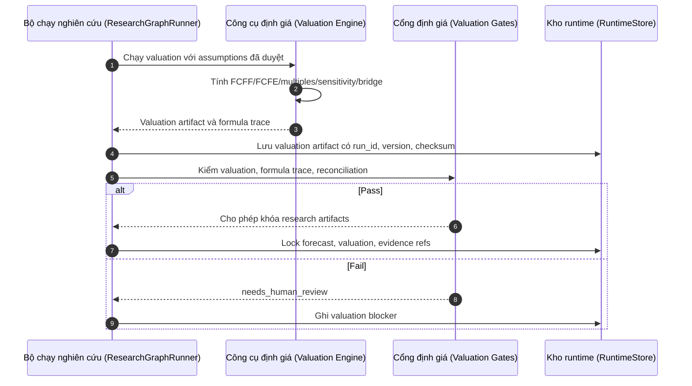

### IPO của Sequence 6

| Input | Process | Output |
|---|---|---|
| Approved assumptions, forecast model, market snapshot, formula policy. | Valuation engine tính FCFF/FCFE/multiples/sensitivity và reconciliation gates. | Valuation artifact, formula trace, locked research artifacts. |

---

## 9. Sequence 7 — Viết báo cáo, kiểm tra lắp ráp và phản biện

Dùng sơ đồ này cho phần report generation. Luồng này thể hiện `ThesisReportAgent` chỉ viết từ locked artifacts và có thể sửa tối đa một lần nếu critic yêu cầu.

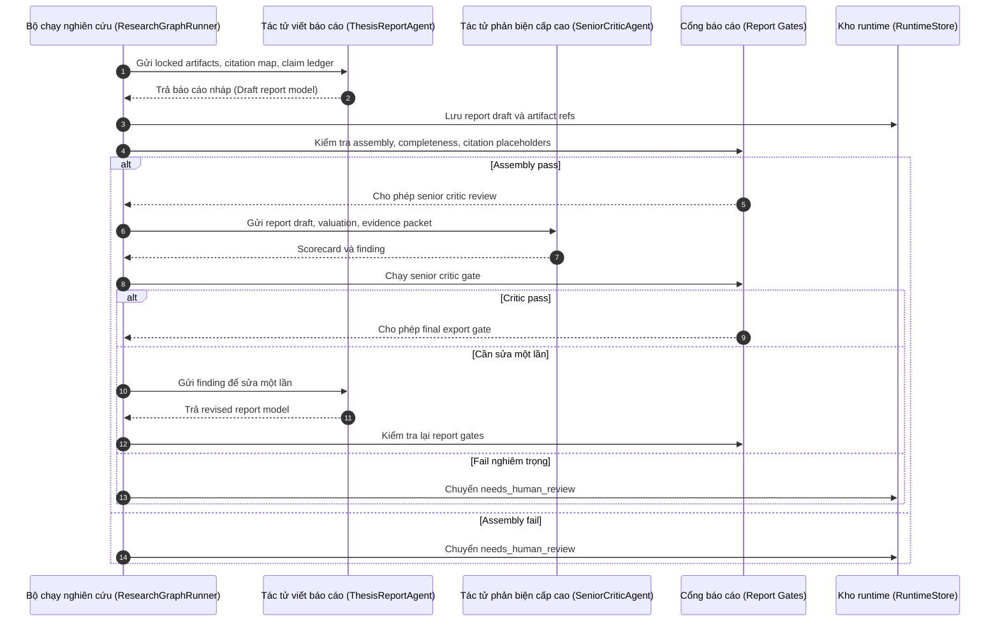

### IPO của Sequence 7

| Input | Process | Output |
|---|---|---|
| Locked artifacts, valuation artifact, claim ledger, citation map, evidence packet. | Draft report, assembly gate, completeness gate, senior critic review, optional one-pass revision. | Final report model hoặc blocking reasons. |

---

## 10. Sequence 8 — Manifest, evidence packet và audit trail

Dùng sơ đồ này nếu đồ án có phần auditability/traceability. Đây là điểm giúp chứng minh hệ thống không lấy nhầm latest file hoặc stale artifact.

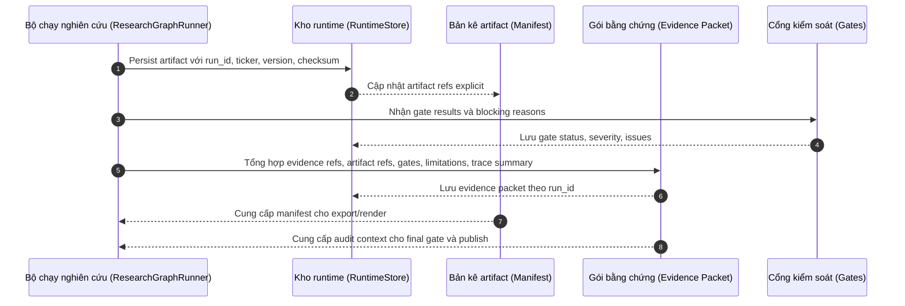

### IPO của Sequence 8

| Input | Process | Output |
|---|---|---|
| Artifact payloads, evidence refs, gate results, limitations, trace summary. | Gắn lineage, cập nhật manifest, tạo evidence packet. | Manifest, evidence packet, audit trail, artifact refs explicit. |

---

## 11. Sequence 9 — Phê duyệt cuối và xuất bản

Dùng sơ đồ này để mô tả publish path. Điểm quan trọng: final export gate và citation gate chạy trước final approval; sau approval còn approval path gate/post-approval check trước render.

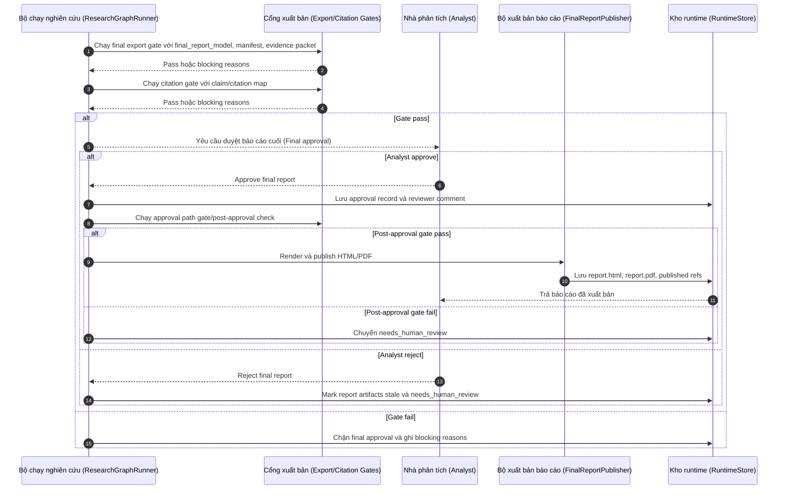

### IPO của Sequence 9

| Input | Process | Output |
|---|---|---|
| Final report model, manifest, evidence packet, citation map, gate results. | Final export gate, citation gate, final approval, approval path gate, render/publish. | `report.html`, `report.pdf`, published refs, approved/published run hoặc blocking reasons. |

---

## 12. Flow IPO tổng thể

Sơ đồ này đặt trước các sequence con để người đọc hiểu toàn bộ hệ thống theo Input → Process → Output.

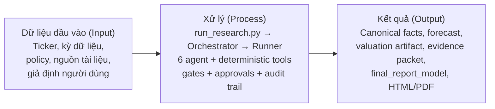

---

## 13. Flow IPO theo mạch chính

### 13.1 Mạch dữ liệu

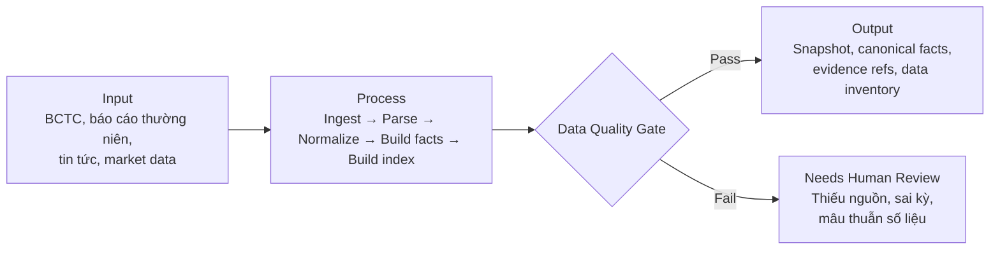

### 13.2 Mạch phân tích và forecast

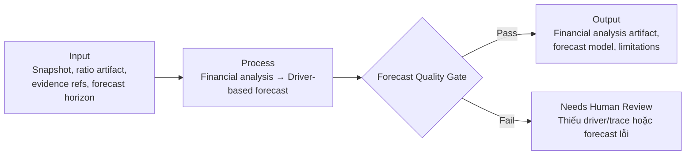

### 13.3 Mạch định giá

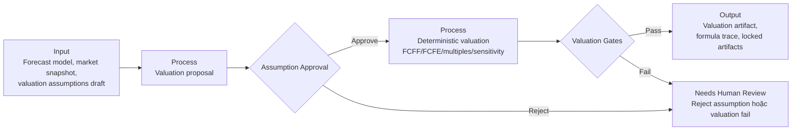

### 13.4 Mạch báo cáo và critic

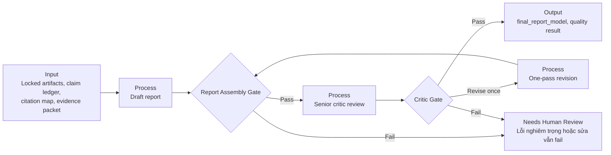

### 13.5 Mạch xuất bản

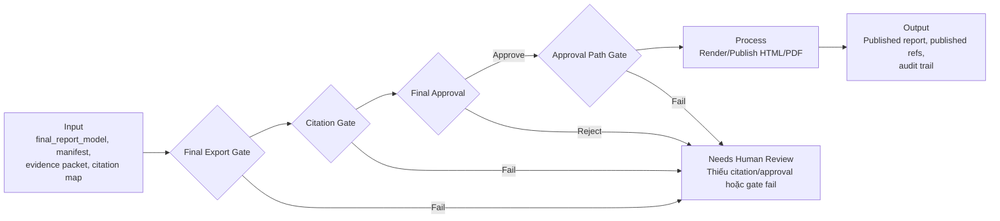

---

## 14. Bảng stage/gate/checkpoint để đi kèm sơ đồ

Không nên vẽ toàn bộ 23 stage vào một hình. Nên để dưới dạng bảng sau để đủ chi tiết nhưng không làm sơ đồ rối.

| Nhóm stage | Nội dung bắt buộc phải mô tả | Gate/checkpoint liên quan |
|---|---|---|
| Khởi tạo | Tạo `run_id`, policy, runtime state, preflight. | Preflight/runtime validation. |
| Research planning | ResearchManagerAgent kiểm scope, ticker, run type, budget routing. | Plan readiness. |
| Data evidence | DataEvidenceAgent chạy `auto_ingest`, `build_facts`, `build_index`. | `DATA_QUALITY_GATE`. |
| Financial analysis | FinancialAnalysisAgent đọc snapshot/ratio artifact và diễn giải. | `FINANCIAL_ANALYST_GATE`. |
| Forecast | ForecastValuationAgent tạo driver-based forecast. | `FORECAST_QUALITY_GATE`. |
| Valuation proposal | Đề xuất WACC, growth, method weights, scenario. | `ASSUMPTION_APPROVAL`. |
| Valuation execution | Code-first valuation sau khi approval. | `VALUATION_GATE`, `VALUATION_RECONCILIATION_GATE`. |
| Report draft | ThesisReportAgent viết draft từ locked artifacts. | `REPORT_ASSEMBLY_GATE`, `REPORT_COMPLETENESS_GATE`. |
| Critic/revision | SeniorCriticAgent review; ThesisReportAgent sửa tối đa một lần nếu cần. | `SENIOR_CRITIC_GATE`, `OPTIONAL_SINGLE_REPORT_REVISION`. |
| Final readiness | Kiểm manifest, evidence packet, citation, formula trace. | `FINAL_EXPORT_GATE`, `CITATION_GATE`. |
| Final approval | Analyst duyệt báo cáo cuối. | `FINAL_APPROVAL`. |
| Render/publish | Render HTML/PDF từ `final_report_model` đã pass. | `APPROVAL_PATH_GATE`, `RENDER_AND_PUBLISH`. |

---

## 15. Đánh giá cuối: đã mô tả đủ chưa?

Đã đủ cho đồ án nếu bạn dùng bộ sơ đồ này theo cấu trúc sau:

1. Một flow IPO tổng thể.
2. Sequence 1 cho khởi tạo run.
3. Sequence 3 cho dữ liệu và bằng chứng.
4. Sequence 4 cho phân tích và forecast.
5. Sequence 5 + 6 cho valuation và duyệt giả định.
6. Sequence 7 cho viết báo cáo và critic.
7. Sequence 9 cho duyệt cuối và publish.
8. Bảng stage/gate/checkpoint để thay cho một sequence diagram quá dài.

Có thể bỏ Sequence 2 và Sequence 8 khỏi phần thân chính nếu đồ án bị dài; hai sơ đồ này nên đưa vào phụ lục kỹ thuật. Không nên bỏ các sơ đồ về approval, gate fail, valuation deterministic và final publish vì đây là các điểm chứng minh hệ thống đáng tin cậy.

---

## 16. Đoạn thuyết minh ngắn để đặt trước các sơ đồ

Để tránh sơ đồ quá dày và khó đọc, luồng xử lý của hệ thống được tách thành nhiều sequence diagram theo từng mạch nghiệp vụ. Cách tách này phản ánh đúng kiến trúc thực tế: hệ thống không phải một chuỗi LLM tuyến tính, mà là một workflow có trạng thái gồm runner, agent, công cụ tất định, cổng kiểm soát, artifact lineage và phê duyệt con người. Mỗi mạch đều được mô tả theo cấu trúc Dữ liệu đầu vào (Input) → Xử lý (Process) → Kết quả (Output), giúp người đọc thấy rõ dữ liệu nào đi vào hệ thống, được xử lý qua bước nào và tạo ra artifact nào cho bước tiếp theo.
