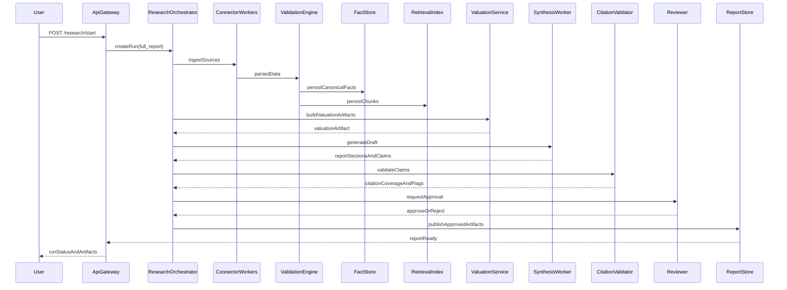
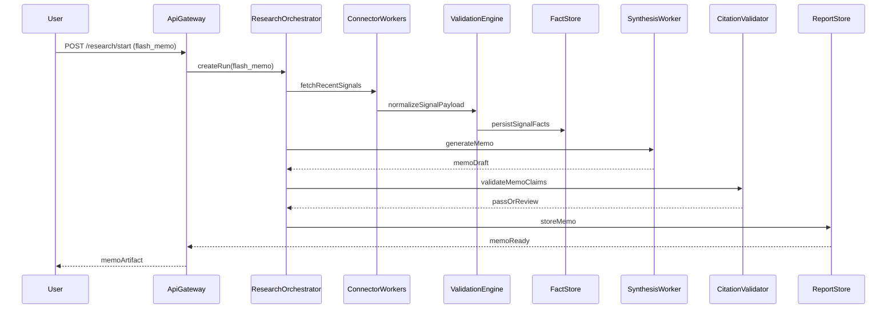
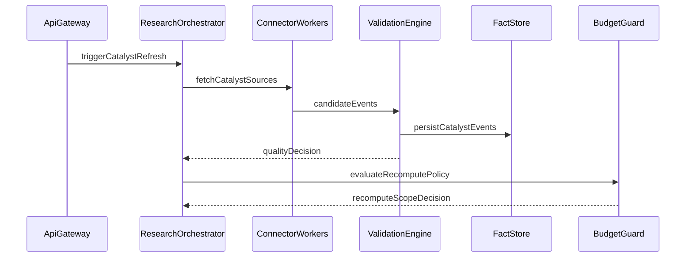
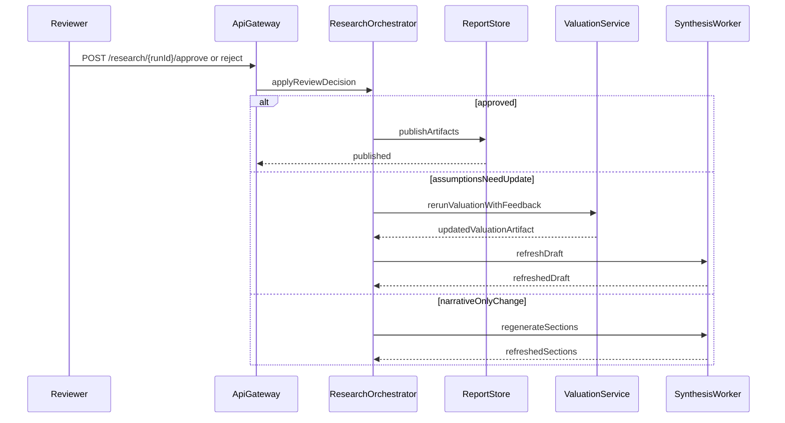
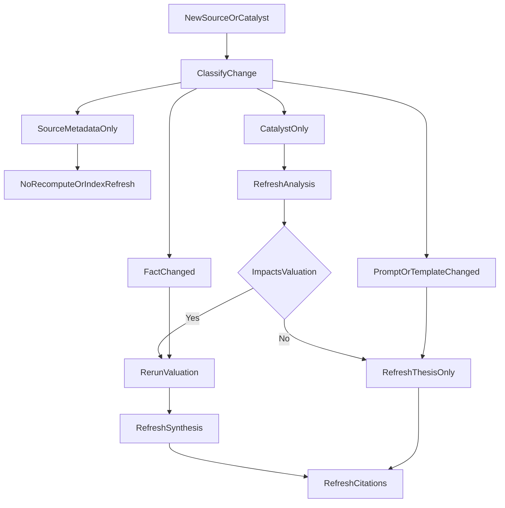
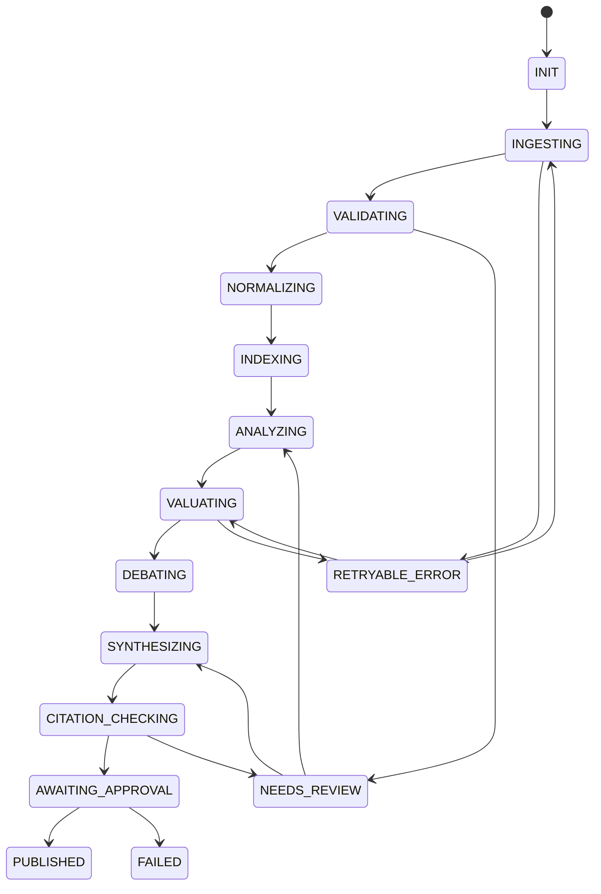
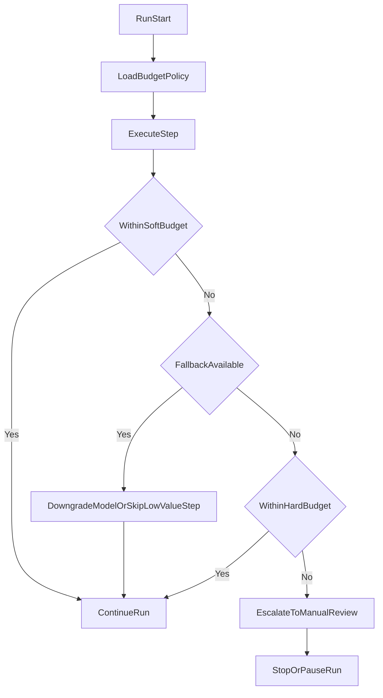
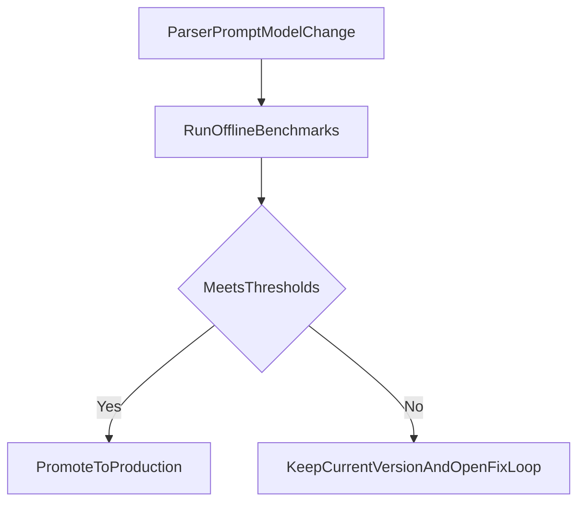

# SEQUENCE — Luồng chạy backend

*Tài liệu mô tả các luồng chạy chính của backend `multi-agent equity research` cho Vietnam Pharma, bao gồm `full report`, `flash memo`, `catalyst refresh`, `HITL`, `retry`, `partial recompute`, và `budget guardrails`.*

---

## 1. Mục tiêu tài liệu

- Mô tả cách các thành phần backend tương tác trong từng run type.
- Làm rõ các điểm checkpoint, approval, retry, và escalation.
- Chốt quy tắc `partial recompute` và `cost-aware fallback` để phục vụ triển khai orchestration.

---

## 2. Thành phần tham gia

- `User`
- `ApiGateway`
- `ResearchOrchestrator`
- `ConnectorWorkers`
- `ValidationEngine`
- `FactStore`
- `RetrievalIndex`
- `ValuationService`
- `SynthesisWorker`
- `CitationValidator`
- `Reviewer`
- `ReportStore`
- `BudgetGuard`

---

## 3. Full report flow

### Ghi chú

- `ValidationEngine` là cổng bắt buộc trước khi facts được phép vào `FactStore`.
- `CitationValidator` có quyền chặn publish nếu claim định lượng không đạt grounding.
- `Reviewer` có thể approve, reject, hoặc yêu cầu partial rerun.

---

## 4. Flash memo flow

### Ghi chú

- `flash_memo` có thể bỏ qua một số bước nặng như full debate nếu policy chi phí yêu cầu.
- Memo vẫn phải có grounding cho các claim định lượng hoặc catalyst trọng yếu.

---

## 5. Catalyst refresh flow

### Ghi chú

- Kết quả của flow này không nhất thiết sinh report ngay.
- Đầu ra quan trọng nhất là `recomputeScopeDecision`.

---

## 6. HITL review and resume flow

### Ghi chú

- Review action phải chỉ rõ `scope` để orchestration biết rerun phần nào.
- `narrativeOnlyChange` không được phép sửa valuation artifact.

---

## 7. Partial recompute decision flow

### Ghi chú

- `source metadata only` là trường hợp thay đổi không ảnh hưởng facts hay reasoning.
- `prompt or template changed` thường chỉ yêu cầu refresh synthesis và citations.

---

## 8. Run lifecycle state machine

### Ghi chú

- `NEEDS_REVIEW` là trạng thái nghiệp vụ, không phải lỗi hệ thống thuần túy.
- `FAILED` chỉ dùng khi run không còn khả năng tiến tiếp theo policy hiện tại.

---

## 9. Budget guardrails and fallback flow

### Ghi chú

- `Soft budget` dùng để kích hoạt fallback hoặc cắt giảm step thấp giá trị.
- `Hard budget` là ngưỡng dừng bắt buộc.

---

## 10. Offline evaluation gate flow

### Ghi chú

- `RunOfflineBenchmarks` cần bao phủ grounding, citation faithfulness, factual consistency, và stability regression.
- Chỉ khi đạt ngưỡng mới cho phép áp dụng vào run production.

---

## 11. Retry and escalation policy

### Retryable

- timeout connector,
- lỗi tạm thời của model provider,
- queue worker restart,
- lỗi mạng tạm thời khi ghi object store.

### Needs review

- fact validation có warning nghiêm trọng,
- citation fail cho claim bắt buộc,
- cost vượt hard budget,
- reviewer reject assumptions hoặc recommendation.

### Failed

- source không truy cập được lâu dài,
- parser không thể trích xuất dữ liệu tối thiểu,
- approval policy không thể thỏa mãn,
- run bị hủy thủ công.

---

## 12. Input and output contracts theo từng stage

### Ingestion

- Input: source config, company scope, date range.
- Output: raw assets, parsed payload, source metadata.

### Validation

- Input: parsed payload.
- Output: quality decision, accepted facts, rejected records, warnings.

### Valuation

- Input: fact snapshot, scenarios, peer context.
- Output: valuation artifact, warnings, sensitivity outputs.

### Synthesis

- Input: valuation artifact, retrieval context, catalyst summary.
- Output: report sections, claims, reviewer notes.

### Citation checking

- Input: claims, candidate citations.
- Output: coverage ratio, invalid claims, publish eligibility.

---

## 13. Kết luận

Các luồng chạy trên được thiết kế để bảo đảm bốn mục tiêu cùng lúc:

- đúng dữ liệu,
- đúng quy trình,
- đúng mức tự động hóa,
- đúng chi phí vận hành.

`SEQUENCE.md` là tài liệu chuẩn để triển khai orchestration, queue policies, review flow, và partial recompute trong backend.
